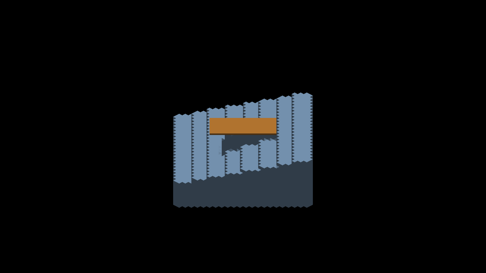
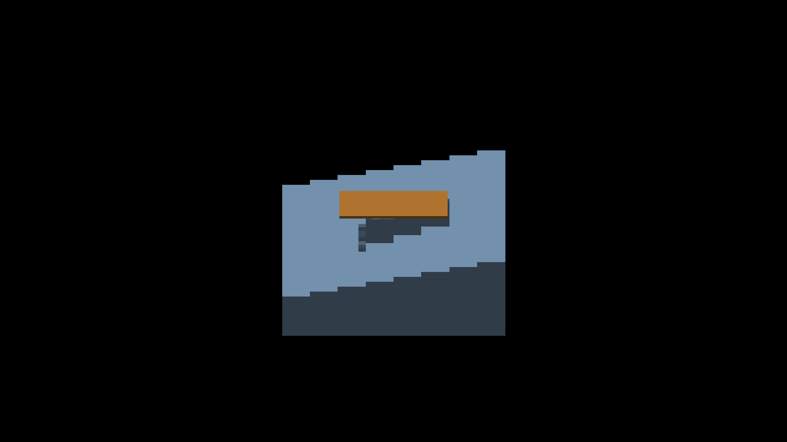
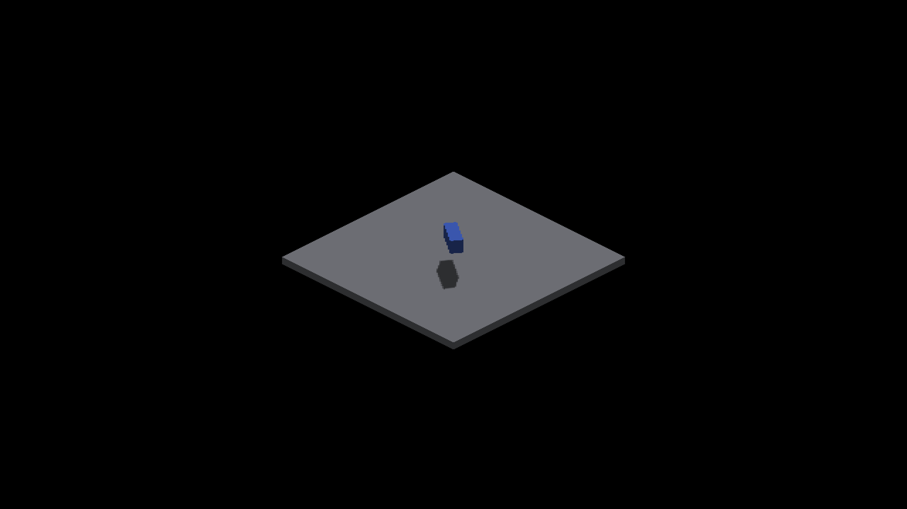

# Finite analytic box sun coverage

The opt-in voxel/source-face sun paths cast main-canvas analytic BOX descriptors
by intersecting texel-center sun rays with the rotated source box. Each covered
texel stores its own entry depth. Boxes no longer contribute depth-point splats;
non-box analytic shapes keep their independent depth pass. Normal display and the
default depth-caster route are unchanged.

The source bounds follow the shape solver: half extent is
`(params.xyz - 1) / 2 + 0.5 / actualSubdivision`. `sdfBox` uses max-axis distance,
so this slab expansion matches its continuous acceptance volume, including
rotation. Source position is continuous; cardinal visible SDF rasterization can
still snap fractional centers. As with source voxel shadows, this is source
geometry coverage, not a claim that the visible raster already matches it.

One batched dispatch reads resident shape descriptors, clips each box to each
cascade, and distributes its covered rectangle among 64 threads. It adds no
shape upload, geometry allocation, shadow-map resolution or sampling taps. Work
scales with projected box bounds, not the square splat radius at every trixel.
Large projected boxes and populations remain unprofiled; the existing non-box
depth pass still launches box tiles which immediately return. Removing that
wasted launch and measuring dispatch/GPU cost belong to the optimization round.

## Native evidence

Metal, Apple M4 Max, 2560x1440, output scale 2. All runs exited CLEAN. Base is
`8ff1f02ce233c54f92399d30f9d39aac63a7aa57`. OpenGL runtime is unverified.
Full captures and the legacy-caster control patch are in
`docs/pr-screenshots/codex/analytic-box-sun-coverage/`.

| Control | Result |
|---|---|
| Detached staircase, original receiver (637) | Blocked/outside regions both error 0 |
| Detached staircase, experimental centroid (640) | Both error 0; legacy analytic caster failed outside by 41 |
| Attached GRID staircase (655) | Both error 0; previous analytic path retained outside error 8 |
| Authored voxel box (658–661) | Existing whole-shadow oracle 4/4, IoU .739/.916/.925/.881 |
| Analytic box, legacy caster (651–654) | 0/4, IoU .100/.394/.373/.424; excessive coverage |
| Analytic box, finite caster (643–646) | 3/4, IoU .668/.916/.925/.881 |
| Rotated/fractionally translated analytic box (647–650) | 4/4, IoU .761/.906/.914/.876 |
| Sphere plus box floor (671/672) | Shadow remains with non-box fallback; 7,096 RGB pixels differ from shadows disabled |

The analytic box's nearly hidden yaw-zero shadow still fails the unchanged .70
IoU threshold. This is recorded as an unresolved raster/source/receiver alignment
case, not an accepted precise boundary. The other passes also retain the existing
aggregate tolerance; they do not prove subtrixel boundary correctness.

Final production captures 673–675 are RGB pixel-identical to 637–639 after
removing the centroid experiment.

The centroid experiment remains disabled. Broadening it to the unblocked
staircase reveals 12,544 false-shadow pixels at yaw zero, maximum blue error 36
(capture 662 versus 666); the other cardinal views match exactly. Changing only
the caster from source faces to resampled voxel faces restores exact equality
(670 versus 666). Source anchors are half-integral on even-sized axes, whereas
rasterization rounds them at odd densities. Correcting that coordinate contract
is required before general centroid adoption. The staircase's existing geometry
teeth are a separate unresolved display/reconstruction defect.

## Recipes

```sh
fleet-run --timeout 120 IRCanvasStress --only shadowocclusion --probe-staircase --probe-analytic-blocker --pivot-origin --no-spin --no-auto-rotate --no-ao --subdivisions 1 --zoom 4 --auto-screenshot 6 --sweep-yaw 3.14159265 3.92699082 3 --source-face-shadows
python3 scripts/render-sun-occlusion-metric.py capture-637.png --staircase
```

637–639 use the normal receiver. Applying the retained centroid correction from
`docs/pr-screenshots/codex/detached-shadow-receiver-samples/` produces 640–642.
Captures 655–657 add `--probe-grid` to that experimental recipe; the detached
centroid branch does not affect GRID. Captures 662–665 omit the roof, add
`--probe-unblocked`, and sweep 0 to 4.71238898 in four shots. 666–669 add
`--no-shadows`; 670 uses only yaw zero and `--voxel-face-shadows` instead.

```sh
fleet-run --timeout 120 IRCanvasStress --only shadowbox,floor --probe-analytic-box --pivot-origin --no-spin --no-auto-rotate --no-ao --subdivisions 1 --zoom 0.4 --auto-screenshot 6 --sweep-yaw 0 4.71238898 4 --source-face-shadows
python3 scripts/render-shadow-box-metric.py capture-643.png capture-644.png capture-645.png capture-646.png --source
```

Add `--analytic-box-yaw 0.6 --analytic-box-offset 0.35 -0.4 0.25` for 647–650;
the oracle takes `--box-yaw 0.6 --box-offset 0.35 -0.4 0.25`. Apply the retained
`legacy-box-caster-control.patch` on Metal for 651–654. Omit the analytic-box
flag for 658–661. Replace it with `--probe-analytic-sphere` and capture yaw pi
only for 671; add `--no-shadows` for 672. Captures 640–672 were made with the
centroid experiment, although only detached receivers enter that branch.






