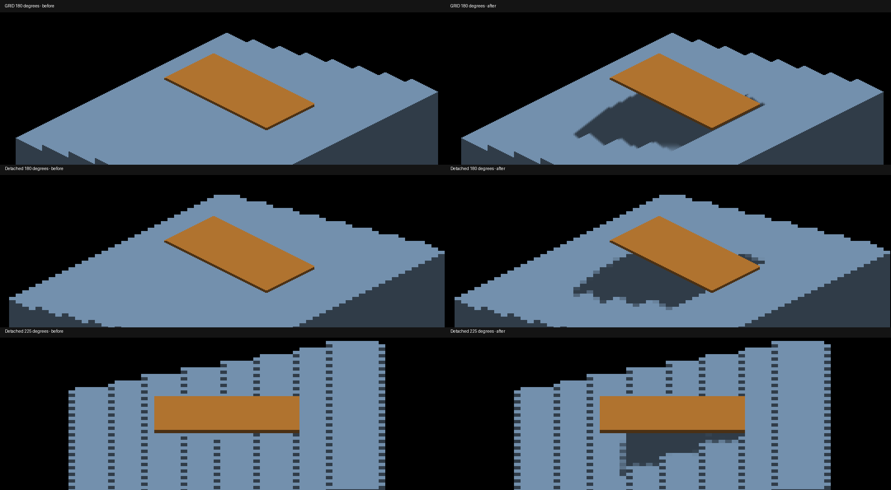
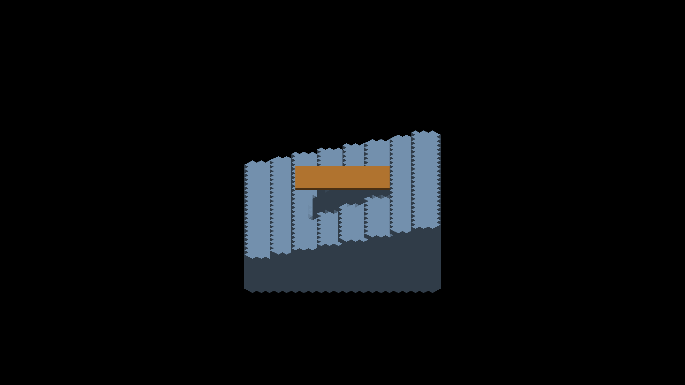
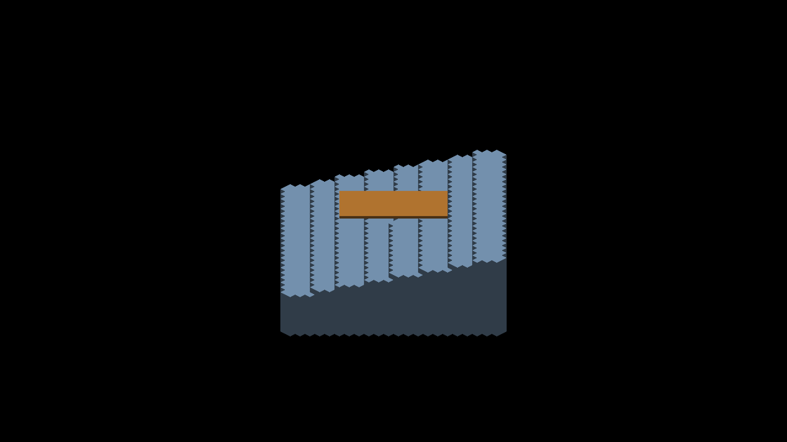

# Analytic casters with voxel face shadows

The opt-in voxel/source-face shadow route previously returned before baking
analytic geometry. An analytic roof remained visible but cast no shadow onto
the staircase. `SHAPES_TO_TRIXEL` now renders a separate main-canvas analytic
depth pass, and `BAKE_SUN_SHADOW_MAP` adds that depth to the existing face map.
Voxel depth never enters this extra pass, preserving finite voxel-face coverage.
The default shadow route and feature defaults are unchanged.



The comparison contains native-resolution crops at `(730,480)-(1810,850)`;
full frames are retained alongside it. These historical detached captures used
raw rectangular display. Normal detached voxel display now reconstructs local
triangles; reproducing the historical display requires `--debug-raw-trixels`.
This change fixes missing cast visibility, not authored-surface reconstruction
or analytic shadow boundaries.

## Data and lifetime contract

The extra depth pass uses the existing SDF shader with `passIndex=0`, retaining
shapes hidden by visible voxel winners. The baker snapshots its producer's camera
offset, canvas extent, effective density and yaw values instead of decoding with
whatever voxel frame last occupied the shared uniform buffer. It restores the main
voxel frame after baking. The scratch texture is lazily allocated and reused,
reallocated on canvas resize, and owned by the render resource manager. Readiness
is reset each frame so an absent shape batch cannot reuse old caster depth.

On Metal, `Texture2D::clear` does not initialize the image-atomic scratch buffer.
The device-level `clearTexImage` initializes both, and
`resolveImageAtomicScratch` materializes the depth before the shadow bake samples
it. A texture-only clear produced a giant false shadow during development; that
implementation is not shipped.

Scope is main-canvas SDF shapes. Non-main analytic canvases and other non-voxel
producers still need coverage. Analytic depth retains the existing depth-point
splat projection; this is a prerequisite for broader face-shadow adoption, not
evidence that the analytic projection is geometrically exact.

## Native validation

Metal, Apple M4 Max, 2560×1440, AO disabled, fixed origin pivot. Every listed
native run reported `RESULT=CLEAN`. Baseline is
`336e11d899a083efc9d0823fbe5c91ce15086930` with only the new demo flag applied;
after captures use this change. The analytic roof uses full box dimensions
`(16,8,1)` at `(0,-2,-2)` for all matched comparisons.

Historical staircase recipe (add `--debug-raw-trixels` on the current stack
to reproduce the original detached display):

```sh
fleet-run --timeout 120 IRCanvasStress --only shadowocclusion --probe-staircase --probe-analytic-blocker --pivot-origin --no-spin --no-auto-rotate --no-ao --subdivisions 1 --zoom 4 --auto-screenshot 6 --sweep-yaw 3.14159265 3.14159265 1 --source-face-shadows
python3 scripts/render-sun-occlusion-metric.py capture.png --staircase
```

| Case | Before / after | Result |
|---|---|---|
| GRID staircase, add `--probe-grid` | 586 / 578 | Blocked patch maximum error 101 → 0, PASS. Outside patch 0 → 8, FAIL against unchanged tolerance 2. |
| Detached staircase | 588 / 584 | Blocked patch becomes `(48,60,72)`; both blocked and outside maximum error 0, PASS. |
| Detached at 225 degrees, sweep endpoint `3.92699082`, count 2 | 589 / 585 | Roof shadow restored visually; cardinal metric does not apply. |
| Default route, GRID, omit `--source-face-shadows` | 587 / 590 | Pixel-identical RGB. |
| Unblocked overhead GRID, omit analytic flag, add `--probe-unblocked --sun-direction 0 0 -1` | prior 555 / 579 | Pixel-identical RGB; still matches shadows disabled. |
| Source-face box on analytic floor, four cardinals | prior 525–528 / 580–583 | Existing analytical shadow oracle passes 4/4. |

Box command is `--only shadowbox,floor --pivot-origin --no-spin
--no-auto-rotate --no-ao --subdivisions 1 --zoom 2 --auto-screenshot 6
--sweep-yaw 0 4.71238898 4 --source-face-shadows`. The source-box oracle
(`scripts/render-shadow-box-metric.py`, `--source`) reports IoU
`.891/.968/.963/.948` and area ratio `.980/1.026/1.027/1.032`.
Yaw zero is pixel-identical. Each other angle changes 32 pixels at the analytic
plate's outside edge, within `(320,750)-(2240,764)`; this is additional analytic
self-shadow coverage, not a claim of exact plate-edge correctness.

Build, changed-line formatting, header conventions (including Metal scratch
consumer registration), comment-reference ratchet and `git diff --check` pass.
OpenGL runtime remains unverified. Shared C++ orchestration adds no shader ABI.

## Why reducing splat radius is not the voxel fix

The overhead staircase diagnostic isolates the default depth caster's footprint:
retained capture 561 bakes only slot-2 top surfaces and is identical to the
failing overhead control 554. Removing vertical-face contributions does not fix
the false shadows. Setting the radius to zero (564) matches disabled shadows,
but the four-cardinal box experiment then undercovers the box and fails all four
oracle checks. The blocked overhead radius-zero capture 565 still casts the roof.
These are diagnostic experiments, not implementation changes in this PR.

A flat top sample expanded over a square can reach a lower tread outside its
physical face. That depth comparison looks like a real blocker; changing receiver
normals or increasing bias cannot distinguish it from nearby external geometry.
Finite projected face footprints provide the right voxel representation. Analytic
geometry must coexist with that route without reintroducing voxel point splats.

## Remaining work and cost

- Correct analytic finite coverage and GRID receiver agreement: the outside
  patch remains a failing control; do not relax the tolerance or blur it away.
- Validate non-main analytic producers, camera pan, density transitions and
  temporal disappearance before changing defaults.
- Resolve detached display geometry and picking independently of shadow casting.
- Measure the additional depth-only SDF dispatch, texture clear, Metal resolve
  and shadow bake. They run only for opt-in face coverage with enabled shadows
  and a main-canvas shape batch. There is one reused R32I canvas texture plus
  backend scratch storage, no per-entity texture or CPU geometry reconstruction.
  This is not a throughput optimization or a large-population benchmark.

The next optimization round should compare finite-face projection against the
legacy radius-seven bake's up-to-225 atomics per sample per cascade, and assess
whether analytic depth can be emitted alongside the existing pass without
duplicating SDF traversal. Preserve visual controls when consolidating that work.

## Normal-display adoption check

After the stack adopted local triangular reconstruction by default, the same
native recipe produced captures 609 (180 degrees) and 610 (225 degrees), without
an enabling display flag. The cardinal blocked patch has maximum error 0 and
the outside patch maximum error 1: both pass the unchanged tolerance 2.

Capture 611 adds `--debug-raw-trixels` at 225 degrees and is RGB pixel-identical
to historical capture 585. Capture 612 instead uses normal display with
`--no-shadows`. Triangular teeth remain along the same tread and silhouette
boundaries with shadows disabled; they are not solely a lighting artifact.
Correct local fragment footprints do not establish correct reconstructed
occupancy or original authored surfaces. That geometry work remains open.

The 225-degree controls use `--sweep-yaw 3.92699082 3.92699082 1`; all other
arguments match the common recipe. All runs exit cleanly. The updated stack
also passes 17 focused default-layout, detached-depth and rebuild-guard tests,
changed-line formatting, header checks, and both comment/instruction ratchets.





The flag-free display also preserves all four source-box shadow checks in
captures 613–616: IoU .920/.967/.963/.948, area ratio
.990/1.026/1.027/1.032, using the existing box recipe and thresholds.
