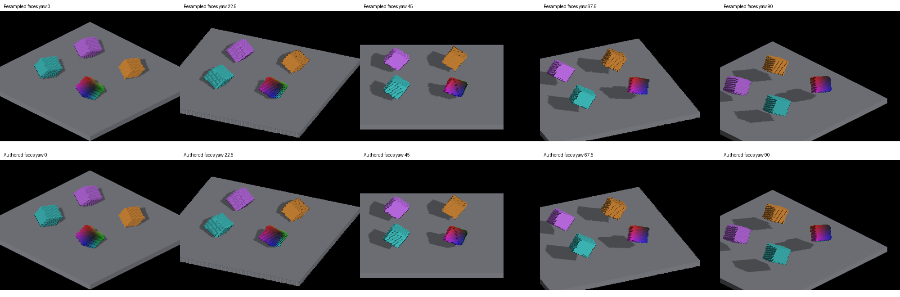
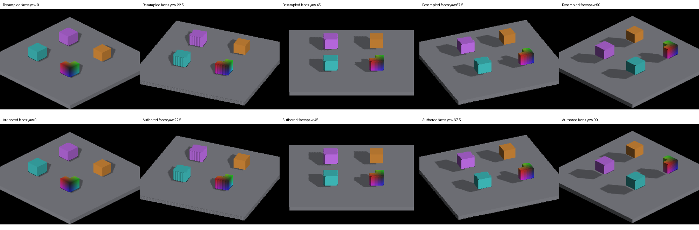

# Authored voxel faces for detached shadow casting

An opt-in follow-up to [complete voxel-face coverage](voxel-sun-face-coverage.md).
`IRCanvasStress --source-face-shadows` enables face coverage and uses the resident
source occupancy grid for detached revoxelized casters. GRID casting still uses
its world voxel pool; screen-locked canvases remain excluded. Defaults are unchanged.

## Geometry and cost

The source grid exists for inverse revoxelization already. Each source cell
supplies its occupancy; at most three sun-facing neighbors determine exposed
faces. Cell centers use `sourceCell + sourceGridMin + anchor`, preserving the authored
half-cell pivot of even-sized models. Face corners subtract the existing
`kVoxelRasterCellAnchor` (0.5 per axis) before orientation, so the occupied mass
is centered on that authored position, as in the visible per-axis renderer.
Composing the camera quaternion with the private canvas quaternion cancels inverse camera rotation, yielding the entity's
world orientation. That orientation projects each source parallelogram directly
into the existing sun cascades. The caster no longer inherits the camera-aligned
destination lattice's stair steps. This does not change visible-surface rendering.

The 96-byte uniform carries world origin/orientation, dispatch dimensions, source
grid bounds and anchor. Source slot 9 is explicitly bound, with a valid unused
placeholder on the non-source path; transient slots 16/28 retain their existing
restore rules. The same kernel handles both paths. No additional CPU voxel walk,
source-grid allocation, voxel upload, dispatch or synchronization is introduced.
The raster also exits immediately for a wholly clipped face rectangle.

Dense source volume can be much smaller than the inverse destination cube: a
12×12×12 source has 1,728 cells. This is not a universal sparse-asset optimization;
empty source-grid slots still cost threads, and occupied cells add neighbor reads.
Projected texel area/overlap, per-canvas dispatches and the existing CPU rebuild
work remain costs. Hundred-thousand-entity throughput is not established.

## Captures and validation

macOS Metal, Apple M4 Max, 2560×1440. Both upright and tilted comparisons keep the
same geometry, camera, sun and receiver settings as their parent captures.





```sh
fleet-run --timeout 120 IRCanvasStress --only revox,shadowattached,floor --no-spin --no-auto-rotate --no-ao --subdivisions 1 --zoom 0.65 --auto-screenshot 6 --sweep-yaw 0 1.57079633 5 --source-face-shadows
```

Add `--probe-upright` for the upright control. Replace `--source-face-shadows`
with `--voxel-face-shadows` for resampled-cell casting.

The box oracle's `--source` option uses the authored, unrounded box coordinates,
independent of camera orientation. All three modes now bound occupied mass at
cell center ±0.5. Their rounding and camera conventions are unchanged; newly
captured default and GRID four-view sets still pass. Thresholds remain IoU
≥.70 and visible-area ratio .75–1.30.

```sh
fleet-run --timeout 120 IRCanvasStress --only shadowbox,floor --no-spin --no-auto-rotate --no-ao --subdivisions 1 --zoom 0.4 --auto-screenshot 6 --sweep-yaw 0 4.71238898 4 --source-face-shadows
python3 scripts/render-shadow-box-metric.py yaw0.png yaw90.png yaw180.png yaw270.png --source
```

| Yaw | Source-face IoU | Area / expected |
| --- | ---: | ---: |
| 0 | .716 | .878 |
| 90 | .943 | .985 |
| 180 | .913 | 1.002 |
| 270 | .876 | .981 |

The table uses centered face corners and the corrected detached origin; the
comparison images above predate those small placement corrections. Current
centering evidence is in [the rendering worklist](rendering-audit-todo.md).

The tilted outlines are visibly straighter, but visible detached voxel faces still
show the underlying revoxelization steps. Source casting can also disagree locally
with that stepped receiver near contact. This experiment therefore stays opt-in;
unifying source face geometry for visible coverage and shadow receive is still
required. OpenGL runtime rendering, larger populations, sparse/elongated assets,
non-default density, fog membership and cascade/pan stress remain unverified.

A bounded A/B profile used the same frozen `--only revox,floor` scene,
`--auto-profile --auto-screenshot 120 --sweep-frames 1 120`, yielding 243 frames
per run. The CPU `SingleVoxelToCanvasFirst` mean was .211 ms for resampled faces
and .197 ms for source faces; frame medians were both 8.32 ms. These are whole
system CPU timings from one pair, not isolated GPU measurements or evidence of
an overall speedup. Raw reports are committed beside the screenshots.

Local checks include the native demo build and clean exits, source box 4/4,
existing detached box 4/4 and GRID box 4/4, Python lint, header/Metal registries,
comment-reference checks and changed-line formatting.
