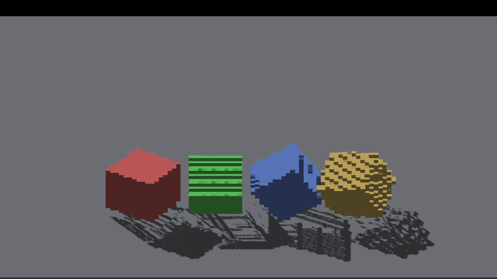
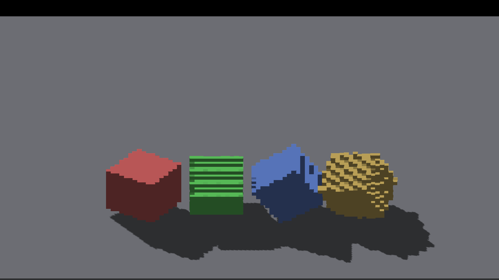

# Canvas stress shadow gaps and receiver phase

The red, green, blue and yellow row in `IRCanvasStress` is `gridspin`:
four `RotationMode::GRID` cubes rerasterized into the shared voxel pool.
It is different from the detached cyan/purple/rainbow `revox` group.
Both need coverage. The captures below are historical diagnosis from the
diagnostic-only slice. [Surface sampling adoption](surface-shadow-sampling.md)
records the subsequent receiver fix; finite caster defaults remain separate.

## Four-cube reproduction

Freeze the authored pose while sweeping the camera. The axis differs for each
cube, matching the normal demo. All captures use native Metal on Apple M4 Max,
2560x1440, output scale 2, and exited CLEAN.

```sh
fleet-run --timeout 120 IRCanvasStress --only gridspin,floor --frozen-pose 0.6 --pivot-origin --no-spin --no-auto-rotate --no-ao --subdivisions 1 --zoom 1 --auto-screenshot 6 --sweep-yaw 0 5.49778714 8
```

Repeat with `--source-face-shadows`, then with `--no-shadows`. At requested
zoom 1 the logged effective density is 1. For the magnified 225-degree view,
use `--zoom 3 --sweep-yaw 3.92699082 3.92699082 1`; its effective density is 4.
Do not infer density directly from requested zoom.

The default caster produces long interior gaps, including the red cube's
shadow. Finite face casting produces continuous coverage in the corresponding
view. On GRID, source-face mode uses the existing world voxel pool; there is
no detached source reconstruction involved. The green bands and yellow face
pattern persist without shadows and require a separate geometry/normal audit.
This comparison is evidence of gap removal, not an exact boundary oracle or
proof that every differently oriented voxel face should have the same normal.

## Detached receiver experiment

The retained `phase-centroid-experiment.patch` carries the resampling anchor
through raster placement, depth, lighting and resampled casting. For actual
density N, the view-space phase is `anchor - roundHalfUp(anchor*N)/N`.
Source casting already preserves the anchor and does not receive this offset.
Source-position fog consumers likewise keep their original origin; only
decoded-raster consumers receive the phase. The diagnostic overlay becomes
raster-origin-relative, as documented in the patch.

The patch fixes the earlier false-shadow pattern on the unblocked staircase:
four cardinal views match the prior shadows-disabled controls exactly in RGB.
Two actual-density-2 controls also match shadows disabled. However, the nearby
analytic roof's blocked sample fails, so the correction remains experimental.

At yaw pi, the selected tread centroid is approximately `(13/3,8/3,-1)`.
The sun ray intersects the thin analytic roof. The existing half-voxel normal
offset moves that ray outward and makes it miss. A separate retained patch
sets that offset to zero for diagnosis. It reduces the blocked sample's maximum
color error from 101 to 5, but still fails the unchanged tolerance of 2.
The outside sample has zero error in both cases. Four unblocked views with
zero offset still match shadows disabled exactly. The remaining filtered
boundary needs an independent coverage check; moving the test point or
increasing its tolerance would not resolve it.

The original renderer has been restored. Neither patch is compiled into this
PR. The demo adds `--probe-canvas-size` (clamped 256..2048, default 256) so
private-canvas density tests can exceed the existing canvas-size cap.

## Evidence and commands

Full PNGs and experiment patches live in
`docs/pr-screenshots/codex/detached-raster-phase/`. Experiment base:
`3376dcd0b5d08a3994d309e503526c6c11e5a901` plus the demo canvas-size flag.
Apply the phase patch first; the zero-offset patch is independent. Build and
stage before each run. Production confirmation captures use neither patch.

| Captures | Configuration |
|---|---|
| 676–679 | Phase + centroid, unblocked staircase, source casting, cardinal sweep; an earlier equivalent no-fog prototype also phased the stage-1 fog origin |
| 680–687 / 688–695 / 696–703 | Phase + centroid; regular tilted `revox,floor,shadowattached`, default / shadows off / source; 0..315 degrees by 45 |
| 704–706 | Phase + centroid; analytic roof/staircase, 180/202.5/225 degrees |
| 707–708 / 748–749 | Phase + centroid; unblocked staircase, actual density 2, source / shadows off, 0/90 degrees |
| 709–716 / 717–724 / 725–732 | Phase + centroid; `gridspin,floor`, default / source / shadows off, eight angles; detached changes do not affect this group |
| 733–734 | Same GRID comparison, magnified 225 degrees, default / source |
| 735 | Phase + centroid + zero normal offset; analytic roof, 180 degrees |
| 736–739 | Same two patches, unblocked staircase, cardinal sweep |
| 740–747 | Same two patches, regular tilted detached group, source casting, eight angles |
| 750–751 | Production renderer restored; magnified GRID default / source. RGB-identical to 733–734, confirming the detached experiment does not affect this comparison |
| 752–753 | Production renderer, larger private canvas, actual density 2, shadows disabled, 0/90 degrees |

Default caster:



Existing finite face caster:



For the staircase experiment:

```sh
fleet-run --timeout 120 IRCanvasStress --only shadowocclusion --probe-staircase --probe-analytic-blocker --pivot-origin --no-spin --no-auto-rotate --no-ao --subdivisions 1 --zoom 4 --auto-screenshot 6 --sweep-yaw 3.14159265 3.92699082 3 --source-face-shadows
python3 scripts/render-sun-occlusion-metric.py docs/pr-screenshots/codex/detached-raster-phase/capture-704.png --staircase
python3 scripts/render-sun-occlusion-metric.py docs/pr-screenshots/codex/detached-raster-phase/capture-735.png --staircase
```

Both metric commands intentionally fail. For unblocked cardinals, replace
`--probe-analytic-blocker` with `--probe-unblocked` and use
`--sweep-yaw 0 4.71238898 4`. For the density-2 pair, also use
`--probe-canvas-size 1024 --subdivisions 2 --zoom 1 --sweep-yaw 0 1.57079633 2`;
repeat with `--no-shadows`. Captures 748–749 also had the zero-offset patch,
which is inactive with shadows disabled.

The regular detached sweep uses the same freeze/pivot flags, with
`--only revox,floor,shadowattached --zoom 1 --subdivisions 1
--sweep-yaw 0 5.49778714 8`. Its tilted face patterns remain with shadows off;
the default caster additionally oversizes detached shadows and stipples the
attached comparison shadow at 45 degrees.

## Acceptance after the diagnostic slice

- Preserve nearby blockers while eliminating false self-shadowing; establish
  exact projected boundaries before adopting phase/centroid recovery.
- Keep both the four GRID cubes and the detached group in mode, density and
  camera sweeps. Extend to moving poses, fog boundaries and screen locking.
- Validate finite casting for non-main producers and remaining analytic shapes,
  then measure its population/dispatch cost before changing the default.
- OpenGL runtime and large-population throughput remain unverified here.
