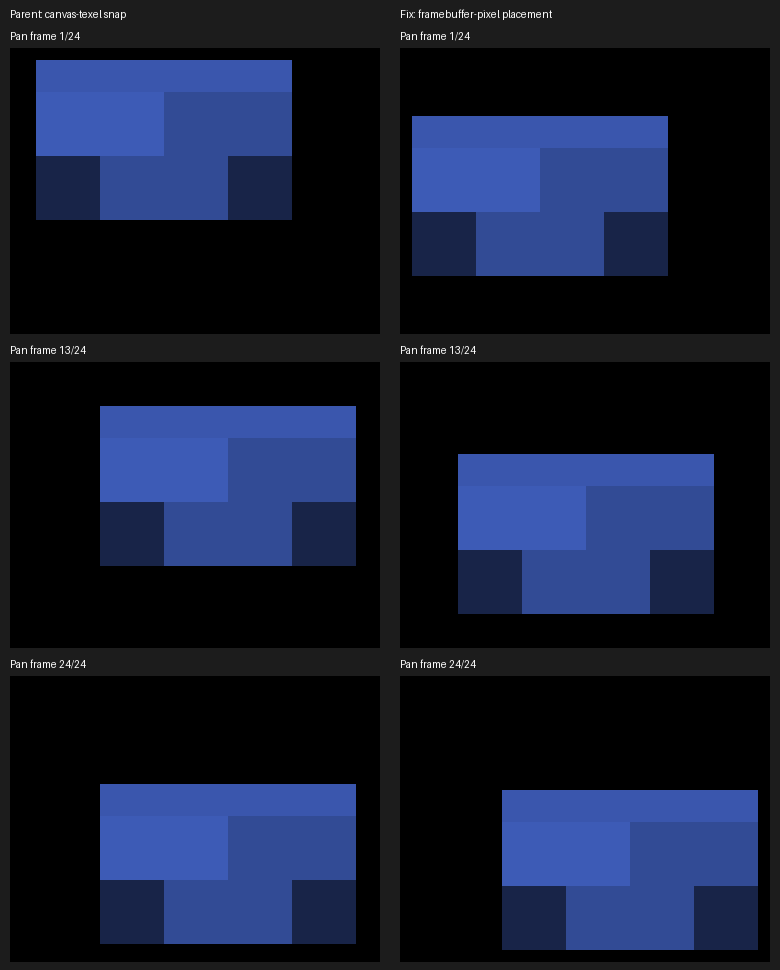

# Detached camera placement

Private canvases place their quad in a Y-up framebuffer basis on both backends.
The camera offset scales the fractional effective iso position into framebuffer
pixels, then floors it and applies the Y-up sign. It is computed once per frame, independent of
private-canvas subdivisions. The final framebuffer upscale owns the remaining
screen-pixel residual. This removes canvas-texel snapping and the Metal Y-sign
mismatch without changing stored trixels, depth keys, shadow geometry or draws.

## Native evidence

Apple M4 Max, Metal, 2560×1440 screenshots, output scale 2. All capture runs
reported `RESULT=CLEAN`. Parent is `1612a063aa34a5714ea354a53bcbc32aff89ef78`;
the parent pan run uses that renderer with only the new demo capture option.
Artifacts live in `docs/pr-screenshots/codex/local-trixel-layout/`.

| Pan arm | Captures | Max residual X/Y (PNG pixels) | Verdict |
|---|---|---|---|
| Parent, yaw 0 | 262–285 | 30.00 / 34.37 | JITTER; steps up to 64 pixels |
| Corrected, yaw 0 | 238–261 | 0.94 / 0.00 | SMOOTH; no reversals |
| Corrected, yaw 22.5°, fixed origin pivot | 286–309 | 0.94 / 0.00 | SMOOTH; no reversals |
| Corrected, yaw 22.5°, default depth-derived pivot | 214–237 | 17.49 / 2.01 | JITTER; separate pivot discontinuity |

```sh
fleet-run --timeout 120 IRCanvasStress --only shadowbox --probe-single-voxel --no-spin --no-auto-rotate --no-ao --no-shadows --subdivisions 1 --zoom 16 --yaw 0 --auto-screenshot 6 --sweep-pan -0.2 -0.2 1.2 1.2 24
```

For the noncardinal fixed-pivot arm, use `--yaw 0.39269908 --pivot-origin`.
Run `build/tools/jitter_probe/jitter_probe --expect-frames 24 --verbose` with
exactly the 24 corresponding full-frame paths in numerical order. Logs retain
centroids, residuals and the unmodified 1.50-pixel threshold. The single blue
voxel is isolated on black; no color mask or crop is used by the measurement.

The comparison uses the same native-resolution rectangle for all six images;
`pan-crop.json` records the rectangle and frame IDs. It illustrates placement,
not corrected voxel shape.



The default camera pivot rereads center depth after settled pans. At nonzero yaw,
a change of two iso-depth units predicts approximately 32.66 screenshot pixels
of X movement for this fixture. The observed discontinuity disappears with a
fixed origin pivot. This supports a separate camera-focus finding; this slice
does not change pivot selection. Do not interpret its default-pivot sequence as
a passing general camera stability check.

Source-shadow box checks at zoom .4 pass all four cardinal views (310–313):
IoU .716/.943/.913/.876, unchanged from the parent measurements. Recipe:

```sh
fleet-run --timeout 120 IRCanvasStress --only shadowbox,floor --no-spin --no-auto-rotate --no-ao --subdivisions 1 --zoom 0.4 --auto-screenshot 6 --sweep-yaw 0 4.71238898 4 --source-face-shadows
```

`render-shadow-box-metric.py` consumes those four ordered full frames with
`--source`; its thresholds are unchanged.

## Triangle display experiment: rejected

The retained patch applies to the parent SHA above, not on top of this PR. It enables an explicit private local-triangle layout, disables
face dilation, and samples color/depth/priority from one triangle-selected cell.
It is diagnostic material only; none of its shader or component changes ship.

Captures 199–203 are the five single-voxel yaw views with continuous geometric
camera compensation, before framebuffer-pixel quantization. The center is within
one pixel in each view. Cardinal silhouette IoU is .982, but intermediate views
still fail (.862/.718/.861): resampling does not preserve the authored box faces.
Capture 206 adds disabled opposite-face selection to the upright multi-probe
scene. Alternating vertical face colors remain. Disabling opposite emission
therefore does not solve that artifact; resampled surface orientation needs a
separate investigation. The retained patch includes this last selection variant.
For 199–203, restore the original `selectVoxelFace` arguments and nonzero
revoxelize predicate in the four stage bodies while retaining the layout changes.

Recipe for 199–203: the single-voxel recipe in
[single-voxel-display-probe.md](single-voxel-display-probe.md), adding
`--local-trixel-display`. Recipe for 206:

```sh
fleet-run --timeout 120 IRCanvasStress --only revox,shadowattached,floor --local-trixel-display --no-spin --no-auto-rotate --no-ao --subdivisions 1 --zoom 0.65 --auto-screenshot 6 --sweep-yaw 0 1.57079633 5 --source-face-shadows --probe-upright
```

Capture 206 is the 45° shot. The flag exists only when the rejected patch is
applied. Captures 209–213 use the original rectangular/dilated display with the
continuous camera experiment at zoom 2: placement passes 4/5, but the 22.5°
centroid still misses by 2.70 pixels and all silhouette checks remain red.
They are experimental evidence, not final integer-placement acceptance.

## Limits

No OpenGL runtime was available. The shared C++ fix adds no allocation, upload,
dispatch or draw; it removes per-entity rounding and offset division. This is not
a large-population benchmark. Triangle coverage, source-face normals, picking,
receiver contact and shadow filtering remain on the rendering worklist.
