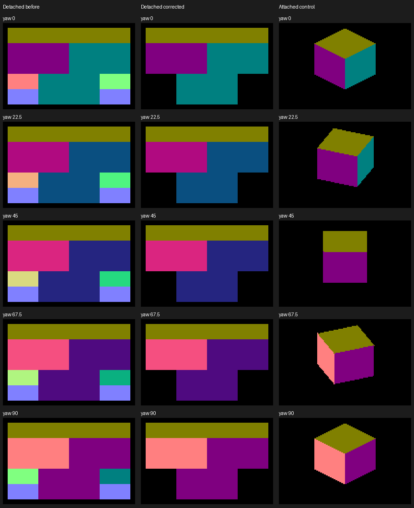
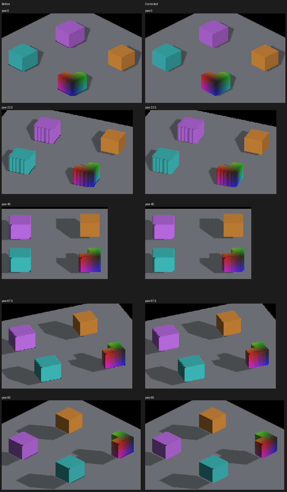

# Camera-facing normals on detached voxels

A rotated voxel staircase can legitimately expose alternating normals. This fix
neither averages those normals nor forces an authored flat face onto resampled
occupancy. It removes a different defect: back-facing voxel surfaces emitted into
the visible image, including on a single unrotated voxel.

Revoxelized occupancy already lives in the camera-aligned raster lattice. The
shared face selector incorrectly enabled silhouette-riser flips and opposite-face
dual emission for that occupancy. Those mechanisms remain available to the
existing authored rotated-voxel route, but are disabled for revoxelized canvases.
Stage 1 depth and stage 2 color use the same selector on Metal and OpenGL.

## Discriminating check

`--debug-overlay normals` writes the actual shading normal as RGB = N/2 + 1/2,
preserving alpha and depth. It bypasses albedo, AO, shadow modulation and tone
mapping. The per-axis overflow route uses the same encoding. The overlay is
opt-in and adds no buffers or dispatches.

`render-normal-facing-metric.py` decodes RGB8, checks unit length, and tests its
dot product with the camera depth axis. It allows only RGB8 quantization error.
Use an isolated object on black, world-placed shading normals, and zero camera
pitch/roll. This checks facing direction, not silhouette, missing faces, correct
normal identity, or smooth reconstruction. Legitimate differences among
camera-facing staircase normals pass.

Apple M4 Max, Metal, 2560×1440 PNGs, output scale 2. The parent renderer is
`13806b93fdb3ecc8890b873eb832645a149428ec`; before captures add only the diagnostic.
All native runs reported `RESULT=CLEAN`.

| Single voxel, yaw 0/22.5/45/67.5/90° | Visible pixels per view | Back-facing pixels per view | Result |
|---|---:|---:|---|
| Detached before (314–318) | 40,960 | 8,192 | 5/5 fail |
| Detached corrected (324–328) | 32,768 | 0 | 5/5 pass |
| Attached GRID control (319–323) | varies with projection | 0 | 5/5 pass |

At yaw zero the before image contains all six normal directions; an opaque cube
should expose only its three camera-facing sides. No rotated-staircase hypothesis
is needed to establish that failure. The corrected image still has enlarged,
rectangular coverage: the independent silhouette defect remains unresolved.



Rows share a crop across all three arms; `normal-crops.json` records its rectangle.
Full frames and numerical output are retained in the same artifact directory.

```sh
fleet-run --timeout 120 IRCanvasStress --only shadowbox --probe-single-voxel --no-spin --no-auto-rotate --no-ao --no-shadows --subdivisions 1 --zoom 16 --debug-overlay normals --auto-screenshot 6 --sweep-yaw 0 1.57079633 5
python3 scripts/render-normal-facing-metric.py docs/pr-screenshots/codex/detached-triangle-contract/capture-326.png --yaw 45
```

Add `--probe-grid` for the attached control. To reproduce the failing selection
with the new overlay, restore `rotatedEmit = reVoxelize || (reserved & 4u) != 0u`
in both `ir_voxel_face_select` shader twins, build, and run the same recipe.

## Adjacent checks and limits

The upright larger-probe recipe includes purple/cyan detached cubes and an
attached orange cube plus a concave rainbow shape:

```sh
fleet-run --timeout 120 IRCanvasStress --only revox,shadowattached,floor --no-spin --no-auto-rotate --no-ao --subdivisions 1 --zoom 0.65 --auto-screenshot 6 --sweep-yaw 0 1.57079633 5 --source-face-shadows --probe-upright
```

Parent-gate captures are 338–342; corrected captures are 329–333.


 Source-shadow box captures 334–337 pass all four
cardinal oracle checks (IoU .729/.943/.913/.876). The existing detached Lambert
check passes 12/12 samples with zero channel error (343–346), using
`--only shadowreceiver --no-spin --no-auto-rotate --no-ao --no-shadows` and the
four-cardinal sweep at zoom 1. These checks do not prove clean
receiver contact or eliminate all shadow noise.

The normal check deliberately keeps the source-face reconstruction question
open. A resampled staircase and an authored planar face are different surfaces;
choosing the desired appearance requires preserving or reconstructing geometry,
not merely replacing every varying normal with one flat normal. A zoom-2 repeat with requested subdivisions 8 resolves to effective density 1
in this private-canvas fixture (347–351); it checks another display scale, not
higher-density coverage. OpenGL runtime and large-population timing remain
unverified. Main checkout stays clean; all
implementation and captures use the dedicated rendering worktree.
