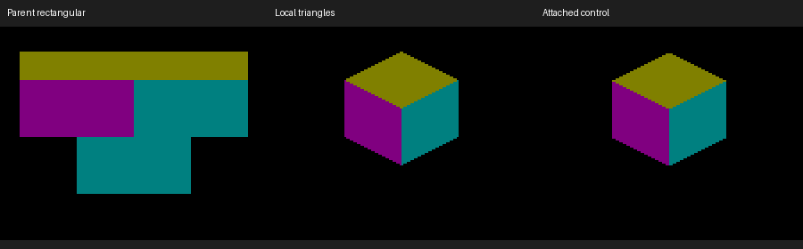
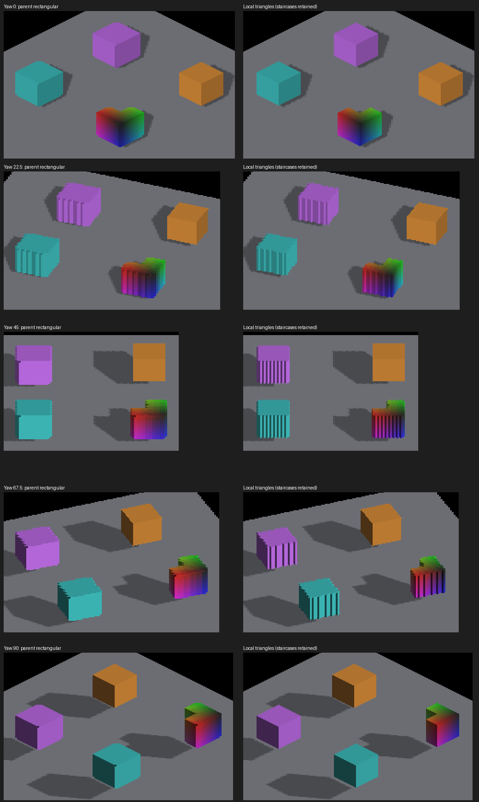

# Local triangular display for detached voxels

Normal detached voxel rendering uses undilated local-triangle reconstruction.
Raw rectangular trixel display is available only as a diagnostic override:
`IRCanvasStress --debug-raw-trixels`. The old `--local-trixel-display` flag is
a compatibility no-op because no presentation flag should be necessary.

This reconstructs the display of camera-aligned resampled cells; it does not
reconstruct the original authored faces or smooth staircase normals. Projected
shadow boundaries remain a geometry problem, not a blur operation. Triangular
teeth can still expose erroneous resampled occupancy even after rectangular
display teeth are removed; those are separate correctness checks.

## Producer and consumer contract

`C_TriangleCanvasTextures::sampleLayout_` defaults to `LOCAL_TRIANGLES`. The
request is interpreted by both detached voxel producers; main world, SDF and
text retain their existing storage conventions. A detached voxel canvas must
not mix SDF/text writes into its local-triangle storage.
The resampling marker stays nonzero so back-face exclusion remains active,
but normal display disables face dilation. Rectangular sampling and its legacy
dilation are a debug override, not an alternate presentation mode.

The raster clears effective layout and density metadata before the empty-pool
return, then records `renderedSampleLayout_` when it produces voxel data. The
composite consumes that effective layout, so switching out of revoxelization or
emptying the voxel pool cannot retain a stale local-triangle interpretation.

The fragment gather uses local canvas parity and a one-row query correction to
center each triangular footprint on the stored voxel origin. Color, depth and
priority select the same cell. Bounds rejection prevents sampling beyond the
canvas. World placement does not enter local parity. The layout occupies existing
UBO padding; there are no additional GPU allocations, dispatches or draws.
Each undilated emit avoids four extra neighbor taps. This is not a population
throughput measurement. Detached picking remains disabled and unvalidated.

## Independent single-cell check

An isolated source voxel at the origin remains one occupied camera-aligned cell
at the five tested Z yaws. Its world normal rotates with the camera; its resampled
cell geometry does not. `render-local-voxel-metric.py` projects the three exposed
faces of that unit cell analytically, rather than copying the trixel selector.
It checks each face's silhouette and area and rejects unexpected normal colors.
The fixed-origin pivot separates face coverage from automatic camera-focus motion.

On native Metal, Apple M4 Max, 2560×1440, output scale 2, zoom 16:

- All 15 face checks pass at 0/22.5/45/67.5/90 degrees. Each face covers 4,096
  pixels, exactly its analytical area; mask IoU is .962/.969/.962.
- The rectangular parent fails: its total occupied area is 32,768 pixels versus
  the expected 12,288. The attached cardinal control passes all three faces.
- Injecting an unexpected white pixel makes a passing capture fail.
- The final effective-layout metadata change reproduces all five measured frames
  pixel-for-pixel.



This is a different question from the authored-box oracle. That oracle remains
unchanged and still exposes camera-dependent revoxelization error. The earlier
[rejected experiment](detached-camera-placement.md#triangle-display-experiment-rejected)
does not become proof of authored-face fidelity. Larger upright cubes still show
alternating staircase faces, particularly at 45 degrees:



## Reproduction and retained evidence

The following captures predate default adoption and use the explicit compatibility flag.
All capture runs exited cleanly. Source base: `66622d60b` (merged rendering stack).
Artifacts are under `docs/pr-screenshots/codex/detached-local-triangles/`.
Captures 352–356 are the initial automatic-pivot normals sweep, which changes
placement with yaw; 366–370 use a fixed origin; 381–385 repeat the fixed-origin
sweep after effective-layout metadata was added.

```sh
fleet-run --timeout 120 IRCanvasStress --only shadowbox --probe-single-voxel --local-trixel-display --pivot-origin --no-spin --no-auto-rotate --no-ao --no-shadows --subdivisions 1 --zoom 16 --debug-overlay normals --auto-screenshot 6 --sweep-yaw 0 1.57079633 5
python3 scripts/render-local-voxel-metric.py docs/pr-screenshots/codex/detached-local-triangles/capture-368.png --yaw 45
```

Captures 357–361 are the larger upright probes. Their matched parent images are
329–333 under `codex/detached-triangle-contract`. All crops are native-resolution;
`crops.json` records the rectangles. Full frames are retained.

```sh
fleet-run --timeout 120 IRCanvasStress --only revox,shadowattached,floor --local-trixel-display --no-spin --no-auto-rotate --no-ao --subdivisions 1 --zoom 0.65 --auto-screenshot 6 --sweep-yaw 0 1.57079633 5 --source-face-shadows --probe-upright
```

Source-shadow checks, captures 362–365, pass all four cardinal views with IoU
.786/.944/.913/.876. This is an adjacent regression check, not exact contact proof.

```sh
fleet-run --timeout 120 IRCanvasStress --only shadowbox,floor --local-trixel-display --no-spin --no-auto-rotate --no-ao --subdivisions 1 --zoom 0.4 --auto-screenshot 6 --sweep-yaw 0 4.71238898 4 --source-face-shadows
```

Captures 371–375 exercise smallzoom with `--subdivisions 8 --zoom 2`, actual
private density 12. These are visual coverage evidence, not a high-density
numerical pass. Rectangular-mode repeats 376–380 and 386–390 differ only within
the rainbow probe (104–952 pixels between corresponding repeats); comparisons
to the older parent also differ there. The cause of that color instability is
unresolved, so a strict whole-scene pixel regression is not claimed.

The 24-frame fixed-origin pan at yaw 22.5 degrees passes `jitter_probe`:
maximum residual .94/0 pixels on X/Y, zero reversals, unchanged 1.50-pixel
threshold. Full frames 391–414 and `pan.txt` are retained.

```sh
fleet-run --timeout 120 IRCanvasStress --only shadowbox --probe-single-voxel --local-trixel-display --no-spin --no-auto-rotate --no-ao --no-shadows --subdivisions 1 --zoom 16 --yaw 0.39269908 --pivot-origin --auto-screenshot 6 --sweep-pan -0.2 -0.2 1.2 1.2 24
```

Screen-locked captures 415–417 at yaw 0/45/90 also retain the same voxel
silhouette. They use the single-cell recipe with `--screen-lock-detached`,
without the normals overlay; lighting is intentionally absent for this overlay.

OpenGL runtime, mixed producers, picking, comprehensive depth/contact agreement
and large-population performance remain unverified. These remain follow-ups; normal voxel presentation still uses fragment reconstruction.

## Default adoption validation

Normal rendering is the flag-free single-cell recipe above: omit
`--local-trixel-display`. Captures 591–595 at 0/22.5/45/67.5/90 degrees
pass all 15 analytical face checks, with area ratio 1.000 for every face and
no unexpected normal pixels. The component default test, five world-depth
checks and nine detached-origin guard tests pass (15 tests total).

Effective layout and density reset before an empty voxel-pool return. The
diagnostic `--debug-raw-trixels` override is applied once after scene creation
to all demo canvases; both detached voxel producers interpret that request.
Inherited comment/instruction lint failures were corrected without changing
executable tokens in those cleanup files or raising budgets.

The explicit `--debug-raw-trixels` negative control at 45 degrees is capture
608. It fails all three face checks (IoU 0.256/0.330/0.195, area ratios
4.0/2.0/2.0), while default capture 593 passes. Both use the same single-voxel
scene and normals overlay, without shadows or AO. The debug capture uses
`--sweep-yaw 0.78539816 0.78539816 1` with the otherwise identical recipe.

## Projected source faces (`DETACHED`)

Plain `DETACHED` retains authored occupancy and exposed-face masks. Normal
presentation uses `SOURCE_FACES`: GPU records preserve each exposed voxel face
through lighting and continuous projected quadrilateral drawing. It does not
move cells or rebuild occupancy. The producer's full model-to-view snapshot
supplies face corners and interpolated depth; shading uses the same source face.
The [source-face contract](trixel-face-reconstruction-validation.md#source-face-presentation)
owns storage, ordering, mixed texture content, AO limitations and validation.

The local centroid raster remains useful for screen-space occluder probes and raw
trixel diagnostics. A rotation-invariant enclosing-sphere bound caps its density
to private texture capacity; it no longer determines source-face display edges.
Revoxelized occupancy continues to use local triangle reconstruction and its real
staircase normals. [World sun casting](../pr-screenshots/codex/rigid-source-shadow-casters/README.md)
uses original transformed faces in the finite-face pipeline.
[World reception](../pr-screenshots/codex/surface-shadow-receiver-controls/README.md)
samples each original face center, preserving its world normal. It shares the
world light-volume path; continuous within-face shadows and picking remain work.

[Fixtures, parity controls and retained evidence](detached-projected-face-coverage.md).
