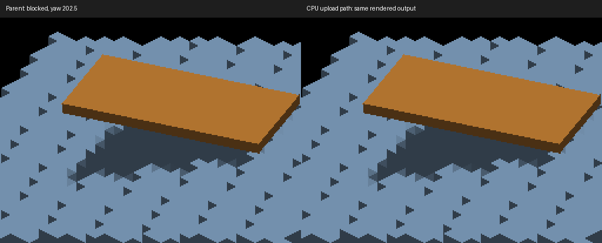

# Detached source-mask upload ownership

Rotating detached inverse resampling builds destination face masks on the GPU.
UPDATE previously also rotated every authored voxel, rebuilt a hash set and
queried six neighbors on the CPU, although that route skips source color uploads.

The existing source-indexed upload branch now owns CPU mask reconstruction.
The actual inverse dispatch predicate selects the route: identity rotations and
missing/unallocated inverse buffers still rebuild immediately before upload.
No cache invalidation flags or additional GPU work are introduced. UPDATE retains
the origin-centered guard and one-time static bounds, with its public system intact.
The existing cell anchoring and occupancy helper are reused without changing math.

This skips linear CPU rotation, hash insertion and neighbor queries on the inverse
route. Scratch vectors and hash buckets are reused; `unordered_set::clear` still
releases nodes, so the retained identity/fallback route is not allocation-free.
No large-population frame-rate improvement has been measured.

## Validation

Native Metal build: `fleet-build -j2 --target format-changed IRCanvasStress
IrredenEngineTest`. All 11 `RebuildDetachedVoxelsGuardTest.*` tests passed.
New coverage checks source masks through identity, quarter-turn and identity again,
including preservation of emissive and priority bits. Restoring the parent UPDATE
implementation made `BoundUpdateDoesNotRewriteRenderMasks` fail (11 versus 255);
the final implementation was restored afterward.

Ten full-frame RGB comparisons are identical to parent
`df3f082c1887437920ac99ab89a7804d86d55ba2`. Captures 539–542 are the
unblocked detached staircase at 0/90/180/270 degrees, compared with 530–533.
Captures 543–546 reverse that sweep, including the return to identity.
Captures 547–548 retain the external roof at 202.5/225 degrees and match 535–536.

```sh
fleet-run --timeout 120 IRCanvasStress --only shadowocclusion --probe-staircase --probe-unblocked --local-trixel-display --pivot-origin --no-spin --no-auto-rotate --no-ao --subdivisions 1 --zoom 4 --auto-screenshot 6 --sweep-yaw 0 4.71238898 4 --source-face-shadows
```

Reverse the sweep endpoints for the identity return. Remove `--probe-unblocked`
and use `--sweep-yaw 3.53429174 3.92699082 2` for the blocked noncardinal pair.
Retained full frames and comparisons are in
`docs/pr-screenshots/codex/detached-mask-upload-path/`.
The side-by-side crop preserves native pixels and shows unchanged output.



Missing GPU-buffer fallback is covered by dispatch/control-flow review and shared
mask-helper tests, not injected in the native demo. OpenGL runtime and population
profiling remain unverified. The staircase's noncardinal silhouette and face
reconstruction artifacts are unchanged and remain geometry follow-ups.
