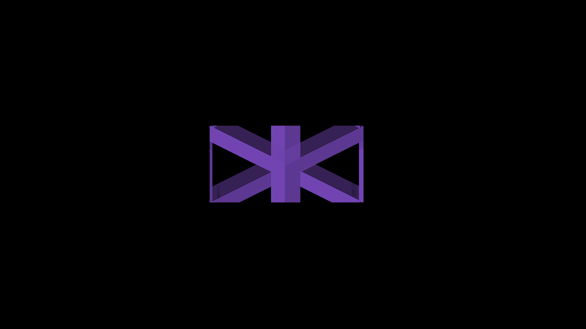
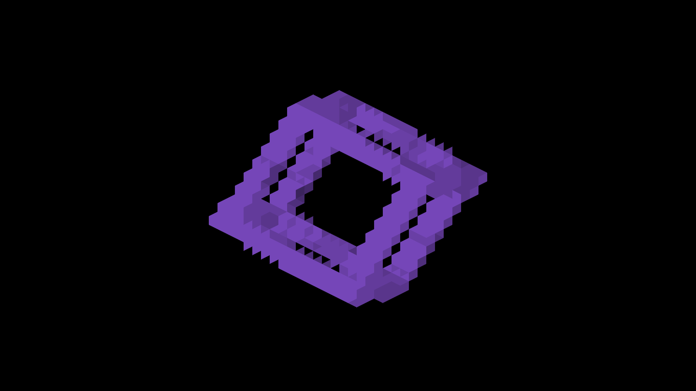
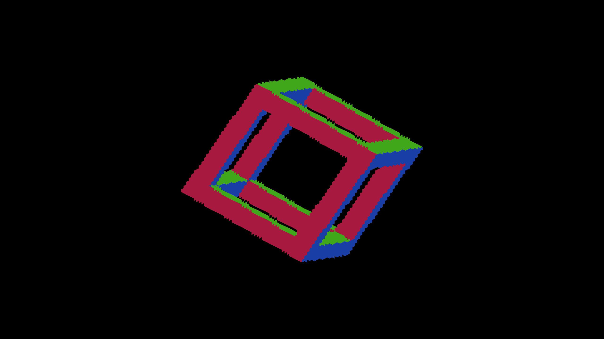

# Detached source-face coverage and triangle parity

The centroid/local-triangle implementation documented below is retained as a
failed geometry control. Capture 1277 passes lattice consistency but fails the
independent source-face gate. Normal plain-detached presentation now preserves
source-face records through a continuous quad draw. See the
[current contract](trixel-face-reconstruction-validation.md#source-face-presentation)
and its remaining acceptance work. The earlier passing lattice captures must not
be cited as proof of correct geometry.

The CanvasStress screenshots identify three fixtures:

| Object | Stable fixture | Mode | Diagnosis |
|---|---|---|---|
| Lime octahedron | orbit 3 | `DETACHED` | Deformed sample origins and rectangular display leave checkerboard holes. |
| Purple frame | orbit 7 | `DETACHED` | Same producer/display mismatch; uncapped density also clips the private canvas at high zoom. |
| Green cube | canary 1 | `DETACHED_REVOXELIZE` | Already reconstructs triangles. Alternating normals belong to the camera-aligned resampled staircase, even with AO/shadows disabled. |

`--focus-orbit N` and `--focus-canary N` preserve the original index, shape,
color and mode while centering the selected entity. Use `--only orbit` or
`--only canary` to exclude unrelated groups. `--no-spin` stops angular velocity;
orbit fixtures still start at their authored 45-degree rotation. Additional
focused orbit controls select an identity rotation, single voxel, alternate
canvas-origin parity, or larger canvas for density probes.

## Centroid reconstruction experiment (superseded for normal presentation)

Plain detached geometry uses the complete projected source-face quad instead
of deforming individual rectangular sample offsets around unrotated voxel
origins. Depth, election and color share one triangle-centroid coverage rule;
fragment presentation reconstructs those triangles with local canvas parity.
Normals follow the same full rotation. A rotation-invariant density cap prevents
zoom clipping and avoids changing raster density as the camera turns.
The [producer/display contract](detached-local-triangles.md#projected-source-faces-detached)
describes the implementation and remaining limitations.

This is neither dilation nor filtering. It keeps the private trixel canvas and
the authored occupied cells. Thin detail and sloping silhouettes remain sampled
on that canvas's triangular lattice; it does not promise exact sub-trixel edges.
Plain detached world-shadow casting/receiving is still unsupported.

## Evidence

Native Metal, Apple M4 Max, Debug, 2560x1440 PNGs. Parent source is
`212b4e7153eacb13c6efb222b4378b47e101a091` plus the focus controls.
Every listed demo run exited cleanly. Full captures and machine-readable
results are under `docs/pr-screenshots/codex/detached-display-artifacts/`.

The independent oracle projects the eight corners of every authored occupied
voxel and unions their convex projected silhouettes. It checks storage coverage
at triangle centroids, then probes three interior positions in each displayed
triangle. It does not copy the compute shader's plane inversion. Optional
normal checks compare against the source entity's rotated axis palette.
Registration is limited to two trixels and reported; all full-turn captures
register at (0,0). This checks coverage and triangle handedness, not absolute
placement or depth correctness.

- Frame captures 1276–1284 and octahedron 1286–1294 cover yaw 0 through 360
  degrees in 45-degree steps. All 18 pass with zero missing/extra samples,
  zero triangle-interior mismatches and zero unexpected normal pixels.
- Frame capture 1295 changes the private texture's X size from 168 to 170,
  reversing canvas-origin parity. The same coverage and triangle checks pass; the image is pixel-identical to 1277.
- Capture 1285 deliberately flips only the runtime fragment gather parity.
  All 762 frame centroids still pass, but **264 triangle-interior probes fail**.
  The runtime-only mutation was restored. This is why a centroid-only test is
  inadequate for the reported wrong-facing triangles.
- Capture 1296 is a single unrotated source voxel at zoom 16. Its three faces
  form the expected isometric hexagon, with 4,096 pixels on each face. This is a plain-detached control, not a
  revoxelized substitute.
- Parent frame 1260 versus corrected 1297 uses identical zoom-6 arguments;
  parent octahedron 1263 versus corrected 1298 uses identical zoom-2 arguments.
  Parent frame fails the authored silhouette check. Its old display also clips
  at that zoom. The corrected full-rotation silhouette differs intentionally.
- Green cube 1259 (normal lighting) and 1262 (AO/shadows disabled) both show
  triangular reconstruction and alternating staircase-face normals. Irregular
  lighting patches are a separate follow-up, not evidence of raw texel display.

Full-turn recipe (replace index 7 / shape frame with index 3 / octahedron):

```sh
fleet-run --timeout 120 IRCanvasStress --only orbit --focus-orbit 7 --no-spin --no-auto-rotate --zoom 4 --debug-overlay normals --no-ao --no-shadows --pivot-origin --sweep-yaw 0 6.283185307 9 --auto-screenshot 6
python3 scripts/render-detached-face-metric.py docs/pr-screenshots/codex/detached-display-artifacts/capture-1277.png --shape frame --yaw 45 --normals
```

Parity recipe: use the same arguments with `--focus-alternate-parity` and
`--sweep-yaw 0.785398163 0.785398163 1`. The negative control changes only
`((z1.x + z1.y) & 1)` to `(((z1.x + z1.y) & 1) ^ 1)` in the runtime
`trixel_to_framebuffer.metal` local-triangle gather; never keep that mutation.

Matched color recipes omit normals/no-AO/no-shadows/pivot flags and use the
same single-yaw sweep, at zoom 6 for frame or zoom 2 for octahedron.

OpenGL visual execution remains unverified on this Metal host. GLSL and Metal
implementations are mirrored. This slice establishes lattice consistency, not source-face fidelity or
throughput improvement; per-canvas election/candidate cost
and higher-fidelity boundary reconstruction remain on the optimization TODO.

## Additional validation

Capture 1302 uses a doubled private canvas and density 3 at zoom 8. All 6,882
occupied samples and triangle-interior probes pass, with registration (0,0).
This caught and corrected a density-dependent two-thirds-unit placement shift.
Capture 1301 checks screen-locked presentation: all 762 samples and interiors pass.
Capture 1300 visually checks the frame intersecting the world floor; this is a
smoke check, not a numeric near-contact depth oracle. An independent rotated
ray/plane calculation verifies physical depth before quantization; the maximum
quantized error stays within 0.5/density world-depth units. The producer must
not add a voxel-anchor depth bias to these physical face samples.
Capture 1303 is pixel-identical to the parent green canary capture 1259.

### Matched frame captures

Before:



After:



Higher-density normal overlay:



## Source-geometry rejection controls

The stronger framebuffer oracle accepts capture 1296 (identity voxel) with zero
silhouette or face-ownership errors. It rejects capture 1277 with 2,730 missing
and 2,370 excess pixels beyond the one-pixel boundary band. Capture 1304 isolates
a rotated single voxel and also fails face ownership. These are expected failing
captures, not approved rendering references. Machine-readable results are in
`source-geometry-results.json`. The `source-*-expected.png` images are analytic
projections generated by the oracle, not engine screenshots or claimed fixes;
`source-*-errors.png` shows cyan missing pixels, red excess and magenta wrong faces.

Capture 1304 uses the single-voxel recipe without `--focus-identity`, at camera
yaw 45 degrees. Capture 1305 repeats the alternate-parity frame after extracting
the shared parity/centroid/display helpers and is pixel-identical to 1295. The
extraction changes ownership of the calculations, not the rendered geometry.

[Acceptance contract and pending renderer work](trixel-face-reconstruction-validation.md)

## Continuous source-face presentation evidence

Native Metal on Apple M4 Max, Debug, 2560×1440. Commands and clean-exit results
are retained in `source-quad-runs.json`; exact counts in
`source-quad-geometry-results.json`, both beside the PR screenshots.

| Fixture | Captures | Source-geometry result |
|---|---|---|
| Single rotated voxel, nine camera yaws | 1326–1334 | All silhouettes pass; six normal-face checks pass. At 90/180/270 degrees one expected face has no testable interior, so normal coverage is insufficient, not accepted. |
| Two coplanar neighbors, nine yaws | 1335–1343 | All silhouettes pass; no gap between neighboring faces in inspected normal captures. |
| Hollow frame, nine yaws | 1344–1352 | All silhouettes pass. |
| Octahedron, nine yaws | 1353–1361 | All silhouettes pass. |
| Alternate canvas parity, larger canvas, density 3 | 1393 | Frame silhouette passes at zoom 8. |
| Lit frame and octahedron | 1362–1379 | Source normals and AO visually inspected; continuous connected faces. No claim of an independent lighting oracle. |
| Coincident differently colored voxels | 1381–1392 | All 12 RGB frames identical; stable first-source ownership. |
| Final helper/format verification | 1395–1396 | Lit frame and normal voxel pixel-identical to 1363 and 1327. |
| Identity voxel control | 1404 | Silhouette and all three normal faces pass. |
| Full scene, three yaws | 1397–1399 | Clean run; revoxelized striping/noise remains visible and is separate follow-up work. |
| Screen-locked frame | 1400–1402 | Clean three-yaw run; source-face presentation retained. |
| Mixed private SDF/voxel, cardinal at zoom 1 | 1403 | Amber SDF texture and purple source voxel both present. |

Every applicable silhouette check reports zero missing/extra pixels outside the
unchanged one-framebuffer-pixel boundary band. All six usable normal checks report
zero wrong-face pixels. Compare frame 1345 with the retained failing frame 1277,
and voxel 1396 with failing voxel 1304. No image registration or filtering is used.

The mixed private-canvas probe at zoom 8/yaw 45 (1394) does **not** validate SDF
placement: the amber marker is absent. The unchanged SDF private-canvas path uses
global density rather than the private voxel's capped density and recenters
before applying camera yaw. It also clears its texture without explicitly
resetting Metal atomic-depth scratch. These require a separate mixed-producer
coordinate/lifecycle fix; preserving the texture composite is not a claim that
those existing contracts are correct.

These results establish the plain-detached source-face correction. They do not
certify all CanvasStress images, green revoxelized normals/lighting, continuous
motion, attachments, OpenGL execution or plain-detached world shadows.
