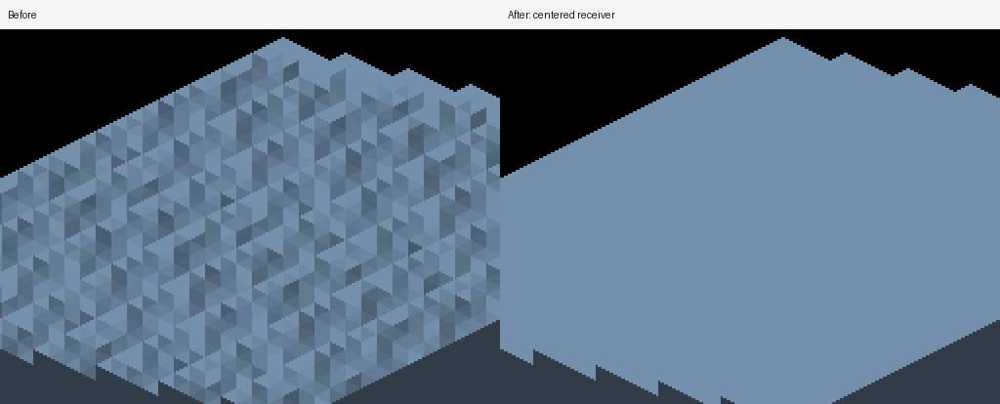
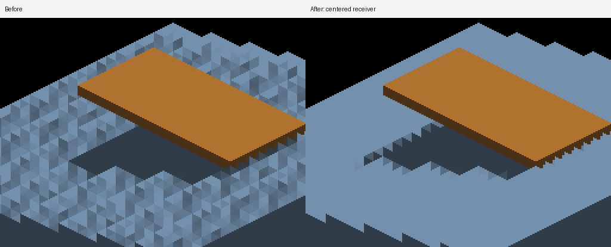

# Centered detached lighting receivers

Detached revoxelized canvases recover a raster position from iso coordinates and
stored depth. The raster uses corner coordinates, while voxel occupancy and full
sun-face casting use centers with bounds at center ±0.5. Lighting now subtracts
`kVoxelRasterCellAnchor` after subdivision normalization and before applying
`detachedViewToWorld`. Subtracting after rotation would put the correction in the
wrong frame. This applies to both rectangular and local-triangle world receivers.
Screen-locked canvases and shared GRID reception do not enter this branch.

The change is one vector subtraction per receiving trixel on both backends. It
adds no buffers, dispatches, uploads or shadow taps. Normal decoding, ambient,
shadow bias and the filter remain unchanged. World light-volume sampling shares
the corrected position; these captures isolate sunlight and do not validate an
emissive light-volume scene.

## Discriminating controls

At yaw 180°, the unblocked staircase has broad -Z treads without an upstream
blocker. The normal overlay is uniform on those treads. Before the correction,
shadows introduce 148,224 changed pixels compared with shadows disabled, with up
to 68 blue-channel levels of false darkening. Afterward the entire frame is
pixel-identical to shadows disabled. The same equality holds at all four cardinal
views. This distinguishes a receiver-coordinate defect from legitimate different
normals on rotated staircase faces.

The overhead blocker still produces ambient-only shadow. The existing analytical
staircase oracle is unchanged: blocked RGB (48,60,72), outside RGB (115,144,173),
every pixel in each 5×5 region within two levels. Its recipe now also documents
the detached local-triangle fixture, whose sample regions lie safely inside the
same authored planes. The old detached outside control fails by 25 levels; both
corrected regions pass with zero error. The wall/plate self-occlusion fixture also
passes all three existing checks at yaw 180°.





## Reproduction and evidence

Metal, Apple M4 Max, 2560×1440, fixed origin/pan, default sun and albedo. Baseline
is `989c59cfd1d181731d73644c9c9c29e6b2b80aa2`; final shader diff only adds the
center correction. Every capture run ended `RESULT=CLEAN`.

```sh
fleet-run --timeout 120 IRCanvasStress --only shadowocclusion --probe-staircase --local-trixel-display --pivot-origin --no-spin --no-auto-rotate --no-ao --subdivisions 1 --zoom 4 --auto-screenshot 6 --sweep-yaw 3.14159265 3.14159265 1 --source-face-shadows
python3 scripts/render-sun-occlusion-metric.py --staircase docs/pr-screenshots/codex/detached-receiver-planes/capture-501.png
python3 scripts/render-sun-occlusion-metric.py --staircase --unblocked docs/pr-screenshots/codex/detached-receiver-planes/capture-500.png
```

Evidence directory: `docs/pr-screenshots/codex/detached-receiver-planes/`.
All staircase captures use the recipe above with these changes:

| Captures | State | Changes to recipe |
|---|---|---|
| 494–496 | Baseline | yaw 180/202.5/225°, copied from parent evidence |
| 497 | Baseline | `--probe-unblocked` |
| 498 | Baseline | `--probe-unblocked --no-shadows` |
| 499 | Baseline | `--probe-unblocked --debug-overlay normals` |
| 500 | Corrected | `--probe-unblocked` |
| 501–503 | Corrected | yaw 180/202.5/225° |
| 504–507 | Corrected | `--probe-unblocked`, yaw 0/90/180/270° |
| 508 | Corrected | `--probe-unblocked`, omit `--source-face-shadows` |
| 509 | Corrected | omit `--source-face-shadows` |
| 510–513 | Corrected | `--probe-unblocked --no-shadows`, yaw 0/90/180/270° |
| 514–517 | Corrected | wall/plate: omit staircase and local display flags; zoom 1, yaw 0/90/180/270° |
| 518 | Baseline shaders restored temporarily | omit `--source-face-shadows` |
| 519 | Baseline shaders restored temporarily | `--probe-unblocked`, omit `--source-face-shadows` |

The actual private density is 1 at zoom 4. Intermediate-angle frames demonstrate
remaining voxel stair edges; they are not a smooth-source reconstruction oracle.
`comparisons.txt` records full-frame RGB differences and `metrics.txt` retains
both passing and failing controls. The default depth caster is still wrong with
the blocker present: the outside patch fails by 101 levels before and 51 after.
Its unblocked image remains identical before/after. Its world-placed resolve
still uses uncentered depth samples; reconciling that producer remains separate
work. Local volume, higher actual densities and OpenGL remain unverified here.
