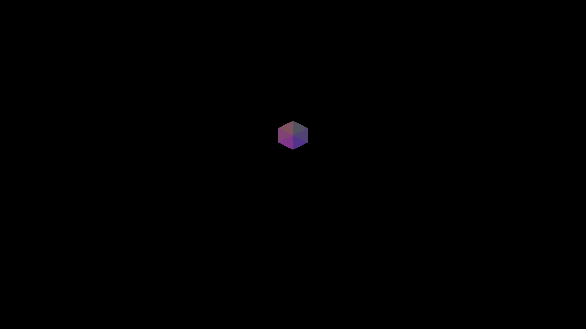
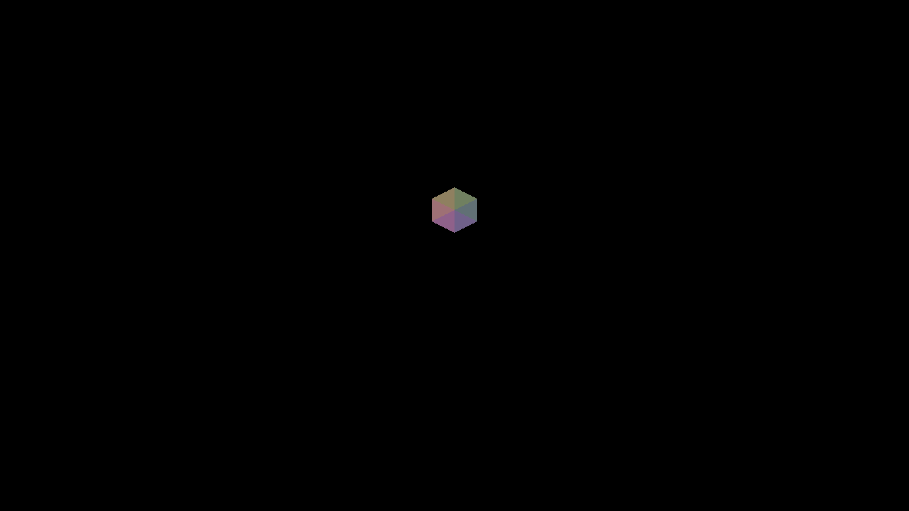
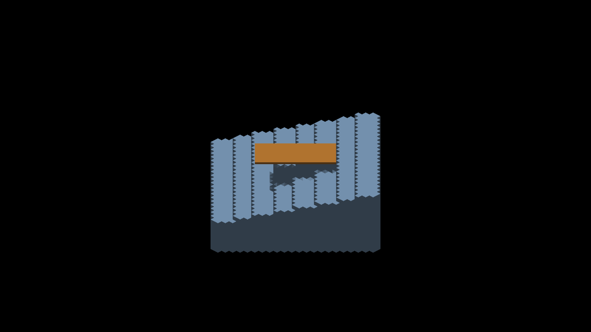

# Detached shadow receiver sample positions

The `receiver_position` diagnostic displays the actual world-space lighting
sample relative to its detached canvas raster origin: `RGB = position / 4 + 0.5`.
That origin includes the raster-phase correction when present; it equals the
owner position in the isolated unit-voxel fixture. Values
outside [-2,2] saturate in the color target, so the numerical oracle uses the
isolated unit voxel. Main/per-axis regular samples are black in this diagnostic;
overflow faces retain their existing albedo behavior. This is not a general
world-position buffer or a probe for non-receiving screen-locked canvases.

Normal `LOCAL_TRIANGLES` receivers use the displayed triangle centroid, with
the resampling phase carried through raster placement, depth, lighting and
resampled casting. Finite caster depths carry a distinct provenance tag and
are compared on the receiver plane at the nearest sun-map sample, without a
normal displacement or coverage filtering. Legacy point samples retain their
filtered comparison. Main/GRID and raw-debug receivers retain the legacy
sampler until their surface reconstruction has a corresponding contract.

See [surface sampling adoption](surface-shadow-sampling.md) for current evidence.
The experiments below document why centroid recovery alone was insufficient.

## Geometric check

Each visible square face of the centered unit cube is split into two triangles.
The oracle averages their three vertices to obtain the expected centroid, rotates
it into world coordinates, and samples the diagnostic at its screen projection.
It does not copy the renderer's inverse iso formula, parity selector or depth
decode. Six samples cover both orientations of all three faces. Native Metal
captures at 0/22.5/45/67.5/90 degrees fail all 30 checks with the original receiver
and pass all 30 exactly with the correction. Color quantization tolerance is one
level. A single-cell result does not validate high-density faces, full SO(3),
arbitrary geometry, or complete shadow boundaries.

The original receiver combined the stored trixel index with the depth of the face
origin. In the undilated local layout, the displayed triangle's centroid instead
has iso displacement `(f - 1, -1)` and depth displacement `+1`, where `f` is
1/3 or 2/3 according to local parity. Inverse projection gives the correction
`(1 - f/2, f/2, 0)` in raster units. Divide by effective density before the
center-anchor subtraction and view-to-world rotation. Integer microcell origins
have even iso parity, so subdivision does not change the orientation rule.

This moves the samples onto the correct face centroids without changing normals,
bias, filter taps, geometry, dispatches or allocations. It still assigns one
lighting value to a whole trixel; exact boundaries crossing a triangle require
additional coverage work.

## Historical centroid-only rejection

The same source-face shadow route, sun and detached staircase distinguish the
caster representations:

| Corrected receiver experiment | Capture | Existing staircase metric |
|---|---|---|
| No roof | 631 | Both regions pass, maximum error 0 |
| Voxel roof, finite face projection | 632 | Both regions pass, maximum error 0 |
| Analytic roof, depth-point splats | 628 | Blocked region passes; outside region fails by 41 levels |

The existing tolerance remains two levels. The analytic outside region's center
is lit but part of its 5x5 patch is falsely darkened. Before this experiment the
same patch passed with maximum error 1. This isolates a remaining interaction
with analytic caster coverage rather than justifying a larger bias or looser
threshold. The receiver correction alone is not an acceptable finished fix.

At 225 degrees, experimental capture 630 still has triangular shadow boundaries
and the known staircase geometry teeth. It is diagnostic evidence, not a visual
acceptance screenshot. The next implementation must reconcile analytic finite
coverage and receiver positions, then check oblique boundaries against geometry.

## Reproduction

Baseline: `bc0294535` plus the retained `baseline-instrumentation.patch`.
The diagnostic-only PR retained the same diagnostic; applying `centroid-correction.patch`
enables the rejected-for-adoption experiment on both backends. Both patches and
all PNGs are under `docs/pr-screenshots/codex/detached-shadow-receiver-samples/`.
Captured on Metal, Apple M4 Max, 2560x1440, output scale 2. Every capture run
exited cleanly. OpenGL runtime remains unverified.

```sh
fleet-run --timeout 120 IRCanvasStress --only shadowbox --probe-single-voxel --pivot-origin --no-spin --no-auto-rotate --no-ao --no-shadows --subdivisions 1 --zoom 16 --debug-overlay receiver_position --auto-screenshot 6 --sweep-yaw 0 1.57079633 5
python3 scripts/render-receiver-position-metric.py capture.png --yaw 45
```

Baseline captures 618–622 fail; experimental 623–627 pass. Full results are
`baseline-metrics.txt` and `corrected-metrics.txt` alongside the PNGs.

```sh
fleet-run --timeout 120 IRCanvasStress --only shadowocclusion --probe-staircase --probe-analytic-blocker --pivot-origin --no-spin --no-auto-rotate --no-ao --subdivisions 1 --zoom 4 --auto-screenshot 6 --sweep-yaw 3.14159265 3.92699082 3 --source-face-shadows
python3 scripts/render-sun-occlusion-metric.py capture.png --staircase
```

Analytic captures 628–630 use 180/202.5/225 degrees. Omit the analytic flag for
voxel-roof captures 632–634. Capture 631 adds `--probe-unblocked`, omits the
analytic flag and uses a one-shot sweep at pi. The metric only applies at pi.
The retained `before-staircase-225.png` is merged capture 610. Final production
capture 636 uses the same two-shot 180/225-degree recipe and is RGB pixel-identical
to capture 610 after removing the experimental correction. The diagnostic-only
change therefore preserves this ordinary rendering case.






