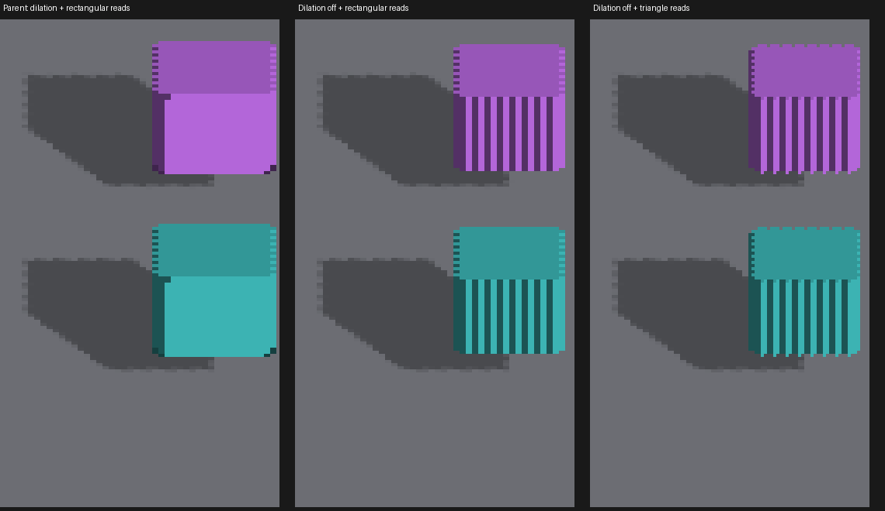
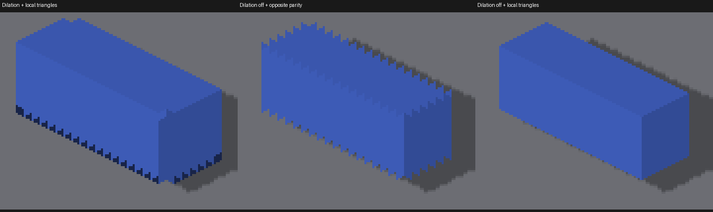

# Detached trixel display investigation

The purple and cyan probes reveal two different problems: rectangular display
of the stored trixels, and camera-dependent reconstruction of the voxel surface.
The second problem also affects lighting normals and agreement with
[authored-face shadows](authored-voxel-shadow-faces.md). Neither problem is fixed
by this investigation; production shaders remain unchanged.

## What the renderer does

`f_trixel_to_framebuffer.glsl::main` and the Metal fragment twin read color,
depth and priority at the raw canvas coordinate. The triangle-selection helper
`trixelFramebufferSamplePosition` is used for hover/picking only. Thus the
detached canvas really is displayed as rectangular texels. This is not a missing
fragment shader: the fragment shader runs, but selects rectangular coverage.

The attached orange control follows the per-axis scatter path, which reconstructs
and deforms face quads. Detached revoxelization instead inverse-samples a lattice
after composing entity and inverse-camera rotation. Its raster deliberately uses
cardinal faces; adding the entity rotation again would double-transform them.
At the upright 45-degree view, the resulting surface contains alternating voxel
face orientations where the authored cube has one planar face.

Both voxel raster stages also dilate revoxelized faces along their in-plane iso
steps. Removing those taps exposes alternating shaded strips in the 45-degree
view. These strips are colored faces, not proof of missing coverage. The existing
dilation masks much of that structure and expands the silhouette.

## Native experiments

Baseline commit: `7be2c93c040abab7d5330fe284332632f30418e5`.

Metal, Apple M4 Max, 2560×1440, subdivisions 1. Every experimental run exited
cleanly. These are diagnostic captures of temporary shader changes, not shipped
behavior. All experimental shader edits were restored afterward.



The columns show the parent behavior, dilation disabled with rectangular reads,
and dilation disabled with local-canvas triangle reconstruction. Crops use nearest-neighbor
magnification. At 45 degrees, triangle reconstruction does not turn the resampled
voxel surface into the attached control's planar surface.

The reconstruction experiment used the canvas origin parity `(z1.x + z1.y) & 1`,
without world placement. Detached voxel writes use zero camera offset. The gather's
existing hover parity incorporates `canvasOffset`, which is a separate coordinate
contract and cannot simply be reused for this display experiment.



At yaw zero and zoom 2, disabling dilation and selecting local triangles produces
cleaner diagonal boundaries. The opposite parity produces repeated teeth. Keeping
dilation with triangle selection also leaves boundary artifacts. A corrected
triangle selector alone therefore does not establish a safe replacement.

Commands used for the scene and magnified control:

```sh
fleet-run --timeout 120 IRCanvasStress --only revox,shadowattached,floor --no-spin --no-auto-rotate --no-ao --subdivisions 1 --zoom 0.65 --auto-screenshot 6 --sweep-yaw 0 1.57079633 5 --source-face-shadows --probe-upright
fleet-run --timeout 120 IRCanvasStress --only shadowbox,floor --no-spin --no-auto-rotate --no-ao --subdivisions 1 --zoom 2 --auto-screenshot 6 --sweep-yaw 0 0 1 --source-face-shadows
```

The first command reproduces the parent behavior in the current tree. To reproduce
the experiments, disable the `reVoxelize` dilation branches in both stage bodies
and their Metal twins. In the Metal gather, select color/depth/priority using
`trixelFramebufferSamplePosition(originRaw, (z1.x + z1.y) & 1)` on the world-placed
detached probe; leave other canvases untouched. The opposite-parity control adds
one before masking. The box comparison's dilation control retains the original
stage bodies. These recipes are for investigation, not production configuration.
Exact patches are retained beside the captures: `no-dilation.patch` (capture 114),
`no-dilation-local-triangles.patch` (119 and 124), `local-triangles.patch`
(122), and `no-dilation-opposite-triangles.patch` (123). Apply each separately
to the baseline commit and rebuild before running; do not combine them.

## Next implementation and acceptance

Keep this work ahead of the CPU occupancy optimization. The visible coverage
needs to preserve projected source faces, with depth and normal recovery in the
same frame as shadow casting. Reuse the resident source occupancy grid; avoid
allocating three full private canvases per entity. Triangle display needs an
explicit canvas-layout contract rather than inferring it from depth-scale fields.

Acceptance requires more than the existing color-presence check:

- A magnified isolated voxel must display the intended triangular cells, with
  color, depth, priority and picked entity referring to the same surface.
- Upright attached and detached cubes must retain corresponding planar faces at
  yaw 0, 22.5, 45, 67.5 and 90 degrees, without alternating edge strips.
- Tilted cubes and the carved rainbow probe must preserve exposed faces and
  concavities; removing visible risers indiscriminately is not a valid fix.
- World placement, screen locking, odd canvas offsets, zoom/density changes and
  camera pan must preserve coverage and depth ordering.
- Re-run the shadow box oracle after visible geometry changes: the current
  source shadow may still disagree with a resampled receiver at contact.

The [earlier parity investigation](trixel-parity-shift-442-investigation.md)
documents the rectangular-read contract and a sawtooth regression. These captures
do not overturn its backend parity finding; they show why matching existing
rectangular output is insufficient as a triangular-display correctness oracle.
