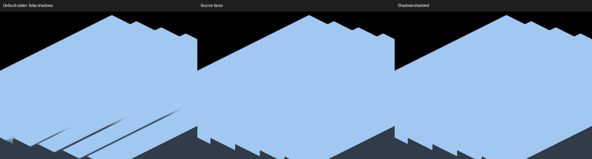
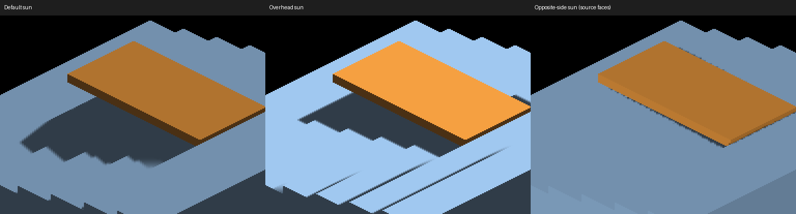

# Lighting direction probes

`IRCanvasStress --sun-direction x y z` sets a world-to-sun vector independently
of the camera. Positive Z points down; the sun requires z <= 0. The default
remains (-0.42,-0.60,-0.55). Zero, nonfinite and below-ground vectors warn and
fall back to that default. Scaling before the renderer's normalization avoids
length overflow for large finite inputs. `LIGHTING-PROBE` logs the normalized
vector and shadow/AO switches once at setup. `--no-lighting` bypasses this setup.

## New geometric acceptance case

An unblocked stair-stepped solid under exactly overhead sunlight must not cast
shadows on its own exposed horizontal treads. Those treads have no material above
them; edge-on risers have zero projected area. Use the existing paired source-face
caster and shadows-disabled controls, without averaging normals or blurring edges.

```sh
fleet-run --timeout 120 IRCanvasStress --only shadowocclusion --probe-staircase --probe-grid --probe-unblocked --pivot-origin --no-spin --no-auto-rotate --no-ao --subdivisions 1 --zoom 4 --auto-screenshot 6 --sweep-yaw 3.14159265 3.14159265 1 --sun-direction 0 0 -1
```

Capture 554 uses default casting; 555 adds `--source-face-shadows`; 556 instead
adds `--no-shadows`. Native Metal, 2560x1440: default differs from disabled in
3,808 RGB pixels (maximum channel difference 168); source faces match disabled
exactly. This is a retained failure, not a renderer fix in this slice.



The default bake expands reconstructed depth points into uniform coverage boxes.
Expansion of edge-on geometry is a hypothesis for the stripes, not established
provenance. Filtering every encoded face slot by its light incidence is unsafe:
world-placed resolve output carries a source slot that need not encode the true
world normal. Any coverage correction must distinguish those input contracts.

## Captures and validation

Full frames and RGB comparisons live under
`docs/pr-screenshots/codex/lighting-direction-probes/`. Crops retain native pixels.
Parent revision: `09e4a8740a84739970288664df6691ba9a6771c1`.

| Captures | Configuration / result |
|---|---|
| 538 / 550 | Parent/current blocked GRID staircase, default direction; RGB-identical |
| 551 / 552 | Blocked GRID staircase, overhead default/source-face casting |
| 553 | Blocked GRID, opposite-side (0.42,0.60,-0.55), source-face casting |
| 554–556 | Unblocked overhead default/source/disabled controls described above |
| 557–559 | Unblocked GRID, zero / NaN / below-ground direction; all RGB-identical fallback |

For blocked captures remove `--probe-unblocked` from the recipe. For opposite-side
lighting replace its direction and add `--source-face-shadows`. The older numerical
occlusion metric assumes the original sun and fixed shadow locations; do not apply
it to these changed directions without rederiving its expected values and probes.



Native build and all capture runs exited cleanly. Default and invalid-input
comparisons validate the new control; overhead comparisons diagnose a preexisting
coverage failure. OpenGL remains unverified. Grazing and detached angle sweeps,
actual caster provenance and receiver reconstruction remain visual work.

## Rejected receiver experiment

Before adding the control, both shader samplers were temporarily changed to use
the receiver-plane comparison for direct taps as well as spread taps. Capture 549
was RGB-identical to 538, retaining the default-light GRID outside-region error
of 8 against tolerance 2. The experiment was reverted completely; no shader
change is included. It did not explain that failure and is not a geometry fix.
