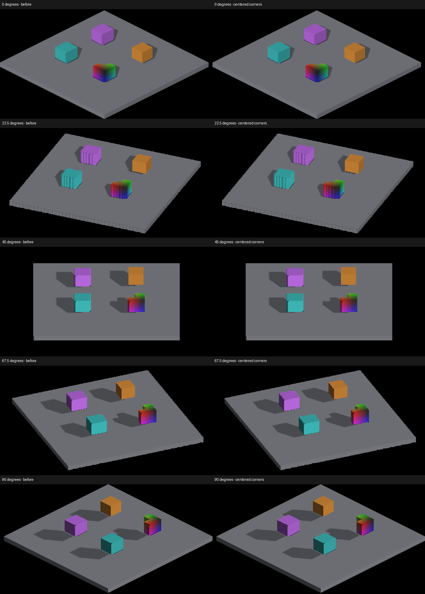

# Rendering audit worklist

Finish visual correctness before the next optimization round. Then profile the
changed paths and other bottlenecks, consolidating logic and improving robustness
against measured costs and the visual controls. Keep the agreed work in this order. A diagnostic experiment is not an implemented
fix, and a small native scene does not establish fleet-scale rendering throughput.

## Current shadow investigation

- [Caster/receiver plane agreement](surface-shadow-sampling.md) removes false
  shadow bands on the two resampled cubes at 45° and 135°. The strict eight-yaw
  comparison improves four views without increasing errors in the other twelve;
  remaining errors are explicitly retained in its evidence. This is not complete
  finite shadow coverage.
- [Strict floor-edge evidence](../pr-screenshots/codex/floor-shadow-plane-sampling/README.md)
  now catches all four cardinal failures missed by aggregate shadow IoU. The
  caster-plane PCF experiment was pixel-identical and rejected. Exact fixture
  visibility per fragment passes all quadrants; per-trixel visibility retains
  small edge failures. Fix map/receiver sampling and carry boundary geometry
  through presentation. The strict oracle now requires measured density and
  known projection instead of inferring precision from SDF floor bounds.
- Next: resolve finite sampling misses and small GRID floor-shadow boundaries
  across quadrants against ray/face geometry, preserving legitimate partial faces.
- Keep six oriented face normals, twelve geometric half-faces, coordinate basis
  and screen parity distinct; see the [identity contract](trixel-face-reconstruction-validation.md#oriented-face-identity-versus-screen-parity).
- Then resume density/rotation GPU profiling and population scaling; native Metal
  correctness evidence does not establish OpenGL runtime parity or a frame-rate target.

## Agreed work

| Priority | Work | State / next acceptance |
|---|---|---|
| 1 | Detached face geometry and trixel display | Investigated in [display diagnosis](detached-trixel-display.md). Visible source faces, depth and picking still need a consistent projection. Origin and camera placement corrected. [Back-facing emission](detached-face-normals.md) now has a targeted correction and normal oracle; [Local triangular display](detached-local-triangles.md) is the normal undilated display with a per-face oracle; raw rectangular display is debug-only. Source-face reconstruction and depth/picking remain. |
| 2 | Shadow reception and contact | [Direct-sun occlusion response](sun-occlusion-response.md) now removes direct sunlight behind opaque blockers while retaining ambient. Paired self/external controls pass. Receivers still use reconstructed surfaces; [Staircase near-rejection](staircase-shadow-visibility.md) no longer erases close external blockers. Check remaining concave faces, false self-shadowing and contact against actual geometry. |
| 3 | Projected face boundaries | Reconstruct voxel-face coverage from light direction and receiver geometry. [Sun sample alignment](sun-sample-centers.md) now follows texel centers without adding filter taps. Clean edges must follow projected geometry, not blur, inflated coverage or bias that hides errors. |
| 4 | Duplicate CPU occupancy reconstruction | [Upload ownership](detached-mask-upload-path.md) now skips CPU reconstruction when inverse GPU resampling owns masks. Identity and buffer fallback retain reconstruction; ten native comparisons are unchanged. Measure population cost next. |
| 5 | Mode and scale validation | Extend density, screen-lock, pan, cascade, sparse/elongated asset and OpenGL coverage. Measure representative large populations and GPU cost before changing defaults. |

Attached probes and corrected authored probe placement are already in the stack.
The source-face shadow paths remain opt-in. Ready-for-review PRs do not imply
that the experimental rendering is ready to become the default.

## Proposed follow-ups discovered during this work

| Priority | Finding | Evidence / next check |
|---|---|---|
| High, within geometry | Detached centroid changes with camera yaw | Camera correction now uses framebuffer-pixel precision with Y-up placement; see [pan evidence](detached-camera-placement.md). Dilation asymmetry and resampled face geometry remain separate errors. |
| Medium, within geometry | Detached dilation expands the visible box | At yaw zero, zoom 2, its area is 1.219× the analytical box. The origin fix leaves that ratio unchanged. Preserve concavities when replacing dilation. |
| Medium, validation | Small-voxel and picking coverage | [Magnified single-voxel control](single-voxel-display-probe.md) now distinguishes detached failure from a 5/5 passing GRID control. Triangle-ID/face-color assertions and a picked-surface oracle remain. The detached composite explicitly disables hover readback, so picking needs implementation. |
| High, within scale validation | Detached composite has a 512-instance limit | `ENTITY_CANVAS_TO_FRAMEBUFFER` stops collecting after `kMaxEntityCanvasInstances`. Raising the limit alone does not meet the entity-count target; design and measure batching/culling for private canvases separately from attached GRID entities. |
| Medium, camera | Depth-derived pivot jumps during noncardinal pan | A zoom-16 isolated voxel jumps about 32 screenshot pixels as the default pivot changes. Verify with fixed-pivot controls; separate camera focus behavior from detached display. |
| Medium, validation | Density-dependent receiver calibration | The small SDF plate needs its smooth boundary convention accounted for at zoom 16. The new fixture does so; generalize the older large-box calibration before using it to judge other densities. |

## Newly observed during local-triangle validation

- The 225-degree staircase still has triangular teeth with normal fragment
  reconstruction and shadows disabled (analytic coexistence captures 610/612).
  Raw-debug capture 611 exactly reproduces historical rectangular capture 585.
  Resolve occupancy and face-boundary reconstruction; changing display defaults
  alone does not fix this geometry, and blur is not an acceptable substitute.

- Repeated identical upright captures differ in 104–952 pixels confined to the
  rainbow probe with triangle mode disabled. Investigate color/depth winner
  determinism before treating this probe as a strict pixel reference; the cause
  is not established. Retained comparisons: `codex/detached-local-triangles`.
- Actual private density 12 was exercised with the smallzoom fixture, but its
  high-density face coverage still needs a numerical oracle. Requested
  subdivisions alone must not stand in for measured effective density.

## Newly observed during occlusion validation

- [Regular demo coverage](canvas-stress-shadow-gaps.md) reproduces the user's
  four red/green/blue/yellow GRID cubes: default shadows have long interior
  gaps, while finite face casting closes them at the matching camera angle
  and at effective densities 1 and 4. This is still an opt-in path, not a
  default-path fix. Retain these cubes alongside detached revox coverage.
- The same investigation preserves a raster-phase/centroid experiment that
  removes unblocked false shadows at cardinal angles and actual density 2.
  It exposes a real thin-roof miss caused by the existing normal offset.
  Zero offset reduces the blocked error from 101 to 5 but still fails the
  unchanged tolerance of 2. Both patches are retained, not adopted. Resolve
  receiver location and finite boundary sampling together before promotion.
- [Finite analytic box casting](analytic-box-sun-coverage.md) now replaces BOX
  depth splats in the opt-in face-shadow path. Detached and GRID staircase
  outside controls both pass with zero error; rotated/fractional box hulls
  pass 4/4. The nearly hidden unrotated analytic box shadow remains below the
  unchanged IoU threshold (.668 versus .70); non-box shapes retain depth splats.
- Centroid sampling remains experimental: a broader unblocked sweep exposes
  source/raster half-cell disagreement (12,544 false-shadow pixels at yaw zero).
  Resampled face casting matches shadows-disabled exactly. The retained phase
  experiment corrects the cardinal case but exposes the nearby-blocker miss
  above. Check odd/even effective densities and fractional source bounds before
  adopting the combined correction.

- [Receiver sample positions](detached-shadow-receiver-samples.md): the current
  detached lookup fails all 30 triangle-centroid checks across five yaws. The
  derived correction passes all 30. Its original analytic-roof overcoverage
  (outside-patch error 41) is resolved by finite box casting; phase and nearby
  blocker sampling remain experimental as described above. Validate whole
  shadow boundaries before adoption.

- [Overhead direction controls](lighting-direction-probes.md) expose 3,808 false
  shadow pixels on unblocked GRID staircase treads with the default caster.
  Source-face casting matches shadows disabled exactly. [Footprint experiments](analytic-face-shadow-coexistence.md)
  establish that top-surface splats alone reproduce the error; radius zero removes
  it but fails box coverage. The default caster remains unfixed. Finite face
  footprints remain the intended correction, with no blur or normal averaging.

- [Analytic caster coexistence](analytic-face-shadow-coexistence.md) now preserves
  main-canvas SDF shadows alongside voxel/source-face casting. The detached roof
  control passes; the GRID outside patch retains an 8-level error and fails.
  Analytic finite coverage, non-main producers, and the 32 changed plate-edge
  pixels at three cardinal angles need validation before default adoption.
  Profile the added SDF depth pass and consolidate traversal in the optimization
  round after visual correctness.

- [Staircase visibility](staircase-shadow-visibility.md) is corrected: a nearby
  external blocker no longer loses its shadow at tread boundaries. The default
  depth caster still falsely shadows an outside control region, unlike full
  voxel-face casting. Resolve caster/receiver geometry agreement before treating
  the full lighting oracle as passing on that default path.
- The detached staircase at density 1 has alternating triangular shadow values
  on otherwise broad treads (capture 494 in the staircase visibility evidence).
  [Centered receiver recovery](detached-receiver-planes.md) removes the false
  pattern: four cardinal unblocked views now match shadows-disabled exactly,
  while the overhead shadow remains. Default depth casting and reconstructed
  face boundaries still need agreement with actual geometry. [Sample alignment](sun-sample-centers.md)
  also fixes the detached default-caster outside control; GRID retains an
  8-level error and still fails the unchanged 2-level tolerance.
- The unobstructed source-face plate has weak false self-shadowing at camera yaw
  90/270. Full direct visibility makes 1,048/16 pixels differ from the prior
  response, by at most 2/1 color levels. This is a receiver/caster agreement
  follow-up, not evidence that normals should be averaged or shadows blurred.
- Fully occluded direct sunlight previously retained 45% intensity, on top of
  ambient. That response is corrected; ambient is still a constant fill rather
  than physically traced indirect light. Local-light transport is a separate
  visibility audit.

## Origin correction evidence

The detached quad places the model origin by compensating for the canvas's
`(-1,-1)` texel origin offset. Texture Y increases down; framebuffer Y increases
up. Applying `(+texelX,-texelY)` instead of `(+texelX,+texelY)` removes the
two-texel vertical displacement without changing the depth key or caster geometry.
No buffer allocation, upload or draw is added.

The visible-box oracle projects the centered authored mass, with corners at
`±(halfCenterSpan + 0.5)`. It calibrates screen scale from the complete receiver
plate and uses no renderer depth samples. The shared projection hull/plate helpers
are also used by the existing shadow oracle; its thresholds and projection
conventions are unchanged in this slice.

At 2560×1440, yaw zero, zoom 2:

| Capture | Centroid error (pixels) | Visible area / expected | Placement |
|---|---:|---:|---|
| Original detached | (+0.5, -8.0) | 1.219 | Fail |
| Corrected detached | (+0.5, 0.0) | 1.219 | Pass |
| Attached GRID control | (+0.5, -1.0) | 1.002 | Pass |

`--placement-only` accepts at most two pixels of error per axis, allowing the
plate calibration/raster quantization. The default additionally requires silhouette
IoU ≥.95 and area ratio .95–1.05. All five GRID captures pass the default check;
the corrected detached silhouette still fails. These outcomes intentionally keep
the remaining geometry defect visible.

```sh
fleet-run --timeout 120 IRCanvasStress --only shadowbox,floor --no-spin --no-auto-rotate --no-ao --subdivisions 1 --zoom 2 --auto-screenshot 6 --sweep-yaw 0 1.57079633 5 --source-face-shadows
python3 scripts/render-visible-box-metric.py yaw0.png --placement-only
python3 scripts/render-visible-box-metric.py yaw45.png --yaw 45
```

Add `--probe-grid` to capture the attached control. Keep the complete plate in
view; the oracle is specific to this scene and does not validate arbitrary assets,
lighting, internal face boundaries or temporal stability.

Native Metal sweeps exited cleanly. Existing source-shadow checks remain 4/4 after
the placement change (yaw-zero IoU .712, the least margin). OpenGL runtime remains
unverified; the corrected C++ placement is shared by both backends.

Retained evidence: `docs/pr-screenshots/codex/visible-box-oracle/`. Capture 135
uses the original placement from baseline `a2c55707add8ba1a74d55091f17f203c92160084`;
125–129 use corrected detached placement at 0/22.5/45/67.5/90 degrees; 130–134
are the GRID controls at the same angles. Captures 136–140 are the corrected
four-probe scene. For example:

```sh
python3 scripts/render-visible-box-metric.py docs/pr-screenshots/codex/visible-box-oracle/capture-125.png --placement-only
python3 scripts/render-visible-box-metric.py docs/pr-screenshots/codex/visible-box-oracle/capture-132.png --yaw 45
```

## Centered shadow corners

The face-shadow kernel now subtracts `kVoxelRasterCellAnchor` from both source
and resampled cell positions before projecting corners. This aligns the occupied
mass with the visible renderer’s centered-voxel convention. The shadow oracle now
uses min(center)-0.5 and max(center)+0.5; its old lower-corner expectation was
part of the discrepancy, so earlier passes alone did not establish correctness.
No thresholds were relaxed. Neighbor occupancy, projected face size, dispatch
counts and buffer allocation are unchanged.

Native Metal box checks: source 4/4, GRID 4/4 and resampled detached 4/4. This
corrects the half-cell convention, not receiver reconstruction or large-scale
performance. Current captures 146–149 (source), 150–153 (GRID), 154–157
(resampled detached), and 158–162 (upright probes at 0/22.5/45/67.5/90 degrees)
are retained under `docs/pr-screenshots/codex/voxel-shadow-cell-anchor/`.



The comparison crops the same rectangle from full frames; left is captures
136–140 (parent), right is 158–162. Face striping at 22.5 degrees and rectangular
coverage at 45 degrees remain visible. Baseline source boxes 141–144 also pass
the corrected oracle: IoU .710/.938/.918/.887, versus .716/.943/.913/.876
afterward. These aggregate thresholds are not a precise contact-alignment test;
the correction follows the independently checked centered-mass convention.
