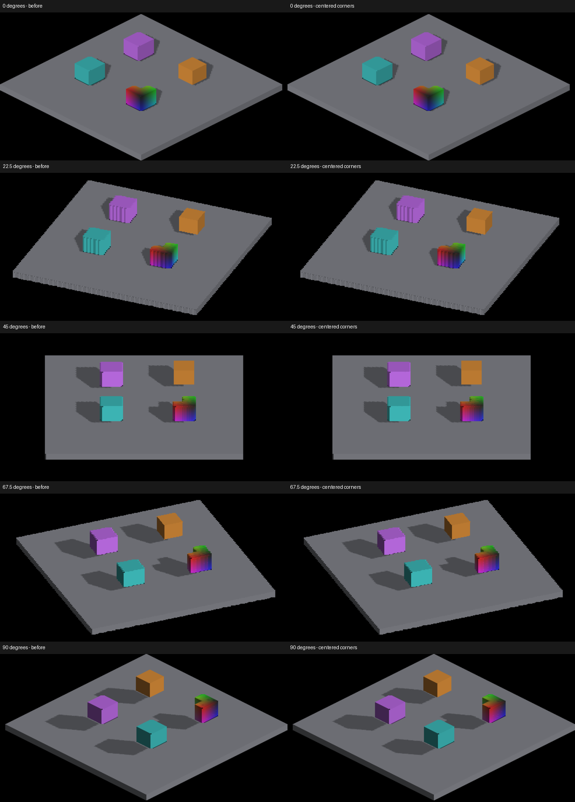

# Rendering audit worklist

Finish visual correctness before the next optimization round. Then profile the
changed paths and other bottlenecks, consolidating logic and improving robustness
against measured costs and the visual controls. Keep the agreed work in this order. A diagnostic experiment is not an implemented
fix, and a small native scene does not establish fleet-scale rendering throughput.

## Current follow-up: finite GRID face coverage

The [cardinal gather follow-up](../pr-screenshots/codex/scatter-boundary-ownership/README.md)
removes normalized-UV rescaling from canvas interpolation. Exact integer ray
checks across four cardinal views go from 2,848 incorrect output pixels to zero;
intermediate-angle images are unchanged. The four zero-tolerance gates run in
CanvasStress; original RGB references remain unchanged. The shared coordinate
contract lives in [trixel gather sampling](trixel-gather-sampling.md).

The [finite-face investigation](../pr-screenshots/codex/scatter-silhouette-edges/README.md)
replaces continuous GRID dilation/margin classification with exact hardware quads,
and removes whole-face rejection based only on the depth at face origins. The
independent orbit ray sweep closes all 673 interior missing samples; non-cardinal
silhouette overfill falls to zero. The strict yaw135° fixture has zero mismatches
without boundary tolerance. That finite-face change alone left cardinal output
unchanged; the gather follow-up above addresses it. This supersedes
the GRID margin policy and unresolved diagonal holes described in earlier entries.

The full-scene Debug control measures a cheaper scatter pass (0.080→0.066ms),
but whole-frame timing ranges overlap. Overflow grows 740→767 records with no
record drops. A 32³-entity paired control reduces scatter about 1.0→0.69ms
while overflow grows 75,166→88,647 with no drops; requested base 4 is capped to 2
during rotation. Neither workload establishes million-entity throughput. PR #3941 has Windows smoke; this follow-up still needs its own native
OpenGL presentation validation.

Next, in order:

1. Complete native OpenGL validation of finite faces and centered gather; isolate
   the remaining intermediate-angle boundary differences using actual capture
   poses and raster ownership rules. The ideal-angle diagnostic still counts
   15 wrong-face and four missing game samples; do not relax a gate to bless them.
   A centered-scatter projection experiment reduced the actual-pose diagnostic
   from 19 to 11 samples but introduced two differences at 22.5°; it was rejected.
   Establish hardware raster ownership with an independent GPU reference before
   treating an algebraically equivalent coordinate rewrite as a visual fix.
2. Profile conservative overflow emission on large rotating populations and high
   effective subdivisions. The scratch-layout follow-up removes the unused mask
   allocation and consolidates consumer offsets, with layout and native GPU-sort
   tests. Its [paired captures and profiles](../pr-screenshots/codex/peraxis-resolve-scratch-layout/README.md)
   preserve all 27 images and show no reliable frame-time gain in the fixed-45°
   262,144-entity control (19.247 → 19.323 ms steady Debug frames). Moving-camera
   and effective-density sweeps remain pending. Future occlusion must prove
   finite-footprint coverage.
3. Continue dense/incomplete sun-index and moving light/camera controls. Incomplete
   tiles still have approximate fallback; the full-pool reference is diagnostic.
4. Extend finite receiving to cardinal GRID and remaining eligible SDF/fog routes,
   coordinating active fog PRs and shared resource lifetimes before changing defaults.
5. Cover local spotlights and representative LOD scenes after these correctness
   and profiling controls. Keep actual occupancy steps; do not use blur to hide
   missing or misoriented faces.

The older sections retain their original validation limits and historical evidence.

## Session handoff: stack through #3931

Post-merge follow-up: all final stack CI checks passed and the additional fleet
recheck approved. Native Windows/OpenGL presentation smoke remains pending.
The [post-merge audit](../pr-screenshots/codex/postmerge-shadow-correctness/README.md)
separates valid orbit staircase bands from an actual back-facing +Z ownership
leak. The continuous per-axis face-selection fix removes that leak in all 17
tested yaw views while retaining cardinal behavior; strict silhouette-edge
acceptance remains incomplete. New native structural gates reject the former
backface and overflow-shadow diagnostic defects. Final CanvasStress validation
passes 13/13 checks with eight reviewed macOS reference refreshes and unchanged
thresholds; renderer tooling passes 59/59 suites. Dense 64/65-record camera
controls verify complete/incomplete index accounting, not exact fallback shadows.
PRs #3932 and #3936 own inherited reference refreshes; the proposed Fog overflow
reference still fails against the retained integrated capture, so do not treat
that PR as closing the visual debt without a fresh final comparison.

The stack integrates master `d29d1ccef2b791d650c6818013c89ea0c3a5007c`.
Review fixes add native OpenGL execution of the sun-index readback test, preserve
analytical-shape cascade depth and PCF bias through shared lighting composition,
and retain explicit zero-bias voxel queries and their mutation tests. The
experimental attached lighting and visibility prepass remain default-off.
The final debug-view correction shades overflow faces in shadow mode instead
of leaving their albedo visible. Eight Metal CanvasStress references record the
intentional receiver change; unchanged beauty controls and independent GRID
center-ray expectations support that refresh.

[Final captures and validation limits](../pr-screenshots/codex/stack-shadow-wrapup/README.md)
record the integration checks. These checks do not establish universal sharp-edge
correctness or million-entity throughput. Existing orbit banding and strict
silhouette deviations remain unresolved; image equality between two modes does
not make either image geometrically correct.

After merging, resume with these bounded tasks:

1. Diagnose the remaining orbit/face-edge artifacts with signed-face, depth and
   independent ray expectations; distinguish legitimate occupancy steps from
   wrong face ownership. Reconcile inherited fog/performance reference drift
   against intended geometry before changing those baselines.
2. Validate dense and incomplete sun-index tiles, moving camera/light transitions,
   local spotlights and native OpenGL presentation. Preserve exact finite
   footprint tests; the bounded full-pool reference is diagnostic, not a scalable
   production fallback.
3. Extend eligible continuous receiving to cardinal GRID and remaining SDF/fog
   routes while preserving actual voxel or revoxelized occupancy. Resolve shared
   resource lifetimes before removing the existing fog fallback.
4. Measure candidate visits, footprint misses and first-blocker position after
   visibility rejection, then profile proposed changes with counters disabled.
   Use representative populations, rotation and effective subdivision with
   separate CPU/GPU timings before selecting defaults or claiming scale.

The detailed entries below retain the implementation evidence and narrower
acceptance limits for each step.

## Current shadow investigation

- Implemented [per-axis caster position agreement](../pr-screenshots/codex/peraxis-shadow-caster-position/README.md):
  finite voxel faces now use the display's signed sixteenth-cell translation
  instead of the subdivision grid when per-axis rendering is active. Executed
  GLSL/Metal geometry controls cover six face directions and density changes;
  four native off-grid views change only floor shadows, while twelve control
  views are identical. This does not enable finite receiving on attached faces.
- Implemented [per-axis receiver centers](../pr-screenshots/codex/peraxis-shadow-receiver-centers/README.md)
  for regular and overflow faces. Both use `O - 0.5*positiveAxis`, continuous
  world depth and finite surface queries; all signed faces and encoded fractions
  are checked against displayed square geometry. Native stair controls improve
  while cardinal, shadows-disabled and isolated/mixed-caster cube controls remain
  identical. Incomplete tiles retain approximate fallback. Next, evaluate
  continuous receiver positions during presentation for boundaries crossing a
  face, and validate transitions to the cardinal route against ray geometry.
  The complete-tile cost control (36/41 peak candidates) increases the two
  affected GPU pass means by about 0.09/0.15 ms; frame ranges overlap. Profile
  worst-case complete tiles and larger populations before extrapolating, and
  retain a native camera-change/off-on GPU frame-upload assertion as follow-up.
  The profile runner now validates yaw and all-frame zoom bounds for static
  `IRCanvasStress` frame sweeps, including excursions that return to their initial
  zoom. Requested fractional zoom is not assumed to equal rendered zoom. Moving
  screenshot suites remain outside this static guard; camera translation and
  pitch/roll still need their own recorded witnesses.
- Implemented a [continuous per-axis diagnostic](../pr-screenshots/codex/peraxis-surface-shadow-probe/README.md)
  for regular and overflow faces. It validates the displayed point
  `P = O + eu*q.x + ev*q.y - kVoxelRasterCellAnchor` using the existing
  dilation-aware interpolated quad parameter, preserving signed face identity and
  the regular/overflow ownership rules. The native identity-frame ray oracle passes
  all four oblique quadrants: 208,344 tested sun-facing pixels, zero false or missed
  shadows. Normal interiors also agree, but strict outline checks retain 1/54/71/20
  extra silhouette pixels; do not report full geometry acceptance. Beauty captures
  remain pixel-identical in four quadrants. The production color path must retain
  linear ambient/local/sky and direct-sun terms separately before display
  mapping; multiplying already-lit RGBA8 color would incorrectly shadow other
  light sources. Reuse the source-face composition contract, account for fog,
  and measure storage and fragment-query cost before enabling it. Conservative
  margins outside the finite face need an explicit extension policy: the diagnostic
  marks them yellow and skips queries. Beauty integration, dense-index acceptance,
  cardinal transition validation and that margin policy remain pending.
- Consolidated [surface material preparation and explicit sun terms](../pr-screenshots/codex/surface-lighting-material/README.md)
  across regular/source, overflow and analytical-fragment lighting. AO/palette
  preparation is shared; the existing continuous source path names its linear
  ambient and direct-sun contributions. Ten native normal/sky controls remain
  pixel-identical. No attached beauty integration or extra GPU storage is added.
  Next compare retained lighting records with preserving albedo for presentation
  lighting: a capacity-sized two-vector payload would reserve 32 MiB for the
  sparse control's overflow lane alone, before its three regular axis regions.
  Include fog eligibility, margin handling and per-vertex repeated work in that
  decision rather than expanding buffers by default.
- Added an opt-in [attached presentation-lighting reference](../pr-screenshots/codex/peraxis-surface-lighting/README.md)
  that preserves existing albedo storage and shares analytical-surface lighting.
  Continuous finite-face sun queries replace face-center visibility; conservative
  margins sample the nearest finite-face point without changing coverage/depth.
  The independent sun-only beauty oracle rejects all four parent views (1,750
  errors) and passes all four enabled views (208,344 tested pixels, zero errors).
  Default-off, no-shadows and HDR sky controls remain pixel-identical. Readiness
  is published by the producer after preserving regular and overflow albedo;
  fog/debug/cardinal paths retain compute lighting. No dense per-face lighting
  payload is allocated. Shared ID-volume binding now satisfies both GL image and
  Metal render texture tables; native SPOT coverage remains pending.
  Three-run Metal controls show a wider-view GPU envelope increase from 5.190
  to 9.922 ms; zoom 4 has far fewer visible overflow faces and is not a scaling
  proof. Disabling shadows lowers the new scatter scope from 5.294 to 0.488 ms.
  Added [exact zero-contribution query gates](../pr-screenshots/codex/surface-shadow-query-gate/README.md):
  14 native views remain RGB-identical; three fresh run pairs reduce scatter
  scope from 5.308 to 5.198 ms and GPU envelope from 10.007 to 9.815 ms.
  This is modest and does not resolve the wider-view cost. A conservative
  [pre-division face rejection experiment](../perf/finite-shadow-query-pruning.md)
  preserves tested hits but shows no useful native speedup; shaders are restored.
  Added an opt-in [visibility prepass](../pr-screenshots/codex/peraxis-visible-lighting-probe/final/README.md)
  that shares one compiled fragment program and the regular/overflow draw sequence
  between visibility and lighting. Independent programs produced a one-band depth
  disagreement and foreground holes despite passing CPU controls; native captures
  now guard that distinction without widening the rejection threshold. Three-run
  same-binary Metal controls reduce the zoom-1 GPU envelope from 9.852 to 8.572 ms
  and scatter scope from 5.217 to 3.960 ms. All 26 final image comparisons are
  identical. Zoom 4 reduces the GPU envelope from 4.922 to 4.783 ms, while steady
  frame ranges overlap. Wider population scaling is not established; retained
  evidence includes the rejected first attempt.
  Storage follows internal framebuffer pixels (3.54 MiB in this fixture), not
  entity or face capacity. Both attached lighting and this extra pass remain
  default-off. Next measure candidate visits and dense/moving-camera workloads,
  including native OpenGL, before deciding adoption or routing.
  Added [subdivision and cardinal-lifecycle controls](../pr-screenshots/codex/visibility-subdivision-controls/README.md):
  nine yaw views at each base density 2, 4 and 8 remain RGB-identical with the
  prepass off/on. Near-cardinal controls exercise both park/unpark and
  release/reallocation. These controls cover global effective subdivision and
  composite depth scaling; per-axis face storage remains at base resolution.
  The profiler automatically records seven exact rendering-environment values,
  preserving unset versus empty and zero-valued flags without collecting unrelated
  environment data. Orbit-shape banding remains visible in both arms; image
  parity does not accept those existing visual defects. Validate dense/incomplete
  tiles, overflow and fog before default adoption; exact shadow-query cost remains
  substantial after this pass. Next instrument actual post-prepass candidate
  visits, footprint misses and first-blocker ordinal in diagnostic-only runs,
  then time any change with counters disabled. Consider delaying depth-coordinate
  loads until the unchanged footprint test accepts only if native evidence shows
  avoidable work; compilers may already do this. Coordinate shared sampler edits
  with the separate analytical-box self-shadow work.
- [Bounded overflow reference](../perf/bounded-source-face-reference.md) isolates
  the dense analytical-box teeth: identical geometry and tile tables regain
  clean floor edges when incomplete tiles query the complete small face pool.
  The reference remains default-off; its 256-record budget is a diagnostic
  boundary, not a scalable exactness guarantee.
- Prioritize the remaining receiver modes alongside index scaling. Attached
  GRID/per-axis and overflow faces now query finite geometry at face centers;
  the cardinal GRID route remains sampled. Eligible analytical boxes and
  continuous detached source faces evaluate finite queries during presentation.
  Validate displayed surface positions, normals and sub-cell phase before
  extending finite receiving. Revoxelized shapes must retain their actual
  occupancy steps. The [mode-routing audit](../perf/bounded-source-face-reference.md#rendering-modes-remain-distinct)
  separates these cases and sampled non-box SDF casters; no blur or enlarged
  footprint is an acceptance criterion.

- [Rigid SO(3) probes](../pr-screenshots/codex/rigid-voxel-rotation-probes/README.md)
  expose the existing continuous source-face path without revoxelizing. Fourteen
  single-voxel pose/camera checks pass; two nearly edge-on cases are inconclusive.
  [Multi-voxel occlusion controls](../pr-screenshots/codex/source-face-occlusion-oracle/README.md)
  pass all eight normal/visible-face checks but fail six of eight baseline shadow
  checks. Exact-ray fixture controls pass all eight; caster normals alone do not
  improve them. [Bounded finite source queries](../pr-screenshots/codex/finite-source-shadow-queries/README.md)
  now pass all eight shadow checks using actual transformed face footprints.
  Tile/record overflow retains approximate fallback; dense temporal transitions
  remain unverified. The mixed-source sampler regression now executes both
  backend surface loops with mutation controls; native tile/bake boundary
  coverage still needs a targeted fixture.
  [Rigid source casting](../pr-screenshots/codex/rigid-source-shadow-casters/README.md)
  now projects original transformed faces: 12 aggregate hull checks pass, while
  all 12 strict edge checks still fail. [Source-face reception](../pr-screenshots/codex/surface-shadow-receiver-controls/README.md)
  now samples continuous face centers; eight relative-position and four normal
  checks pass. The
  [continuous source-surface gate](../pr-screenshots/codex/continuous-source-shadow-oracle/README.md)
  rejects all eight prior face-center captures. The
  [fragment receiver implementation](../pr-screenshots/codex/continuous-source-face-lighting/README.md)
  now passes all eight with zero interior errors at unchanged tolerances. It
  interpolates original surface positions and combines direct visibility with
  separate linear lighting terms before tone mapping. Local-volume/sky/AO terms
  remain face-centered; dense overflow and temporal transitions still need coverage.
  Profile the 80-byte source records and per-fragment bounded queries before
  making any population-throughput claim.


- [Caster/receiver matrix](../pr-screenshots/codex/shadow-receiver-mode-matrix/README.md):
  16 mode pairs at eight yaws captured on Metal. The original matrix predates
  rigid source casting and receiving. Both now participate; intermediate GRID
  receivers show interior shadow gaps, and source/SDF contact controls retain
  boundary differences.
  Resolve those separately from silhouette aliasing. Add explicit participation
  and local-trixel versus continuous-surface sampling choices after their geometric
  contracts are validated; world placement and screen locking remain separate.


- [Caster/receiver plane agreement](surface-shadow-sampling.md) removes false
  shadow bands on the two resampled cubes at 45° and 135°. The strict eight-yaw
  comparison improves four views without increasing errors in the other twelve;
  remaining errors are explicitly retained in its evidence. This is not complete
  finite shadow coverage.
- [Strict floor-edge evidence](../pr-screenshots/codex/floor-shadow-plane-sampling/README.md)
  now catches all four cardinal failures missed by aggregate shadow IoU. The
  caster-plane PCF experiment was pixel-identical and rejected. Exact fixture
  visibility per fragment passes all quadrants; per-trixel visibility retains
  small edge failures. Fix map/receiver sampling and carry boundary geometry
  through presentation. The strict oracle now requires measured density and
  known projection instead of inferring precision from SDF floor bounds.
- [Receiver/query factorial controls](../pr-screenshots/codex/sdf-receiver-factorial/README.md)
  separate the known-floor experiment: receiver-only worsens all quadrants;
  query-only darkens almost the whole floor. Combined reduces total error but
  still fails all strict checks, with missed pixels at 180° rising from 19 to 48.
  Preserve winning surface location, normal and coverage together with the
  matching query contract; these hardcoded fixture patches are not a shipped fix.
- [Cascade receiver correction](https://github.com/jakildev/IrredenEngine/pull/3635)
  is deferred outside the merge-ready stack. Its axis derivation is sound, but
  the refreshed floor control still worsens at 180° from 12/266 to 19/356
  missing/excess pixels. The factorial captures use that experimental branch;
  they do not describe the current production baseline.

- [SDF surface contract](sdf-receiver-geometry.md): both shader interval solvers
  share continuous box intersection and signed normals, checked by an independent
  480,000-ray integer/fractional oracle per backend, but distinct planes
  alias to the same stored depth/slot. Preserve winning geometry through its
  last consumer; slot-derived normals cannot recover an analytical surface.
  This scalar gate does not accept the remaining rendered shadow failures.
- Next: resolve finite sampling misses and small GRID floor-shadow boundaries
  across quadrants against ray/face geometry, preserving legitimate partial faces.
- [Finite voxel queries](../pr-screenshots/codex/finite-voxel-shadow-query/README.md)
  retain projected GRID and revoxelized faces alongside rigid source faces.
  GRID casting onto a continuous source floor passes all four strict cardinal
  edge controls with zero errors. The [revoxelized oracle correction](../pr-screenshots/codex/revoxelized-shadow-oracle/README.md)
  accounts for its preserved lattice phase: cardinal captures at actual densities 1, 2 and 3
  pass all twelve strict controls, while pre-query captures still fail all four.
  Arbitrary revoxelized rotations and dense overflow remain unaccepted. SDF/GRID receivers still need
  continuous winning surface data through fragment presentation. Shared index
  capacity can reduce rigid-source exactness in dense scenes; test temporal
  overflow and larger populations before promoting this as a scalable solution.
- Keep six oriented face normals, twelve geometric half-faces, coordinate basis
  and screen parity distinct; see the [identity contract](trixel-face-reconstruction-validation.md#oriented-face-identity-versus-screen-parity).
- Default-scene context still contains visible banding/trixel artifacts in both
  parent and receiver-enabled captures. The independent frame and stepped
  octahedron oracle now isolates map-sampling failures from passing normal
  ownership and exact-ray controls. Resolve those failures before certifying
  self-shadows; preserve legitimate staircase occlusion.
- Then resume density/rotation GPU profiling and population scaling; native Metal
  correctness evidence does not establish OpenGL runtime parity or a frame-rate target.

## Agreed work

| Priority | Work | State / next acceptance |
|---|---|---|
| 1 | Detached face geometry and trixel display | Investigated in [display diagnosis](detached-trixel-display.md). Visible source faces, depth and picking still need a consistent projection. Origin and camera placement corrected. [Back-facing emission](detached-face-normals.md) now has a targeted correction and normal oracle; [Local triangular display](detached-local-triangles.md) is the normal undilated display with a per-face oracle; raw rectangular display is debug-only. Source-face reconstruction and depth/picking remain. |
| 2 | Shadow reception and contact | [Direct-sun occlusion response](sun-occlusion-response.md) now removes direct sunlight behind opaque blockers while retaining ambient. Paired self/external controls pass. Receivers still use reconstructed surfaces; [Staircase near-rejection](staircase-shadow-visibility.md) no longer erases close external blockers. Check remaining concave faces, false self-shadowing and contact against actual geometry. |
| 3 | Projected face boundaries | Reconstruct voxel-face coverage from light direction and receiver geometry. [Sun sample alignment](sun-sample-centers.md) now follows texel centers without adding filter taps. Clean edges must follow projected geometry, not blur, inflated coverage or bias that hides errors. |
| 4 | Duplicate CPU occupancy reconstruction | [Upload ownership](detached-mask-upload-path.md) now skips CPU reconstruction when inverse GPU resampling owns masks. Identity and buffer fallback retain reconstruction; ten native comparisons are unchanged. Measure population cost next. |
| 5 | Mode and scale validation | Extend density, screen-lock, pan, cascade, sparse/elongated asset and OpenGL coverage. Measure representative large populations and GPU cost before changing defaults. |

Attached probes and corrected authored probe placement are already in the stack.
The source-face shadow paths remain opt-in. Ready-for-review PRs do not imply
that the experimental rendering is ready to become the default.

## Proposed follow-ups discovered during this work

| Priority | Finding | Evidence / next check |
|---|---|---|
| High, within geometry | Detached centroid changes with camera yaw | Camera correction now uses framebuffer-pixel precision with Y-up placement; see [pan evidence](detached-camera-placement.md). Dilation asymmetry and resampled face geometry remain separate errors. |
| Medium, within geometry | Detached dilation expands the visible box | At yaw zero, zoom 2, its area is 1.219× the analytical box. The origin fix leaves that ratio unchanged. Preserve concavities when replacing dilation. |
| Medium, validation | Small-voxel and picking coverage | [Magnified single-voxel control](single-voxel-display-probe.md) now distinguishes detached failure from a 5/5 passing GRID control. Triangle-ID/face-color assertions and a picked-surface oracle remain. The detached composite explicitly disables hover readback, so picking needs implementation. |
| High, within scale validation | Detached composite has a 512-instance limit | `ENTITY_CANVAS_TO_FRAMEBUFFER` stops collecting after `kMaxEntityCanvasInstances`. Raising the limit alone does not meet the entity-count target; design and measure batching/culling for private canvases separately from attached GRID entities. |
| Medium, camera | Depth-derived pivot jumps during noncardinal pan | A zoom-16 isolated voxel jumps about 32 screenshot pixels as the default pivot changes. Verify with fixed-pivot controls; separate camera focus behavior from detached display. |
| Medium, validation | Density-dependent receiver calibration | The small SDF plate needs its smooth boundary convention accounted for at zoom 16. The new fixture does so; generalize the older large-box calibration before using it to judge other densities. |

## Newly observed during local-triangle validation

- The 225-degree staircase still has triangular teeth with normal fragment
  reconstruction and shadows disabled (analytic coexistence captures 610/612).
  Raw-debug capture 611 exactly reproduces historical rectangular capture 585.
  Resolve occupancy and face-boundary reconstruction; changing display defaults
  alone does not fix this geometry, and blur is not an acceptable substitute.

- Repeated identical upright captures differ in 104–952 pixels confined to the
  rainbow probe with triangle mode disabled. Investigate color/depth winner
  determinism before treating this probe as a strict pixel reference; the cause
  is not established. Retained comparisons: `codex/detached-local-triangles`.
- Actual private density 12 was exercised with the smallzoom fixture, but its
  high-density face coverage still needs a numerical oracle. Requested
  subdivisions alone must not stand in for measured effective density.

## Newly observed during occlusion validation

- [Regular demo coverage](canvas-stress-shadow-gaps.md) reproduces the user's
  four red/green/blue/yellow GRID cubes: default shadows have long interior
  gaps, while finite face casting closes them at the matching camera angle
  and at effective densities 1 and 4. This is still an opt-in path, not a
  default-path fix. Retain these cubes alongside detached revox coverage.
- The same investigation preserves a raster-phase/centroid experiment that
  removes unblocked false shadows at cardinal angles and actual density 2.
  It exposes a real thin-roof miss caused by the existing normal offset.
  Zero offset reduces the blocked error from 101 to 5 but still fails the
  unchanged tolerance of 2. Both patches are retained, not adopted. Resolve
  receiver location and finite boundary sampling together before promotion.
- [Finite analytic box casting](analytic-box-sun-coverage.md) now replaces BOX
  depth splats in the opt-in face-shadow path. Detached and GRID staircase
  outside controls both pass with zero error; rotated/fractional box hulls
  pass 4/4. The nearly hidden unrotated analytic box shadow remains below the
  unchanged IoU threshold (.668 versus .70); non-box shapes retain depth splats.
- Centroid sampling remains experimental: a broader unblocked sweep exposes
  source/raster half-cell disagreement (12,544 false-shadow pixels at yaw zero).
  Resampled face casting matches shadows-disabled exactly. The retained phase
  experiment corrects the cardinal case but exposes the nearby-blocker miss
  above. Check odd/even effective densities and fractional source bounds before
  adopting the combined correction.

- [Receiver sample positions](detached-shadow-receiver-samples.md): the current
  detached lookup fails all 30 triangle-centroid checks across five yaws. The
  derived correction passes all 30. Its original analytic-roof overcoverage
  (outside-patch error 41) is resolved by finite box casting; phase and nearby
  blocker sampling remain experimental as described above. Validate whole
  shadow boundaries before adoption.

- [Overhead direction controls](lighting-direction-probes.md) expose 3,808 false
  shadow pixels on unblocked GRID staircase treads with the default caster.
  Source-face casting matches shadows disabled exactly. [Footprint experiments](analytic-face-shadow-coexistence.md)
  establish that top-surface splats alone reproduce the error; radius zero removes
  it but fails box coverage. The default caster remains unfixed. Finite face
  footprints remain the intended correction, with no blur or normal averaging.

- [Analytic caster coexistence](analytic-face-shadow-coexistence.md) now preserves
  main-canvas SDF shadows alongside voxel/source-face casting. The detached roof
  control passes; the GRID outside patch retains an 8-level error and fails.
  Analytic finite coverage, non-main producers, and the 32 changed plate-edge
  pixels at three cardinal angles need validation before default adoption.
  Profile the added SDF depth pass and consolidate traversal in the optimization
  round after visual correctness.

- [Staircase visibility](staircase-shadow-visibility.md) is corrected: a nearby
  external blocker no longer loses its shadow at tread boundaries. The default
  depth caster still falsely shadows an outside control region, unlike full
  voxel-face casting. Resolve caster/receiver geometry agreement before treating
  the full lighting oracle as passing on that default path.
- The detached staircase at density 1 has alternating triangular shadow values
  on otherwise broad treads (capture 494 in the staircase visibility evidence).
  [Centered receiver recovery](detached-receiver-planes.md) removes the false
  pattern: four cardinal unblocked views now match shadows-disabled exactly,
  while the overhead shadow remains. Default depth casting and reconstructed
  face boundaries still need agreement with actual geometry. [Sample alignment](sun-sample-centers.md)
  also fixes the detached default-caster outside control; GRID retains an
  8-level error and still fails the unchanged 2-level tolerance.
- The unobstructed source-face plate has weak false self-shadowing at camera yaw
  90/270. Full direct visibility makes 1,048/16 pixels differ from the prior
  response, by at most 2/1 color levels. This is a receiver/caster agreement
  follow-up, not evidence that normals should be averaged or shadows blurred.
- Fully occluded direct sunlight previously retained 45% intensity, on top of
  ambient. That response is corrected; ambient is still a constant fill rather
  than physically traced indirect light. Local-light transport is a separate
  visibility audit.

## Origin correction evidence

The detached quad places the model origin by compensating for the canvas's
`(-1,-1)` texel origin offset. Texture Y increases down; framebuffer Y increases
up. Applying `(+texelX,-texelY)` instead of `(+texelX,+texelY)` removes the
two-texel vertical displacement without changing the depth key or caster geometry.
No buffer allocation, upload or draw is added.

The visible-box oracle projects the centered authored mass, with corners at
`±(halfCenterSpan + 0.5)`. It calibrates screen scale from the complete receiver
plate and uses no renderer depth samples. The shared projection hull/plate helpers
are also used by the existing shadow oracle; its thresholds and projection
conventions are unchanged in this slice.

At 2560×1440, yaw zero, zoom 2:

| Capture | Centroid error (pixels) | Visible area / expected | Placement |
|---|---:|---:|---|
| Original detached | (+0.5, -8.0) | 1.219 | Fail |
| Corrected detached | (+0.5, 0.0) | 1.219 | Pass |
| Attached GRID control | (+0.5, -1.0) | 1.002 | Pass |

`--placement-only` accepts at most two pixels of error per axis, allowing the
plate calibration/raster quantization. The default additionally requires silhouette
IoU ≥.95 and area ratio .95–1.05. All five GRID captures pass the default check;
the corrected detached silhouette still fails. These outcomes intentionally keep
the remaining geometry defect visible.

```sh
fleet-run --timeout 120 IRCanvasStress --only shadowbox,floor --no-spin --no-auto-rotate --no-ao --subdivisions 1 --zoom 2 --auto-screenshot 6 --sweep-yaw 0 1.57079633 5 --source-face-shadows
python3 scripts/render-visible-box-metric.py yaw0.png --placement-only
python3 scripts/render-visible-box-metric.py yaw45.png --yaw 45
```

Add `--probe-grid` to capture the attached control. Keep the complete plate in
view; the oracle is specific to this scene and does not validate arbitrary assets,
lighting, internal face boundaries or temporal stability.

Native Metal sweeps exited cleanly. Existing source-shadow checks remain 4/4 after
the placement change (yaw-zero IoU .712, the least margin). OpenGL runtime remains
unverified; the corrected C++ placement is shared by both backends.

Retained evidence: `docs/pr-screenshots/codex/visible-box-oracle/`. Capture 135
uses the original placement from baseline `a2c55707add8ba1a74d55091f17f203c92160084`;
125–129 use corrected detached placement at 0/22.5/45/67.5/90 degrees; 130–134
are the GRID controls at the same angles. Captures 136–140 are the corrected
four-probe scene. For example:

```sh
python3 scripts/render-visible-box-metric.py docs/pr-screenshots/codex/visible-box-oracle/capture-125.png --placement-only
python3 scripts/render-visible-box-metric.py docs/pr-screenshots/codex/visible-box-oracle/capture-132.png --yaw 45
```

## Centered shadow corners

The face-shadow kernel now subtracts `kVoxelRasterCellAnchor` from both source
and resampled cell positions before projecting corners. This aligns the occupied
mass with the visible renderer’s centered-voxel convention. The shadow oracle now
uses min(center)-0.5 and max(center)+0.5; its old lower-corner expectation was
part of the discrepancy, so earlier passes alone did not establish correctness.
No thresholds were relaxed. Neighbor occupancy, projected face size, dispatch
counts and buffer allocation are unchanged.

Native Metal box checks: source 4/4, GRID 4/4 and resampled detached 4/4. This
corrects the half-cell convention, not receiver reconstruction or large-scale
performance. Current captures 146–149 (source), 150–153 (GRID), 154–157
(resampled detached), and 158–162 (upright probes at 0/22.5/45/67.5/90 degrees)
are retained under `docs/pr-screenshots/codex/voxel-shadow-cell-anchor/`.



The comparison crops the same rectangle from full frames; left is captures
136–140 (parent), right is 158–162. Face striping at 22.5 degrees and rectangular
coverage at 45 degrees remain visible. Baseline source boxes 141–144 also pass
the corrected oracle: IoU .710/.938/.918/.887, versus .716/.943/.913/.876
afterward. These aggregate thresholds are not a precise contact-alignment test;
the correction follows the independently checked centered-mass convention.

## Mixed-source sampler regression

`python3 -m unittest discover -s scripts/tests -p test_render_mixed_source_shadow.py`
executes the surface depth-layer loop extracted from each production shader. A
source quad covers the map tap but misses the receiver ray; an independent plane
behind it must still occlude. The controls also require an exact miss to suppress
the source fallback, incomplete queries to retain that fallback, empty/behind/far
planes to stay lit, and both cascade offsets to preserve layer ownership. Three
mutants per backend must fail their designated cases: discarding the other layer,
accepting source fallback after an exact miss, and dropping overflow fallback.
This closes the scalar sampler-selection gap from the previous native overlap
experiment, which did not fail its negative control. It does not exercise GPU
atomics, tile population, final raster coverage or arbitrary rotated normals.

Concurrent work checked before this slice: #3595 owns graded rim diagnostics and
shared shadow-mask classification; #3588 refreshes screenshot references; #3584
bounds voxel-pool capacity; #3577/#3581 own million-entity profiling controls;
#3597 repairs OpenGL shader compilation and hosted performance comparisons.
Keep their work separate from finite-face correctness. In particular, a lower
rim-roughness score alone cannot establish correctness because eroding coverage
also lowers it; retain independent geometry/coverage gates.

## Shared face-coordinate math

[Projected-face consolidation](../pr-screenshots/codex/projected-face-math/README.md)
shares the determinant and inverse coordinate solve across display sampling,
voxel face shadow baking and finite source queries. Quadrants, reflection and
winding are tested; ten native captures preserve their baseline RGB exactly.
Keep coverage ownership and authored versus revoxelized geometry explicit. SDF
ray intersection is not a projected quad and retains its separate implementation.

## SDF receiver prerequisite: opaque ownership

[Deterministic SDF winner publication](../pr-screenshots/codex/sdf-winner-ownership/README.md)
selects one submitted sample at the winning depth before color/identity writes.
This closes the opaque tie race prerequisite. Surface position/normal storage,
fragment receiver recovery, X-ray overlay ordering, and bounded shared geometric
caster queries remain pending. Measure and reduce the extra SDF election cost
without returning to independently raced surface fields.

### Sharp-shadow acceptance and optional softness

The target across every rendering mode is sharp, unblurred, geometrically
accurate projected shadows. Audit existing PCF/filtering and expose any retained
artistic softness as an explicit setting with a zero-softness path. Validate
receiver and caster mode combinations with softness disabled; filtering must
not hide parity, coverage, depth or projection errors. Zero softness alone does
not repair undersampled shadow geometry.

Before merging deterministic SDF ownership as a default, account for its measured
GPU cost (roughly 0.95–1.04 ms to 1.97–1.98 ms in the overlap fixture). Follow
the measurement-first next step in the cost experiment below before selecting
another optimization, or explicitly accept the tradeoff. Also investigate the
demo's `--no-lighting` path omitting SDF geometry so future geometry-only
captures can exercise the same rendering modes.

### SDF cost experiment and sharp-shadow sampling audit

Surface-query reuse was [tested and rejected](../pr-screenshots/codex/sdf-surface-reuse/README.md):
full-frame RGB stayed identical, but timings do not justify up to 64 MiB of
additional lane scratch. Production ownership is unchanged. Next split GPU
measurement into depth, owner election and publication without overlapping
timer scopes; compare warmed cardinal and noncardinal poses before optimizing.
The analytic-sphere shadow fixture retains surface speckling in both arms;
include it in receiver-geometry/self-shadow validation.

The current `ir_sun_shadow_sample` GLSL/Metal twins mix distinct contracts:
source-face ray queries and finite surface footprints use unfiltered coverage,
while the remaining map path in `sampleCascadeShadow` uses weighted 2×2 PCF.
`sunCascadeKernelInterior` derives near- versus far-cascade selection from that
2×2 kernel footprint, and `worldSunShadowFactorImpl` blends cascades. An explicit
zero-softness path must re-derive the selection gate and audit the blend as well
as the taps; removing PCF alone neither repairs finite coverage nor proves sharp
transitions across cascades. Preserve off-screen caster coverage and receiver-plane
depth handling while unifying the geometry queries.

### SDF dispatch attribution implemented

[Separate non-nested SDF timers](../pr-screenshots/codex/sdf-pass-timing/README.md)
now measure owner clear, depth, election, publication and casting. Fixed-pose
Metal captures preserve pixels with timing enabled/disabled. In two shadowed
sphere runs, casting is the largest row (3.024/2.744 ms), while individual
raster rows range 0.363–0.790 ms. Next isolate finite box casting, non-box
depth fallback, resolve and bake within that casting bundle before selecting
a change. Ownership cost remains a merge consideration; these timing scopes
are not an optimization and do not fix sphere speckling or sharp-shadow geometry.

### Finite analytic-box casting optimized

[Separated casting scopes and bounded sample partitioning](../pr-screenshots/codex/analytic-cast-dispatch/README.md)
identify and reduce underutilization on large analytic boxes. Metal box casting
in the sphere/floor fixture falls from 1.028 ms to 0.046/0.059 ms with exact RGB
parity; a small-box control also improves. This is a dispatch-only optimization,
not a geometry or filtering fix. Mixed large descriptor populations may not
benefit because the bounded fanout returns to one group per descriptor.

Pending: ownership cost still needs its own decision; Windows validation; general
SDF receiver geometry and sphere self-shadow artifacts; sharp sampling across
PCF/fallback/cascade paths.

### Box-only fallback eliminated

[Box-only submission gating](../pr-screenshots/codex/box-only-cast/README.md)
skips non-box clear/raster/resolve/bake for all-box canvas batches. Six full-frame
Metal comparisons are pixel-identical, including four camera quadrants; the
mixed sphere/floor control retains all fallback stages. The removed rows total
0.269 ms in the parent small-box profile. This is workload-specific evidence,
not an end-to-end performance claim. Windows execution and the visual work above
remain pending.

### Sphere artifact separated from shadow sampling

[Lighting isolation controls](../pr-screenshots/codex/sdf-lighting-normal-frame/README.md)
show only 24 of 6,016 sphere pixels changing when shadows are disabled; the
remaining pattern maps exactly to the three face-slot normal classes. Treat the
dominant artifact as surface/normal reconstruction work, with the small shadow
delta still unresolved. Main-canvas smooth-yaw directional normals also use a
different frame from shadow-query normals. A broad canvas-level rotation was
rejected because secondary canvases can use different producers. Preserve elected
surface provenance before unifying the two consumers; retain true lattice faces
where that is the selected representation. No production fix is claimed yet.

### Main-canvas normal frame corrected

[Explicit main-canvas lighting routing](../pr-screenshots/codex/main-canvas-normal-frame/README.md)
aligns continuous-yaw slot normals with the shadow lookup, while excluding
secondary, detached and per-axis routes. Native normals match the independent
inverse-yaw color expectation, cardinal images remain identical, and shader
mutation controls pass. This is a frame conversion only: synthetic SDF face
selection and exact surface metadata remain unresolved.

For retained surface metadata, keep election scratch independent of publication.
A candidate compact depth/normal payload must carry the source half-face anchor,
retain continuous hit depth before quantization, and define world/model frame and
density. Invalidate on every geometry reset (including no-SDF frames), unsupported
winners and later non-SDF overpainting. Assess memory and bandwidth before choosing
this over retained per-canvas descriptors; neither option is implemented yet.

### Canvas descriptor lifetime retained

Canvas-owned [descriptor uploads](sdf-receiver-geometry.md#canvas-owned-descriptor-uploads)
now preserve each producer's shape array and projection snapshot across other
canvas submissions. Buffers grow with the canvas's submitted descriptor count;
empty frames invalidate the active count while retaining capacity. This removes
the shared-upload lifetime obstacle without adding per-trixel geometry storage.
Next publish an elected descriptor reference and explicit validity, then retain
linear lighting terms and evaluate the finite receiver at the fragment position.
The current change does not fix SDF/GRID receiver edges or sphere face selection.

Proposed performance-validation follow-up: compare pinned base/head alternately
on the same CI host and record runner image, Mesa/LLVM renderer, CPU quota and
available threads. Recent historical EPYC baseline comparisons showed broad
voxel-only slowdowns despite a zero SDF stage, with clean retries. Keep failed
runs and existing thresholds; add an SDF-active workload to measure election cost.

- Implemented next SDF provenance slice: retain elected sample keys and padded tile lookup per shape canvas, with frame invalidation, owner-stride reset and capacity reuse. This preserves the SDF pass winner without another GPU pass. Final-winner validity after later writes, fragment bindings, linear lighting payload and exact finite receiver evaluation remain pending. Track aggregate per-canvas owner memory alongside GPU timing before widening the consumer.

- Implemented conservative SDF sample validity: completed non-X-ray submissions become eligible; geometry writes and clears invalidate the whole canvas, including equal-depth/equal-ID replacements. Per-texel invalidation, consumer bindings, linear lighting payload and finite fragment receiver evaluation remain pending. Raw custom GPU writers must use the geometry-write accessor or invalidate explicitly.


### Finite box compute receivers

- Implemented: retained selected-owner data now feeds finite main-canvas analytical
  box queries in the compute-shadow pass, with exact signed normals and continuous
  receiver positions. Both backends use the shared inverse-iso helper. Unsupported
  shapes, lattice rendering, private canvases and finite misses preserve fallback.
- Validated: executable geometry/selection/layout controls, native Metal box captures,
  and pixel-identical shadows-disabled ownership controls. See
  [evidence](../pr-screenshots/codex/sdf-box-shadow-receiver/README.md).
- Still pending: linear material/ambient lighting payload and finite queries at
  actual presentation fragments; analytical Lambert/sky normals; curved/rotated
  receivers; per-texel validity; native OpenGL smoke; GPU profiling of the added
  receiver reads. One-value-per-trixel shadow edges remain visibly jagged.


### Analytical box normal continuity

- Implemented exact finite-box normal forwarding from shadow compute to main-canvas
  Lambert, sky and normal debug through unused RGBA8 alpha. Specialized ordinary
  kernels exclude the carrier path. Shadows-disabled normals remain identical.
- Native captures and executed shader/mutation controls are recorded in
  [box lighting normals](../pr-screenshots/codex/sdf-box-lighting-normal/README.md).
- Remaining: preserve linear material/ambient/direct lighting inputs for finite
  per-fragment receiving; use actual fragment coordinates without extrapolating
  finite misses; curved/rotated geometry and native GL smoke. Current shadow
  outlines are still not accepted as the final sharp-edge result.


### Shared surface lighting math

- Consolidated ambient-preserving sun response and final display mapping across
  canvas/overflow compute and deferred source-face fragments, with executable
  two-backend composition/mutation controls and native output-equivalence captures.
- Still pending: retained linear SDF lighting payload and finite queries at actual
  presentation fragments. This consolidation does not itself change shadow edges.
- Implemented the sky hemisphere correction: shared `surfaceSkyLight` uses
  `max(-worldNormal.z, 0)` because world +Z points down. Executed six-axis and
  tilted-normal/yaw/AO controls cover both shader backends; native HDR probes
  cover analytical boxes and rotated source faces. Sun-shadow on/off controls
  are pixel-identical. See [sky evidence](../pr-screenshots/codex/sky-hemisphere-normal/README.md).
- Next: retain linear SDF inputs and query finite geometry at presentation
  fragments, including sky from the actual fragment normal. The sky sign fix
  does not resolve trixel-sized shadow outlines or add sky occlusion tracing.


### Selected finite receiver query

- Centralized elected-owner selection separately from continuous finite query
  coordinates, with executable fractional-query and fallback-preservation gates
  on both backends. Compute now consumes that shared contract.
- Still pending: linear SDF lighting retention, final-write validity through
  fog/post-lighting color operations, actual fragment receiver evaluation, and
  measured memory/bandwidth cost before broadening eligibility. No new payload
  allocation or visual edge improvement is claimed by the extraction.


### Actual fragment receiver diagnostic

- Implemented `surface_shadow` for finite analytical boxes using the selected
  stored owner and actual continuous fragment coordinate. Shared buffer binding
  and restoration serve compute and presentation; ordinary variants omit the path.
- Native eight-angle comparisons change edges but retain jagged outlines. Default
  beauty controls remain RGB-identical and shadows-disabled controls are black.
  [Evidence and scope](../pr-screenshots/codex/fragment-receiver-probe/README.md).
- Next: isolate finite caster footprint/sampling with correct camera-frame normals;
  receiver precision alone has not met the sharp-edge objective. Keep legitimate
  voxel steps and do not use blur to hide mismatches.
- Then choose/profile linear lighting storage and preserve fog/post-lighting
  composition before beauty integration. Curved/rotated receivers, per-texel
  validity, mixed-mode coverage, native GL smoke and GPU cost remain pending.


### Unified finite caster footprint

- Implemented: analytical boxes index their oriented light-facing faces using
  the same finite-face indexer/query as voxel casters. No blur, new buffer or
  extra dispatch. The fragment diagnostic uses finite sampling and the actual
  camera quaternion for view-aligned fallback faces.
- Validated: repeating teeth disappear in eight-angle analytical controls;
  normal source-face floor shadows also gain straight boundaries. Independent
  ray/slab oracle, index-overflow and mixed-caster tests pass.
  [Evidence](../pr-screenshots/codex/fragment-caster-footprint/README.md).
- Next: carry finite receiving into SDF beauty composition while preserving fog,
  AO and local lights; choose/profile compact linear inputs first. Continue
  representation coverage for voxel/revoxelized/rigid casters and receivers.
- Performance follow-up: quantify box tile insertion and shared index saturation
  with large overlapping boxes and dense voxel scenes. Overflow currently retains
  sampled coverage, not the exact sharp boundary. Native OpenGL smoke is pending.

### Shared local-light query

- Consolidated canvas and overflow volume sampling on both backends, preserving
  caller filtering and world-space spotlight direction. No new GPU storage or
  dispatch. Executable coordinate tests and six pixel-identical native controls
  cover the extraction; [evidence](../pr-screenshots/codex/surface-light-volume-query/README.md).
- Next: use retained descriptor material and existing lighting resources for
  finite SDF fragment lighting, with explicit fog composition. Dense per-trixel
  linear payloads remain an alternative to measure, not a committed requirement.
- Still pending: ordinary SDF sharp receiving, curved/rotated receiver coverage,
  crowded finite-index overflow/performance, and native Windows/OpenGL validation.

### Finite box shadows in ordinary lighting

- Implemented descriptor-backed fragment lighting for eligible main-canvas
  analytical boxes. AO/material, local light, ambient and sky compose before
  display mapping; finite sun visibility removes the sampled teeth in the
  eight-angle floor-shadow fixture. No blur or dense per-trixel payload.
  [Evidence](../pr-screenshots/codex/finite-box-fragment-lighting/README.md).
- Conservative fallbacks remain for fog pipelines, procedural color, X-ray
  blending, invalid provenance, unsupported shape geometry and finite misses.
- Next: shared fog composition, then procedural material/curved and rotated
  receiver support. Consolidate AO/LUT material modulation across compute and
  fragment consumers while preserving sampler policy. Profile bounded index
  queries under crowding and across zoom before widening use.
- Windows/OpenGL native validation remains pending. The finite fragment path
  uses linear local-light volume sampling, matching merged sampler PR #3740;
  the parent stack now preserves that policy in its compute consumers too.
  This slice does not claim million-entity throughput.

### Fog integration dependencies

- Stack reconciliation preserves the shared light-volume query and merged
  sampler policy. Four updated-parent spotlight controls remain RGB-identical.
- Coordinate the next finite-fragment fog implementation with #3719 (shared
  per-axis paint), #3763 (BODY factor semantics) and #3770 (SDF adoption and
  hidden-shape exclusion). Do not introduce a competing fog formula while these
  contracts are being integrated.
- Required checks: hidden BODY geometry stays absent; soft BODY factors remain
  uniform across a shape; FIELD fog uses the finite surface position and normal;
  fog follows display mapping exactly once. Cover all camera quadrants, hard
  and soft edges, explored memory, and side/top receiver transitions.
- Lighting and fog currently alias buffer slot 27. Fragment composition needs
  both resources simultaneously, so binding lifetime and restoration must be
  solved before removing the conservative fog-pipeline fallback. Shared color
  math alone is insufficient.
