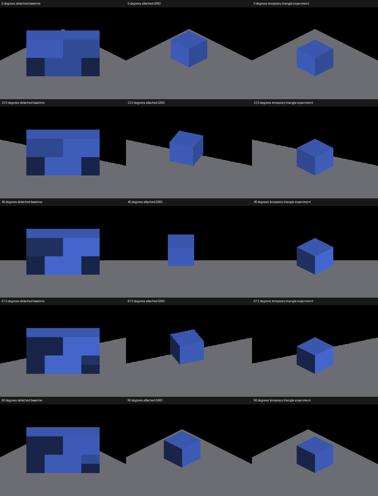

# Magnified single-voxel display control

`IRCanvasStress --probe-single-voxel --only shadowbox,floor` replaces the box
with one centered voxel at `(0,0,-2)` and reduces the receiver to `12×12×4`.
`--probe-grid` selects its attached counterpart. Other scenes retain their
existing geometry when the new flag is absent.

```sh
fleet-run --timeout 120 IRCanvasStress --only shadowbox,floor --probe-single-voxel --no-spin --no-auto-rotate --no-ao --no-shadows --subdivisions 1 --zoom 16 --auto-screenshot 6 --sweep-yaw 0 1.57079633 5
```

Repeat with `--probe-grid` for the attached control. Full subdivision mode is
required for the metric recipe (the demo config's default). Shading is retained;
AO and shadows are disabled to isolate coverage and face boundaries.

## Independent silhouette check

```sh
python3 scripts/render-visible-box-metric.py capture.png --single-voxel --yaw 22.5 --overlay checked.png
```

The expected solid is the projection of the eight authored corners at ±0.5.
It does not use renderer depth, resampled occupancy or observed voxel bounds.
The existing blue classifier, IoU ≥.95, area ratio .95–1.05 and two-pixel
centroid tolerance are unchanged. A failure is a useful diagnostic result.

The new option is specific to zoom 16, base subdivisions 1 and full mode. Its
plate calibration accounts for the smooth SDF box's `size - 1 + 1/subdivision`
boundary convention: half-span 5.53125, upper surface Z 2.46875 at density 16.
Without that correction the small plate produces a false size/placement failure
even for the attached control. The older large-box option is unchanged and is
still bounded to its documented recipe; general density calibration remains
follow-up work. Neither option proves shading, picking or temporal stability.

## Metal evidence

Native macOS, Apple M4 Max, 2560×1440; every capture run exited cleanly.

| Yaw | Detached IoU / area ratio | GRID IoU / area ratio | Triangle experiment IoU / area ratio |
|---|---|---|---|
| 0 | .303 / 3.299 | .964 / .990 | .493 / .990 |
| 22.5 | .286 / 3.502 | .967 / .996 | .466 / 1.051 |
| 45 | .250 / 4.004 | .972 / .989 | .437 / 1.201 |
| 67.5 | .286 / 3.502 | .965 / .997 | .505 / 1.051 |
| 90 | .249 / 3.558 | .964 / .990 | .511 / .990 |

GRID passes 5/5; detached and the temporary triangle experiment each fail 5/5.
The experiment disables dilation and selects local-canvas triangles using the
previously retained
[exact patch](../pr-screenshots/codex/detached-trixel-display/no-dilation-local-triangles.patch).
It restores a cube-sized silhouette at yaw zero, but leaves a 32.5-pixel vertical
centroid error there. At intermediate yaw it still renders a cardinal cube
instead of the authored face projection. Cleaner edges alone are insufficient.
The patch was restored afterward; the final yaw-zero capture is RGB-identical
to the baseline. No experimental shader edits ship with this fixture.



Full frames under `docs/pr-screenshots/codex/detached-face-selection/`:
168–172 detached, 173–177 GRID, 178–182 temporary triangle experiment, and
183 restored yaw-zero baseline. The five-view sets use the table's yaw order. Comparison columns use the same native-resolution crop
within each row; `comparison-crops.json` records those rectangles. Row crops
follow the rotating scene, without independently recentering the three arms.

A separate face-selection experiment excluded revoxelized canvases from the
opposite-face riser rule (`rotatedEmit = !reVoxelize && (reserved & 4u) != 0u`
in both face-selector twins). Upright four-probe captures 163–167 correspond
to parent captures 158–162. Striping remains at 22.5 degrees; the edit was
rejected and restored. It does not establish that the riser rule is correct,
only that removing it does not solve the observed strips.

## Next work

Preserve authored face orientation through visible storage/display, together
with surface depth and normal recovery. Add a triangle-layout contract instead
of inferring it from a depth-scale field. The detached composite currently
sets its hovered index off-screen, so picked-surface acceptance requires
implementing detached picking, not merely checking its existing output.

This fixture supports that work without additional production allocations or
dispatches. It does not establish OpenGL parity or large-population performance.
