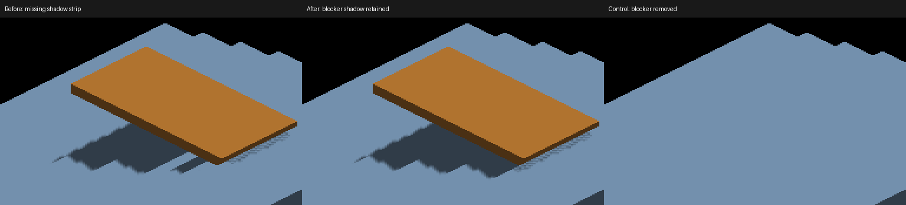

# Preserve close shadows on staircase receivers

The shared-canvas sun pass inferred self-shadowing from neighboring same-normal
faces separated by approximately one voxel. It then rejected any blocker within
three sun-depth units, including other objects. A nearby overhead blocker lost
an entire strip of its shadow at a tread boundary.

The sun pass now uses the standard visibility lookup on every receiver. The
neighbor detector, second cascade lookup, and extra near-rejection parameter
are removed from GLSL and Metal. Standard slope/quantization bias, normal bias,
face normals, and geometric coverage are unchanged. Other sampler callers
previously used zero extra rejection and retain their existing math.

This removes up to eight neighboring depth reads plus a repeated cascade lookup
from affected pixels. It adds no buffers or dispatches. This is a structural cost
reduction, not a measured large-scene speedup.

## Discriminating control

`--only shadowocclusion --probe-staircase` makes explicit treads whose top
surfaces descend toward the sun, so the preceding step does not block direct
sunlight. The separate orange overhead blocker casts across those treads.
`--probe-unblocked` removes it. `--probe-grid` selects shared-canvas reception.
The fixture also supports detached reception, but the numeric oracle below
is calibrated for GRID at zoom 4 (actual subdivision 4), yaw pi, 2560x1440.

```sh
fleet-run --timeout 120 IRCanvasStress --only shadowocclusion --probe-staircase --probe-grid --pivot-origin --no-spin --no-auto-rotate --no-ao --subdivisions 1 --zoom 4 --auto-screenshot 6 --sweep-yaw 3.14159265 3.14159265 1 --source-face-shadows
python3 scripts/render-sun-occlusion-metric.py --staircase capture.png
```

The blocked patch is near world (4.25,2.5,-1). Its sun ray intersects the blocker
at (3.105,0.864,-2.5), inside the occupied rectangle. Its camera ray clears the
blocker's y=2 edge, making the receiver visible. A separate outside patch should
remain directly lit. Removing the blocker makes both patches directly lit.
The oracle checks every pixel in each 5x5 patch against analytic Lambert/ambient
colors, preserving its two-level tolerance.

## Evidence

Native Apple M4 Max Metal runs all exited `RESULT=CLEAN`. Captures and metric
results are in `docs/pr-screenshots/codex/staircase-shadow-visibility/`.

| Captures | Experiment / result |
|---|---|
| 468–470 | Initial opposite-slope fixture; disabling the heuristic changed only 256 pixels, insufficient to establish an external-shadow defect. Not the final acceptance fixture. |
| 471,472 | Parent `f6ccfed` shaders, final staircase fixture with/without blocker |
| 473,474 | Same fixture, only the Metal heuristic condition disabled experimentally |
| 475 | Final removal in both backends; identical to experiment 473 |
| 476–479 | Final code, default depth caster, cardinal sweep |
| 480–484 | Final code, tilted attached cube/floor, source faces, yaw 0/22.5/45/67.5/90 |
| 485–488 | Parent shaders, same default-depth staircase sweep |
| 489–493 | Parent shaders, same tilted attached cube sweep |
| 494–496 | Final code, detached staircase, yaw 180/202.5/225; visual coverage only, private density 1 while GRID uses 4 |

In 471 the blocked patch is fully lit (115,144,173); 475 correctly yields
ambient (48,60,72). The old code fails by 101 color levels. Both outside controls
pass. The unobstructed full frames 472 and 474 are identical; no broad darkening
is needed. The blocked-frame correction affects 1,936 pixels.



The comparison uses native-size crops (1000,520)–(1512,840). Full frames,
`metrics.txt`, `comparisons.txt` and `crops.json` retain the evidence.

The default depth caster also recovers the missing strip at yaw 180, but its
outside control fails before and after: center (92,115,138), maximum patch
error 58. That oracle remains failing; full voxel-face casting passes the same
fixture. This exposes a separate geometry-reconstruction problem and is not
resolved by weakening the metric or restoring arbitrary near-rejection.

The tilted attached sweep changes 72/168 pixels at cardinal yaw 0/90, where the
heuristic ran; the three noncardinal frames are identical. These comparisons
are regression evidence, not a proof that every newly restored self-shadow is
geometrically correct. Geometry-based self-occlusion remains on the worklist.

The detached control at density 1 shows alternating triangular shadow values
across broad treads (494), while GRID density 4 is smooth there. Detached
receivers already used zero extra rejection, so this is a separate sampling/
reconstruction artifact, not evidence of success on that route. Diagnose the
recovered surface position against the caster plane.

OpenGL sources are mirrored and reviewed; runtime validation remains Metal-only.
The change does not solve contact precision, jagged projected boundaries, or
large-population batching. Those are separate [worklist](rendering-audit-todo.md)
items, and full-face shadow casting remains opt-in.
