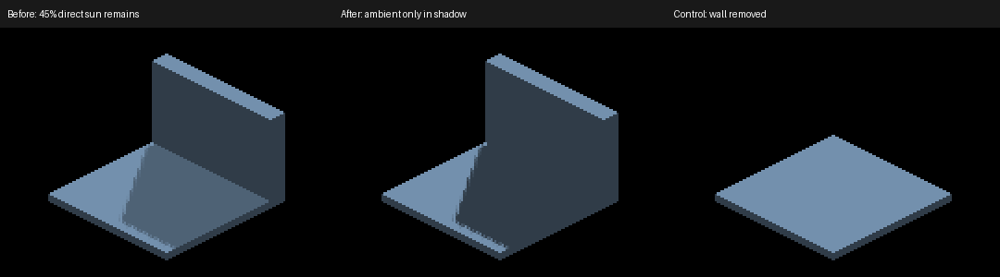

# Direct-sun visibility and occlusion

An opaque blocker removes direct sunlight. Face orientation supplies the Lambert
term; visibility determines whether that light reaches the face. The integration
already adds ambient separately, so remapping full occlusion to 45% direct light
counted an extra directional fill. `worldSunShadowFactor` now returns
`1 - shadowAccum` in both GLSL and Metal. No normals, geometry, shadow bias,
filter taps, buffers or dispatch counts change.

The resulting diffuse factor is `ambient + (1-ambient) * max(N·L,0) * visibility`.
This is an occlusion-response correction, not a complete physical lighting model:
ambient remains a configurable constant and local-light transport is unchanged.
It intentionally darkens sun-shadowed regions in existing scenes. It does not
smooth edges or correct an incorrectly classified shadow sample.

## Controlled fixture

`IRCanvasStress --only shadowocclusion` renders a plate and wall with albedo
(160,200,240). The plate has authored cell centers z=0.5,1.5 (top surface z=0),
and the wall has its highest authored cell center at z=-21.5.
They are one carved voxel object by default. `--probe-external-blocker` splits
exactly the same occupied cells between two objects/private canvases;
`--probe-unblocked` removes the wall. `--probe-grid` uses the shared world canvas.
The fixture is opt-in and does not alter the default scene.

At camera yaw pi, the -Z floor normal faces the sun in both selected regions.
The central region is behind the wall relative to the sun; the outer region's
ray passes outside the wall. The visible wall normal faces away from the sun.
`scripts/render-sun-occlusion-metric.py` checks every pixel in three interior 5x5
regions against analytic Lambert/ambient colors, with a two-level tolerance.
It requires the stated resolution/camera and is not a boundary or picking oracle.

```sh
fleet-run --timeout 120 IRCanvasStress --only shadowocclusion --local-trixel-display --pivot-origin --no-spin --no-auto-rotate --no-ao --subdivisions 1 --zoom 1 --auto-screenshot 6 --sweep-yaw 0 4.71238898 4 --source-face-shadows
python3 scripts/render-sun-occlusion-metric.py yaw180.png
```

Add `--probe-external-blocker` for the separate-object control, `--probe-unblocked`
for the unobstructed control (metric also takes `--unblocked`), or `--probe-grid`
for the attached control. Removing `--source-face-shadows` exercises the default
depth-derived caster. All source-face paths remain experimental/opt-in.

## Native Metal evidence

Artifacts are under `docs/pr-screenshots/codex/sun-occlusion-response/`.
All runs exited `RESULT=CLEAN` on Apple M4 Max at 2560x1440.
Before captures use parent `912734b` shaders plus the new fixture; after captures
use the visibility correction. AO is disabled and no local lights are spawned.

| Capture range | Configuration | Result |
|---|---|---|
| 418–421 | Before, self blocker, source faces, cardinal yaw sweep | Center floor (78,98,117); expected ambient (48,60,72), fails by 45 levels |
| 422–425 | Before, wall removed | Direct-light control |
| 426–429 | Before, external blocker | Identical to same-object captures at all four angles |
| 430–433 | After, self blocker | All three interior checks pass at yaw 180 |
| 434–437 | After, external blocker | Identical to self blocker at all four angles; all three interior checks pass |
| 438–441 | After, wall removed | Two floor checks pass at yaw 180; identical full frame there and at yaw 0 |
| 442–445 | After, attached GRID | All three interior checks pass at yaw 180 |
| 446–449 | After, default depth caster | All three interior checks pass at yaw 180 |
| 450–454 | After, self blocker, yaw 180/202.5/225/247.5/270 | Visual noncardinal coverage; repeated yaw 180 is identical |
| 455–459 | After, existing upright cube/concave/attached scene | Retains visible staircase striping; darker cast shadows |
| 460–463 | After, existing source shadowbox control | All four prior box thresholds pass; IoU .802/.945/.906/.878 |
| 464–467 | After, shadows disabled, existing detached receiver | All 12 world-normal Lambert checks pass |

The old response fails the new interior oracle on both self and external cases.
The corrected response passes 12/12 blocked-scene checks and 2/2 unobstructed
checks. `metrics.txt` retains these results, including the failing positive
controls. `comparisons.txt` records exact image comparisons.



The image uses identical native-size crops (1100,540)–(1460,810) from captures
420,432,440. `crops.json` also records the existing-scene comparison with parent
captures 357–361. No image is blurred or rescaled.

## Remaining visibility work

The unobstructed plate shows weak false self-shadowing at yaw 90/270: the corrected
response changes 1,048/16 pixels by at most 2/1 channel values. The geometric
source/receiver mismatch needs its own correction. The default caster control
passes these interior points, which does not establish complete hidden-face
coverage for all objects or lights.

`detectSelfStepStaircase` in the shared-canvas sun pass can reject blockers within
three sun-depth units when neighboring same-normal faces differ by about one
voxel. This does not establish blocker ownership. A close external blocker and
rotated concave/staircase fixture are the next discriminating controls. Genuine
staircase face normals should remain; their light visibility must be evaluated
against geometry. See the [worklist](rendering-audit-todo.md).

No large-entity throughput claim follows from these small fixtures. The shader
change removes a remap without adding work; source-face scalability and private
canvas batching still need measurement. OpenGL math is mirrored and reviewed,
but OpenGL runtime and cross-host screenshot baselines remain unverified.
