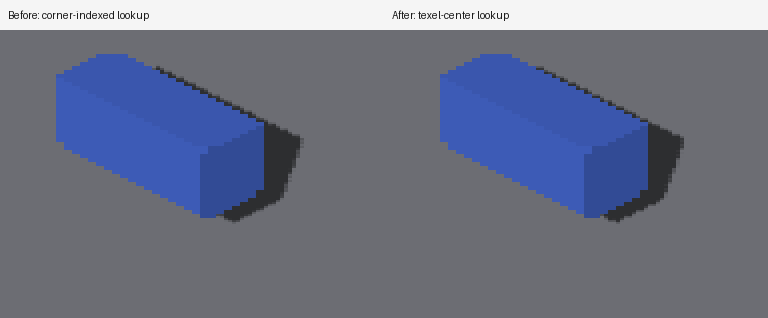

# Sun-map sample alignment

Full voxel-face rasterization writes sun depth at `origin + (pixel + 0.5) *
texelSize`. Splat-origin reconstruction uses the same texel-center convention.
The receiver interpolation previously used `(sunUV-origin)/texelSize` directly,
so a receiver at a sample center blended four samples at 25% each instead of
selecting that sample. Subtracting 0.5 before floor/fraction recovery aligns the
existing 2×2 filter with the map. The cascade-interior predicate uses the same
shift, retaining its two-texel margin around the actual footprint.

This does not widen the filter or add blur. Tap count, depth/normal bias, sun-map
rasterization and resource counts stay unchanged. Boundaries move relative to
the old lookup; their placement must be judged against geometry rather than
pixel identity. GLSL and Metal implement the same arithmetic.

## Evidence

Native Metal, Apple M4 Max, 2560×1440. Parent
`08a77796a1ce476a7ee2aa9634e63f6cec401c40`. Every run ended `RESULT=CLEAN`.
The existing analytical box oracle passes all four views before and after;
thresholds are unchanged. The floor bounds calibrate pixel scale independently.

| Camera yaw | Baseline IoU | Corrected IoU | Baseline area ratio | Corrected area ratio |
|---|---:|---:|---:|---:|
| 0 | .890 | .891 | 1.085 | .980 |
| 90 | .969 | .968 | 1.021 | 1.026 |
| 180 | .937 | .963 | 1.024 | 1.027 |
| 270 | .944 | .948 | 1.031 | 1.032 |

These aggregate changes are modest and not uniformly better. The reason for the
change is the sample-coordinate contract, not tuning to improve one silhouette
score. Geometry reconstruction and clean projected face boundaries remain work.



The staircase controls retain ambient-only blocked pixels and fully lit outside
pixels. Source-face casting passes both regions for GRID and detached receivers.
Detached default depth casting improves from a 51-level outside-patch error to 1
(pass at the unchanged tolerance of 2). GRID default casting improves from the
previously retained 58-level error to 8, still failing. All four unblocked
cardinal detached frames remain pixel-identical to the parent and to shadows
disabled. Intermediate-angle blocked captures retain the real shadow; their
stair edges are not claimed as smooth-source geometry.

## Capture recipes

All images are retained in `docs/pr-screenshots/codex/sun-sample-centers/`.

```sh
fleet-run --timeout 120 IRCanvasStress --only shadowbox,floor --pivot-origin --no-spin --no-auto-rotate --no-ao --subdivisions 1 --zoom 2 --auto-screenshot 6 --sweep-yaw 0 4.71238898 4 --source-face-shadows
```

Captures 521–524 are parent; 525–528 corrected, yaw 0/90/180/270°.
Run `scripts/render-shadow-box-metric.py --source` with each group of four full
PNGs in order. `metrics.txt` retains the output.

```sh
fleet-run --timeout 120 IRCanvasStress --only shadowocclusion --probe-staircase --local-trixel-display --pivot-origin --no-spin --no-auto-rotate --no-ao --subdivisions 1 --zoom 4 --auto-screenshot 6 --sweep-yaw 3.14159265 3.14159265 1 --source-face-shadows
```

| Capture | Change to staircase recipe |
|---|---|
| 529 | Corrected, unchanged recipe |
| 530–533 | Corrected, `--probe-unblocked`, yaw 0/90/180/270° |
| 534 | Corrected, replace local display with `--probe-grid` |
| 535–536 | Corrected, yaw 202.5/225° |
| 537 | Corrected, omit source-face flag |
| 538 | Corrected, `--probe-grid`, omit source-face flag |

Copied parent controls 501–507 and 509 are described in
[receiver evidence](detached-receiver-planes.md). `comparisons.txt` records
full-frame RGB differences; both failing and passing contact checks are retained.
Actual private density is 1; GRID is 4 for the zoom-4 staircase. OpenGL and a
camera sweep crossing cascade boundaries remain unverified.

## Rejected caster-centering experiment

Capture 520 tested subtracting `kVoxelRasterCellAnchor` in both world-placed depth
resolve shaders before `viewToWorld`, on the parent receiver correction. It changed
only 40 pixels versus capture 509, at (1464,672)-(1472,680), and left the outside
patch failing by 51 levels. That edit was reverted before sample-alignment work.
The resolver's centered geometry contract still needs attention, but that small
experiment was not evidence of a complete default-caster fix.
