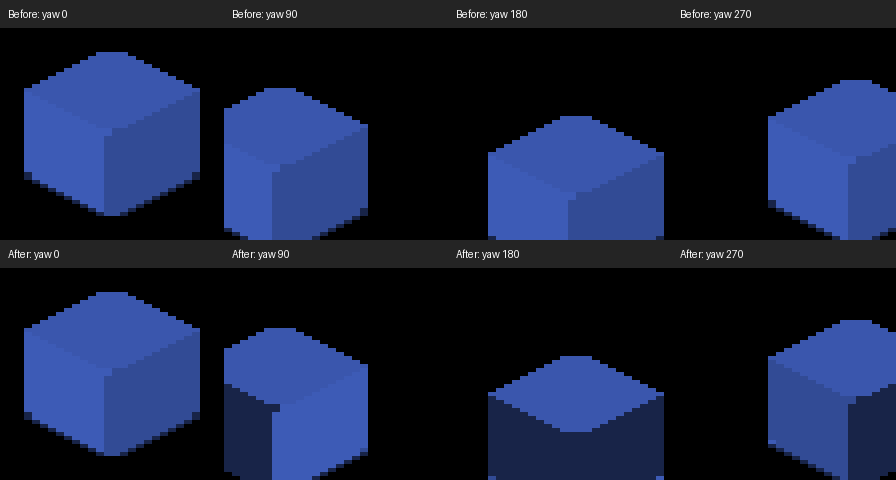
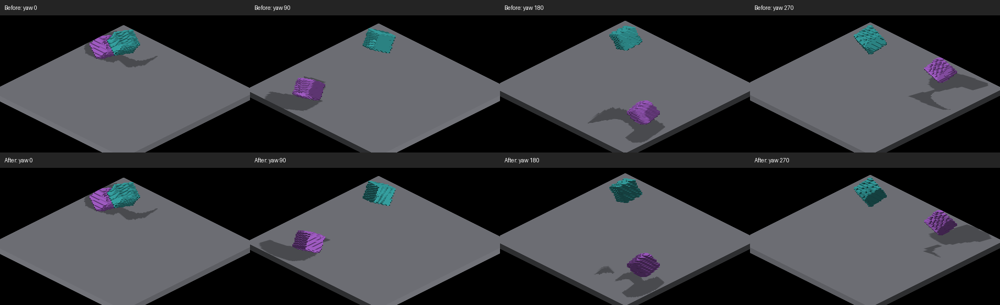
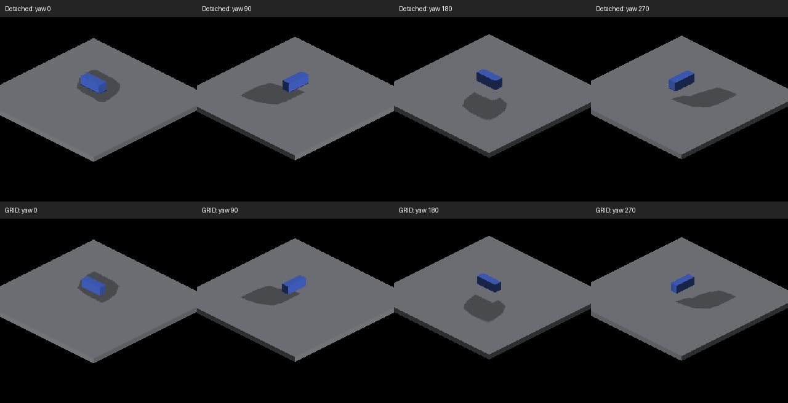
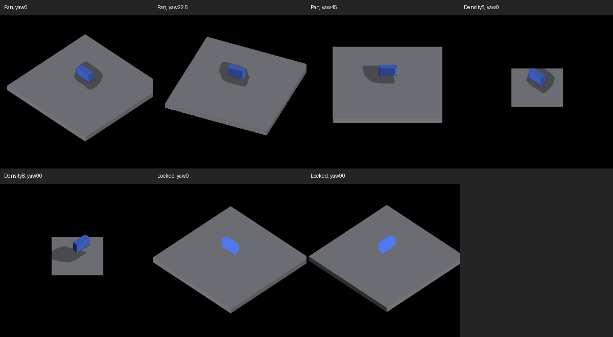

# Trixel lighting and shadow audit

Audit of `351bb927b` and the working changes on `codex/shadow-lighting-audit`,
2026-09-12, by Codex. Visual evidence is from macOS/Metal on Apple M4 Max,
2560×1440 screenshots. GLSL changes mirror Metal; OpenGL runtime is unverified.

## Assessment

The canvas renderer still fits the engine: voxel faces supply depth and color,
2D trixel canvases carry the stylized projection, and deformations provide
rotation. The shadow pipeline loses too much geometry between those stages.
It reconstructs camera-visible samples, resolves some of them into another
camera layout, then expands each sample into a square in the sun map. Clean
voxel edges cannot reliably survive that sequence.

There are two separate problems: incorrect coordinate recovery, and incomplete
surface coverage. This change fixes concrete recovery errors and adds isolated
probes. It does **not** complete the clean-edge shadow redesign or establish
performance at 100,000 entities.

## Changes implemented

`PROPAGATE_CANVAS_ROTATION` places detached re-voxelized geometry in the frame
`inverse(cameraRotation) * entityRotation`. Recovering private-canvas depth
therefore yields a camera-relative position, not a world position. Lighting
previously added the world translation without restoring camera rotation;
it also treated the private face normal as a world normal.

The corrected receive transform is:

```
worldPosition = cameraRotation * recoveredPrivatePosition + worldOrigin
worldNormal   = cameraRotation * privateNormal
```

Entity rotation is already in the rebuilt pool; applying it again would be
wrong. Cascade selection now uses the recovered world position's iso distance,
not private depth plus translation. Both shader backends share this behavior.
See [lighting shader](../../engine/render/src/shaders/c_lighting_to_trixel.glsl)
and [lighting frame](../../engine/prefabs/irreden/render/systems/system_lighting_to_trixel.hpp).

The detached cast resolver had a related error. Rotating into the main cardinal
layout and undoing that rotation in the bake did not remove the private pool's
inverse camera rotation. It also decoded using the main camera offset and
subdivision density. It now recovers with zero private camera offset and the
actual stored density, restores world orientation, then encodes into the main
canvas layout. Face-region selection follows the transformed normal.
See [resolver](../../engine/render/src/shaders/c_resolve_world_placed_depth.glsl).

The private density can be capped below the requested global density.
[Iterating frame authoring](../../engine/prefabs/irreden/render/voxel_frame_data.hpp)
now uses `renderedSubdivisions_` for detached re-voxelized lighting/AO decoding.
The cast resolver receives the same stored density independently of the main
canvas's destination density.

The lighting UBO gains one quaternion, with compile-time size/offset checks.
Cast parameters use a 32-byte UBO in transient slot 16 and restore that slot's
re-voxelization buffer afterward. This replaces patching the shared main frame
for every caster. No new render dispatch or permanent buffer slot is added.

## Visual evidence



Isolated blue receiver, no AO or shadows, yaw 0/90/180/270. Before, all four
images had the same face colors despite the world-space sun. After, the side
faces respond to camera rotation and the top remains constant. The independent
Lambert/albedo oracle passes **12/12 samples, maximum channel error 0**; the
pre-fix captures fail six samples, with maximum error 110. The test excludes
shadow coverage deliberately so those defects cannot mask this lighting bug.



Frozen `revox,floor`, shadows and AO enabled, zoom 1. Rows use identical capture
settings before/after. The yaw-0 full frames are byte-identical. Other cardinals
change; the large misplaced extensions shrink, but gaps and ragged edges remain.
This comparison proves a visible change, not analytic shadow-shape correctness.



New 18×6×8 box over the floor, AO disabled, zoom 0.4, four cardinals. Both routes
produce enlarged, uneven shadows. This isolates a defect in shared coverage,
beyond detached coordinate recovery. Images are labeled crops resized with
nearest-neighbor sampling; no smoothing or retouching is applied.



Pan `(12,-8)` and yaw 22.5/45 degrees run cleanly but show remaining stepped
geometry and shadow edges. At requested subdivision density 8, the private box
remains readable while the floor is clipped to a smaller canvas region; this
is a smoke check, not evidence that high-density scene coverage is correct.
The screen-locked box stays unshaded and contributes no visible floor shadow
at yaw 0/90, consistent with overlay placement. These check crops use ordinary
image resizing for inspection, not a boundary metric.

## Structural findings and priorities

| Finding | Consequence | Priority |
|---|---|---|
| Private frame mistaken for world frame; main density used for capped private raster | Camera-dependent lighting, wrong world lookup and cast placement | Fixed here |
| Bake sees camera-visible depth, not all sun-facing surfaces | Hidden sun-side faces cannot contribute; camera movement changes coverage | Next architecture change |
| Cardinal bake uses radius-7 constant-depth square splats | Inflated silhouettes and unrelated face coverage; up to 225 atomic writes per sample per cascade | Replace coverage producer before tuning softness |
| Intermediate camera-layout resolve retains only front-most samples | Additional quantization and loss before sun projection | Remove from a future face-based path |
| Detached canvases own resources and dispatch separately | Per-entity submission/allocation cost remains even with one aggregate bake | Batch and pool before targeting very large detached populations |
| Main-canvas cascade depth/unit contracts remain distinct from world receive | Density and pan need explicit cross-route validation | Follow-up; not repaired by this patch |

The splat count follows `kSunSplatMaxTexels = 7` and the nested loops in
[c_bake_sun_shadow_map.glsl](../../engine/render/src/shaders/c_bake_sun_shadow_map.glsl):
`(2*7+1)^2` attempts per cascade, two cascades. It is an upper bound on write
attempts per eligible sample, not a GPU timing measurement. Some routes explicitly
turn splatting off, and out-of-map writes are rejected.

## Recommended simplification

Make an exposed voxel face the common geometric input to color and shadow
projection. Preserve trixel/deformation rendering for the color image; derive
the corresponding world-space face corners before camera rasterization destroys
information. Project those corners directly into the sun basis and rasterize
the face polygon with interpolated depth. Include sun-facing exposed faces even
when hidden from the camera. For a flat receiver, this produces the continuous
projected polygon edges the visual style calls for, subject to finite shadow-map
resolution. A small coverage filter can then antialias an accurate boundary.

This is **not** the previously rejected same-surface neighbor splat. It changes
the source data from sparse camera pixels to complete faces, including missing
faces. The negative experiments in
[sun-shadow-bake-coverage.md](sun-shadow-bake-coverage.md) remain relevant and
should not be repeated as another radius derivation.

Prototype this behind a debug switch using the rectangular box first. Compare
against the analytic sun projection of its eight world corners onto the floor;
measure boundary error, area inflation, holes, and temporal motion. Then add a
concave L shape, stacked receivers, shared-grid/deformed/re-voxelized variants,
cardinal transitions, camera pan, zoom, density caps, and screen-locked overlays.
Keep the existing path until both backend captures establish the replacement.

For scale, retain shared GRID/chunk occupancy and cache exposed faces by shape
or dirty chunk. Pool transformed instances and canvas storage, compact casters
by the lighting domain (including relevant offscreen casters), and submit batches
rather than one dispatch/resource set per entity. Cache static geometry; update
transforms without reconstructing identical geometry. Bound light-space work by
visible light tiles and projected area. Benchmark 1k/10k/100k populations with
separate static, moving, unique-shape, and shared-shape cases, reporting CPU
submission, GPU shadow time, memory, and frame-time percentiles. This audit has
not run that matrix and makes no 100k performance claim.

## Existing work reconciled

- [Epic #1717](https://github.com/jakildev/IrredenEngine/issues/1717) describes the
  same visual goals. Closed implementation children do not demonstrate that
  clean silhouettes have been achieved; the box probe still contradicts that.
- [Issue #3023](https://github.com/jakildev/IrredenEngine/issues/3023) identifies
  detached receiver camera-pose errors. The quaternion correction addresses
  that mechanism; this audit does not claim every issue acceptance check ran.
- [PR #3358](https://github.com/jakildev/IrredenEngine/pull/3358) adds a detached
  cast regression gate. Its account agrees with current runtime: Metal casts
  work. The historical Metal-blocked/cast-correct claims in
  [the SO(3) spike](detached-so3-shadow-projection.md) should not guide new work
  without revalidation. Camera cardinal encode/decode cancellation is not the
  missing private-to-world transform.
- [PR #2393](https://github.com/jakildev/IrredenEngine/pull/2393) addresses PCF
  softness and zoom-aware texel budget. This patch leaves that work separate;
  softness cannot restore missing geometry or fix its frame of reference.
- [Epic #2314](https://github.com/jakildev/IrredenEngine/issues/2314) is relevant
  to lighting-domain culling and the batching proposal. Do not use camera-only
  visibility as the caster membership rule.

## Reproduction and validation

Build `fleet-build --target IRCanvasStress`. The new groups are opt-in and do
not change the default scene. Isolated directional-light capture:

```sh
fleet-run IRCanvasStress --only shadowreceiver --no-spin --no-auto-rotate \
  --no-ao --no-shadows --auto-screenshot 6 --sweep-yaw 0 4.71238898 4
python3 scripts/render-detached-lighting-metric.py yaw0.png yaw90.png yaw180.png yaw270.png
```

Pass the four newly saved full-frame screenshots, in order, to the metric.
Add `shadowcaster` to the `--only` list for a separate object casting onto the
receiver's faces. For the box comparison:

```sh
fleet-run IRCanvasStress --only shadowbox,floor --no-spin --no-auto-rotate \
  --no-ao --zoom 0.4 --auto-screenshot 6 --sweep-yaw 0 4.71238898 4
```

Repeat with `--probe-grid`. Focused sweeps also accept `--camera-iso <x> <y>`
and honor explicitly supplied `--zoom`; their existing default zoom is preserved.
`--screen-lock-detached` applies to the box fixture for overlay checks.

Validation performed: target build, Metal shader compilation and clean capture
runs, the 12-sample lighting oracle plus pre-fix positive control, header/Metal
registry checks, Python lint, comment-reference lint, changed-line formatting,
and whitespace checks. Cardinal, intermediate-yaw/pan, density-cap, and
screen-locked captures supplement the isolated tests; these are visual/smoke
checks, not a comprehensive scene baseline gate. OpenGL runtime, analytic
shadow-boundary acceptance, and large-population performance remain unverified.

The instruction-size validator also ran and failed on four unchanged files:
`docs/agents/FLEET.md`, `engine/command/CLAUDE.md`, `engine/script/CLAUDE.md`,
and `scripts/fleet/CLAUDE.md`. The new validator-index row is within its budget;
this rendering change does not adjust the unrelated instruction budgets.
