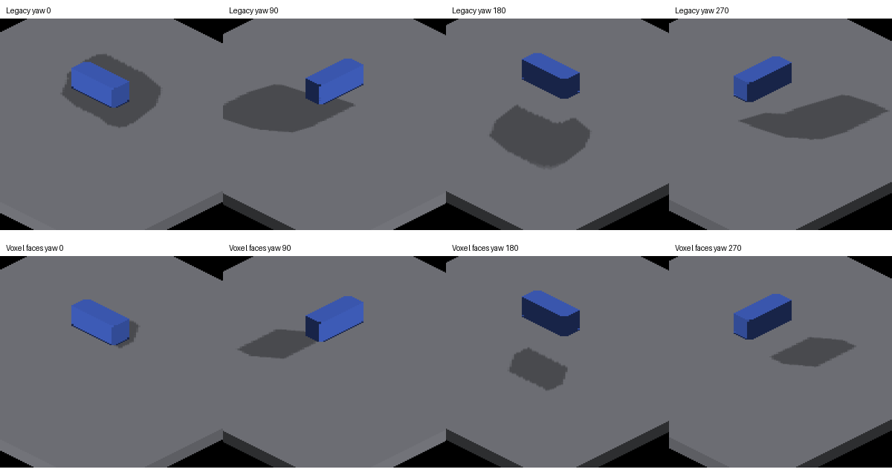
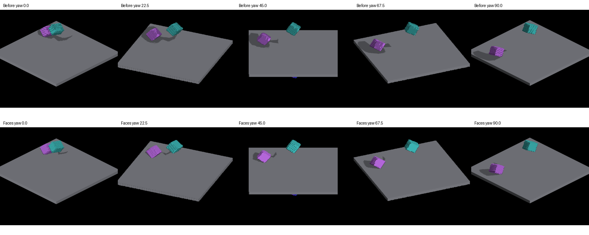
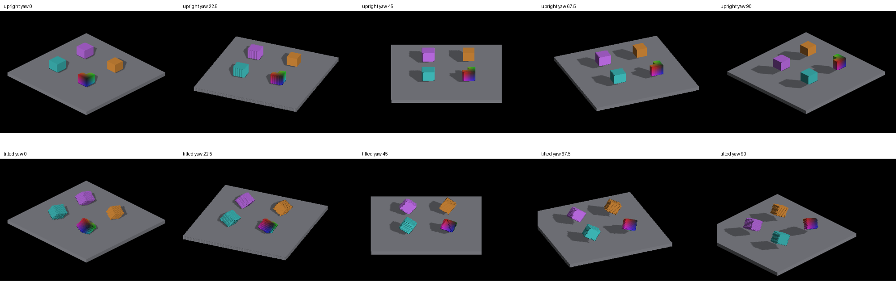
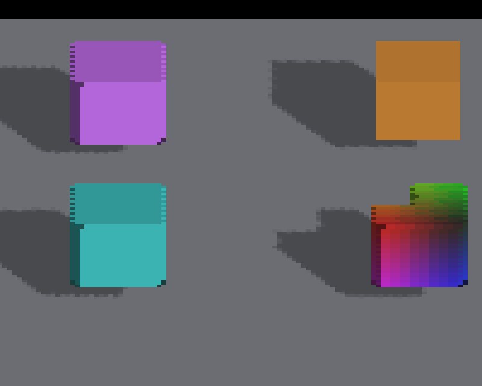

# Experimental voxel face sun coverage

Historical: finite face casting became the default in
[finite shadow defaults](finite-shadow-defaults.md), and the resampled cells
are the only caster geometry for revoxelized canvases
([authored-grid casting is retired](authored-voxel-shadow-faces.md));
`--voxel-face-shadows` is accepted and ignored.

This experiment follows the [lighting audit](trixel-shadow-lighting-audit.md).
Enable `IRCanvasStress --voxel-face-shadows`. The default remained the existing
shadow producer. The experiment replaces that producer for the entire frame;
only voxel casters contribute. SDF, text and particle casting is not covered.
Screen-locked detached canvases are excluded from world casting.

## Why complete faces

The resolved camera canvas contains only camera-visible samples. Expanding those
samples into conservative sun splats inflates the box footprint and cannot
recover hidden sun-facing geometry. This producer projects exposed voxel faces
as parallelograms into the existing two sun cascades, testing texel centers and
interpolating face depth. It keeps the trixel receiver, distortion/compositing,
shadow filter and voxel representation. There is no replacement triangle scene.

The voxel stage submits positions, colors/exposure flags and active masks while
those buffers are resident, before camera compaction overwrites or removes inputs.
Detached positions are restored through the private camera frame and world origin.
Snapping uses the canvas's actual render subdivision. The active mask is essential:
inverse-revoxelization leaves stale position/color data in inactive destination cells.
Using color alpha alone creates false extra lobes and self-shadowing.

One frame setup clears the shared sun map. Each eligible canvas uploads 48 bytes
and dispatches one thread per voxel pool slot. There is no additional CPU voxel
walk or voxel upload. Metal transient slots 16 and 28 are restored before their
next consumer. GLSL and Metal kernels implement the same projection.

## Evidence

Captured on macOS Metal, Apple M4 Max, 2560×1440. Both baseline and experimental
runs shut down cleanly. Full frames and comparison crops are committed under
[`docs/pr-screenshots/codex/voxel-sun-face-coverage`](../pr-screenshots/codex/voxel-sun-face-coverage).
The baseline includes the preceding detached world-frame lighting fix.



The independent box oracle projects authored box bounds along the configured sun
onto the floor. The floor supplies image scale/origin; the measured shadow does
not fit the expected outline. It measures the full floor top, excluding the blue
caster and a three-pixel boundary inset to avoid the floor's shaded side faces.
Thresholded shadow pixels must overlap at least 70% by intersection-over-union
and have an area ratio within 0.75–1.30. These tolerances allow trixel rasterization,
filtering and plate calibration; this is a fixed-fixture regression, not a general
scene or pixel-exact geometry validator. Subdivision 1 is required by the oracle.

| Yaw | Legacy IoU | Face IoU | Legacy area / expected | Face area / expected |
| --- | ---: | ---: | ---: | ---: |
| 0 | .071 | .766 | 14.160 | .997 |
| 90 | .365 | .937 | 2.743 | .999 |
| 180 | .387 | .911 | 2.564 | .987 |
| 270 | .393 | .868 | 2.384 | 1.002 |

At yaw 0 most of the expected shadow is hidden by the box, making the area ratio
particularly sensitive. All four experimental detached views pass; all four
legacy views fail. GRID views also pass all four, with IoU .802–.935.

```sh
fleet-build --target IRCanvasStress
fleet-run --timeout 120 IRCanvasStress --only shadowbox,floor --no-spin --no-auto-rotate --no-ao --subdivisions 1 --zoom 0.4 --auto-screenshot 6 --sweep-yaw 0 4.71238898 4 --voxel-face-shadows
python3 scripts/render-shadow-box-metric.py yaw0.png yaw90.png yaw180.png yaw270.png --overlay-dir overlays
```

Omit `--voxel-face-shadows` for the baseline; add `--probe-grid` and metric
`--grid` for the GRID fixture. For the concave rotation sweep, replace the
selection with `--only revox,floor`, use zoom .55 and `--sweep-yaw 0 1.57079633 5`.



## Limits before adoption

- This is an opt-in voxel-only experiment, not a replacement ready for all engine
  content. Fog/visibility membership and mixed caster types need explicit coverage.
- Complete voxel faces retain voxel stair steps on curved/concave silhouettes.
  The concave sweep still shows residual face and silhouette artifacts. These
  captures do not establish smooth continuous outlines for every shape.
- Fractional GRID translations at smooth yaw still snap to the subdivision lattice,
  while the per-axis receiver can preserve fractional positions. Add a translated
  fixture and align those conventions before broadening adoption.
- Face rasterization samples texel centers; existing bilinear shadow sampling has
  a half-texel phase offset. Receiver/filter changes are deferred to a separate slice.
- Higher subdivision, camera pan, cascade transitions, non-cardinal GRID motion and
  screen-locked exclusion need broader visual regression coverage. OpenGL runtime
  shader compilation and rendering have not been validated on this host.
- No hundred-thousand-entity performance claim is made. Dispatch scans inactive
  pool slots, face bounding rectangles have divergent work and atomic overlap,
  and each canvas adds an upload/dispatch/barrier. Light-domain chunk culling,
  batched submissions and measured close-view/overlap stress tests are required.
- The experimental GPU work is charged to voxel conversion, not the later shadow
  bake timing row. Legacy caster gathering still runs for existing diagnostic
  consumers; its count is not the number of face submissions. Dedicated timings
  and counters are required before comparing producer cost.

Local validation: native demo build and clean capture runs, four-view detached and
GRID geometric regressions, header/Metal registry checks (33 kernels), Python lint,
comment-reference lint, changed-line formatting and whitespace checks.

## Attached controls and grounded probes

Use `--only revox,shadowattached,floor` for the expanded comparison. Orange is
attached GRID; cyan and purple use private detached revoxelization; the rainbow
object is a carved L-prism, not a complete cube. All four centers are at z=-12
above the floor top z=2. A size-derived squared-radius assertion includes lattice
rounding clearance and rejects the old below-platform height. The legacy
`--solo-revox` placement is retained for its isolated coverage ROI.

The earlier rainbow center z=+42 placed it below the floor, while the cyan z=-42
put it far above the other probes. The purple center z=-6 also allowed a rotated
corner to intersect the floor. Corrected spacing/height makes these usable casting
comparisons. Full-scene reference images containing the relocated revox group
will require deliberate recapture; old reference positions are not an expected
pixel match. The isolated solo coverage placement remains unchanged.

```sh
fleet-run --timeout 120 IRCanvasStress --only revox,shadowattached,floor --no-spin --no-auto-rotate --no-ao --subdivisions 1 --zoom 0.65 --auto-screenshot 6 --sweep-yaw 0 1.57079633 5 --voxel-face-shadows
python3 scripts/render-shadow-probes-metric.py capture0.png capture1.png capture2.png capture3.png capture4.png
```

Add `--probe-upright` to remove the probes' authored tilt and freeze their spin;
this flag does not require `--no-spin`. Add `--screen-lock-detached` to exercise
overlay exclusion: the orange GRID object continues casting, while detached
probes no longer cast world shadows or receive world lighting.



The ten 2560×1440 upright/tilted captures pass the new fixed-scene presence guard. It
requires substantial orange/cyan/purple populations and visible blue in the
rainbow model; it does not certify face geometry or shadow accuracy. The old
concave screenshot fails because the attached control and rainbow model are
absent. Native captures also cover five screen-locked views. Restoring the old
z=+42 in the probe height constant causes compilation to fail at the clearance
assertion, then restoring z=-12 builds successfully.

### Remaining face alignment, now isolated

At camera yaw 45 degrees the upright orange GRID cube has straight sides, while
the cyan/purple detached cubes retain staircase risers. GRID camera rotation uses
the per-axis store and `f_peraxis_scatter` deformation. Detached revoxelization
instead bakes the inverse camera rotation into destination cells, derives exposed
faces from destination adjacency, and renders through the cardinal single-canvas
gather. It does not take the same per-axis fragment deformation path. Applying
that deformation to the already rotated cells would rotate them twice.



Complete-face casting removes inflated sample splats, but still projects that
resampled voxel staircase. Fixing this distinction requires retaining the source
face frame through camera projection, with shared camera-facing and sun-facing
coverage. Increasing private-canvas density or blurring shadows does not establish
that correspondence, and per-entity private per-axis canvases would compound the
existing memory/dispatch scaling problem. This remains an adoption blocker.

Two smaller experiments were rejected in this iteration: applying triangular
row reconstruction in the detached gather introduced serrated edges, and aligning
PCF lookup to texel centers left the mostly occluded yaw-0 box at IoU .679 (below
.70), although its other three views passed. Neither shader change is retained;
the geometric threshold remains unchanged. The sampling phase, receiver normal
bias and near-contact oracle need to be assessed together before that adjustment
ships. Current shader behavior and the original four-view box results above are
unchanged by the probe expansion.
