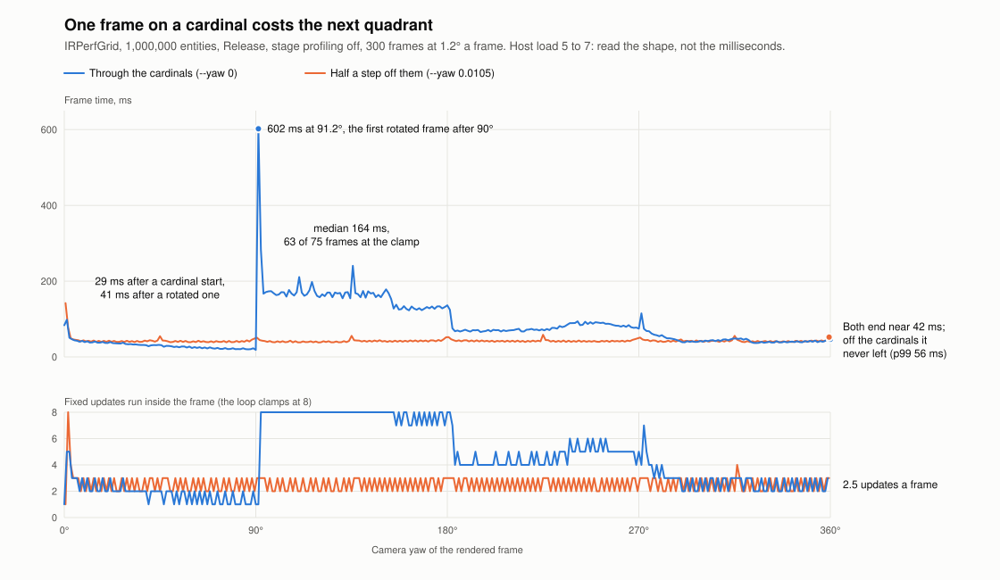

# Continuous yaw as a profiled fixture

The objective's headline criterion
([`million-entity-render`](../design/objectives/million-entity-render.md)) is a
frame time **under a continuous yaw sweep**, and every committed million
number so far is a static pose. `IRPerfGrid --yaw-step <radians>` makes the
sweep a fixture: frame N renders at `--yaw + (N − 1) × step`. The step is per
rendered frame and not per second, so every run of a sweep renders the same
poses whatever its frame time, and the yaw is set absolutely, so frame N's pose
carries no accumulated rounding.

```bash
IRREDEN_BUILD_DIR="$PWD/build-release" python3 scripts/perf/repeat_profile.py \
    --output save_files/perf/sweep -- --wave-freeze --no-overlay \
    --auto-profile 300 --config-preset configs/perf/million-profiling-off.lua \
    --yaw 0.010471976 --yaw-step 0.020943951     # a full turn, 1.2° a frame
```

`repeat_profile.py` checks a sweep from the report's run witness
([million-controls.md](million-controls.md) § The run witness and its
controls): the first frame at `--yaw`, the last at `--yaw + (frames − 1) ×
step`, the travelled arc equal to `(frames − 1) × |step|` within 0.05°, the
overflow lane sampled, and nothing dropped. A 300-frame full turn reads
`first=0.600 last=-0.600 travel=358.800`, which is 299 × 1.2° exactly.
`million_controls.py` runs this sweep as a third pose beside 0° and 45°.

## What the first sweeps showed

Apple M4 Max, Metal, macOS 26.5.2, AC power, Release, stage profiling off, the
million scene (100³ entities, 128³ pool, zoom 4, frozen wave), head `a9d6a3740`
plus this change, shaders `6a13afcaf26f7615`. One run per row unless a
replicate is named; **the fleet was live, host load 4.6 to 7.0 on 14 CPUs**, so
these are not reference milliseconds. Each finding below is a ratio of 1.3× to
17×, far outside the 1 to 8 ms the same host moved on its own that day, and
each has a control beside it that differs in one variable. Reports and
manifests: [continuous-yaw-sweep/](continuous-yaw-sweep/); the figure below is drawn
from the two full-turn reports' frame and update-tick series.

| Sweep (300 frames, 1.2° a frame) | Steady mean ms | Steady p99 ms | Worst steady frame ms | Updates / frame | Overflow peak / dropped |
|---|---:|---:|---:|---:|---:|
| Through the cardinals (`--yaw 0`) | 95.80 | 240.49 | **602.26** | 4.3 | 959,592 / 0 |
| Through the cardinals, replicate | 98.10 | 382.60 | **739.10** | 4.3 | 959,592 / 0 |
| Half a step off them (`--yaw 0.010471976`) | 42.03 | 55.65 | 58.45 | 2.5 | 2,213,946 / 0 |
| Half a step off them, replicate | 42.02 | 54.53 | 59.72 | 2.5 | 2,213,946 / 0 |
| Half a step off, `max_update_ticks_per_frame = 1` | 37.98 | 52.33 | 53.91 | 1.0 | 2,213,946 / 0 |

### 1. Zero overflow drops across a full turn, measured in the objective's build

All 300 poses of the turn, in a build that logs nothing, dropped nothing. The
lane peaks at **2,213,946 entries of 8,388,608 (26%) at exactly 45°**, the
symmetric pose; the sweep that steps past 45° without landing on it (44.4°,
45.6°) peaks at 959,592. The objective's row asks for zero drops across a
15-pose sweep; this is that reading on Metal at twenty times the poses.

### 2. A frame that lands on a cardinal costs the next quadrant

The two sweeps differ by 0.6° of starting yaw. The one that lands on 90°, 180°
and 270° has a **602 ms** frame (739 ms in the replicate) at 91.2°, the first
rotated frame after the cardinal, and the one that never lands on a cardinal
has no steady frame above 60 ms. At the 64³ pool (Debug tree) the same pair
reads 55.6, 49.5 and 57.0 ms at 91.2°, 181.2° and 271.2° against a steady
maximum of 19.13 ms.



What follows the hitch is larger than the hitch. Per quadrant, median frame
time, mean fixed updates per frame and frames at the 8-update clamp:

| Quadrant | Through the cardinals | Half a step off them |
|---|---|---|
| 0° to 90° | 29.1 ms, 1.88 updates, 0 clamped | 41.3 ms, 2.51, 0 |
| 90° to 180° | **163.6 ms, 7.68 updates, 63 of 75 clamped** | 41.2 ms, 2.51, 0 |
| 180° to 270° | 74.3 ms, 4.73 updates, 2 clamped | 42.3 ms, 2.53, 0 |
| 270° to 360° | 41.9 ms, 2.77 updates, 0 clamped | 41.7 ms, 2.53, 0 |

The report's new per-frame update-tick series shows the mechanism directly.
The 602 ms frame leaves the fixed-step loop owing updates; `World` clamps the
debt to eight a frame, eight updates make the frame long enough to owe eight
more, and the loop sits at its clamp for 63 of the next 75 frames. It takes two
more quadrants to drain. One hitch of 0.6 s costs about 9 s of 4× frames.

The trigger is isolated: landing exactly on a cardinal. The work inside that
frame is not. `PerAxisCanvas::syncAllocationToCameraYaw` releases the three
per-axis texture sets and the 96 MiB overflow buffer on the cardinal frame and
allocates them again on the next rotated one, and that is the first candidate;
the cardinal frame also switches the raster path and rebuilds chunk bounds for
a new cardinal index. Separating those is the next slice's first measurement.

### 3. The fixed updates are worth 4 ms of a 42 ms frame

With the clamp at one update a frame the same sweep reads 37.98 ms against
42.03 ms at 2.5, with the GPU frame envelope unchanged (28.35 and 28.48 ms).
That is D5's first number at this fixture: the objective's "≤ 1 update per
rendered frame" row is worth about 4 ms here, and the other 38 ms is rendering.

### 4. The same rotated poses cost 27 or 40 ms depending on where the run started

The first quadrant of the through-the-cardinals sweep reads 29 ms, below even
the one-update run. Two 75-frame sweeps over the same k × 1.2° poses settle it
as history and not pose:

| First-quadrant sweep | Frames 10 to 75, median ms | Updates / frame | Overflow peak |
|---|---:|---:|---:|
| Starts on the cardinal (`--yaw 0`, first rotated frame is 1.2°) | **27.4** | 1.73 | 959,592 |
| Starts rotated (`--yaw 0.020943951`, the same 1.2°) | **40.1** | 2.42 | 967,956 |

Reproduced three times (29.6, 29.1 and 27.4 ms against 41.0, 41.3 and 40.1).
The overflow lane is the same size in both, so it is not the lane. Something
established by a frame rendered at an exact cardinal makes the rotated quadrant
after it about 30% cheaper, and a run that starts rotated never gets it. Chunk
bounds are the first candidate: `VOXEL_TO_TRIXEL_STAGE_1` builds them per
cardinal index and static chunks reuse them under yaw. It matters twice over:
it is a lead worth 12 ms of a 40 ms frame for D3, and every static 45° arm in
[million-controls.md](million-controls.md) starts rotated, so the reference
measures the expensive history.

## What this does not say

- No millisecond here is a reference. The host was loaded (issue 3638 in the
  tracker covers what the benchmark lock excludes); the quiet-host matrix is
  still owed and now carries the sweep arm.
- One Release run per row, with one replicate of the main pair. The effects
  are large and the controls are paired minutes apart, but round-to-round
  spread of the sweep is not yet measured.
- The second quadrant's 164 ms is a property of the 8-update clamp and this
  scene's update cost as much as of the hitch; a different clamp moves it.

## Next measurements

1. Split the cardinal frame: release and re-allocation against the path switch
   and the chunk-bound rebuild, then keep the per-axis canvases resident across
   a crossing while the camera is turning and re-run the through-the-cardinals
   sweep.
2. Find what a cardinal-rendered frame leaves behind that a rotated start
   lacks, with per-frame visible and admitted-chunk counts in the report.
3. The sweep in the three-round quiet-host matrix, and a longer window than
   one turn for the tail.
