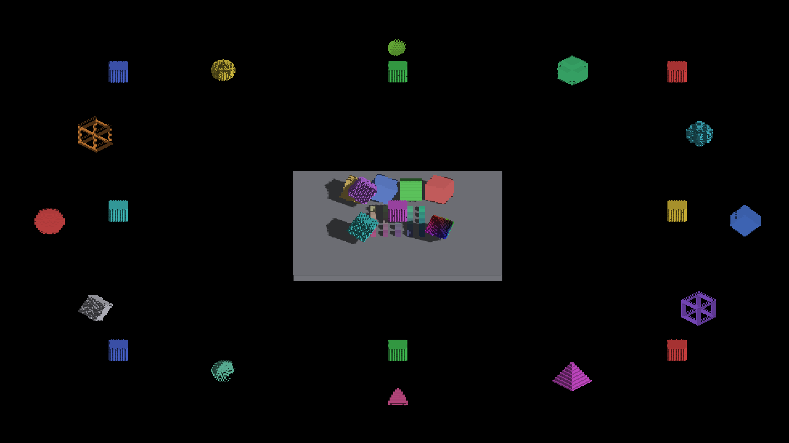

# Current-frame overflow sort

Sort eligibility still uses the pool's displaced-cell collision flag. Its work
now derives from the current GPU append count, so an empty-to-nonempty transition
is sorted on its first frame. A preparation mode writes indirect grids for fill,
local sorting and stages 12..30. Empty lists and stages beyond the active span
produce zero-sized grids. CPU encoding and uniform-update overhead remains even
for those grids; this does not claim zero overhead for flagged empty pools.

The scratch control region grows from 256 to 512 bytes. Its first eight words
retain draw/counter ownership; 21 four-word commands fit afterward. Storage and
command barriers order argument production and consumption. Both backends flatten
2-D workgroup grids, preserving coverage beyond the X dispatch limit. Rendering
no longer uses the diagnostic readback as a correctness input.

## Validation

Eight focused capacity/GPU tests passed on Metal. The production sort shader
matches a CPU lexicographic reference through counts 0, 4097, 1, 0 and 262145;
it checks draw/counter preservation and a fill dispatch spilling into Y. This
covers first population, stale argument replacement and partial sort blocks.
IRPerfGrid, IRCanvasStress and IrredenEngineTest built; header/Metal registry,
comment and diff checks passed. Review found no correctness blockers.

All nine full-turn CanvasStress capture pairs are full-RGB identical;
[results](current-frame-overflow-sort/canvas-comparison.json) retained. OpenGL
runtime validation remains outstanding. Unflagged cross-cell band-code ties
remain outside this sort's eligibility contract.

| Parent | Current-frame sort (identical RGB) |
|---|---|
|  |  |

## Measurements

Apple M4 Max, Metal Debug, default lights/shadows, voxel-set frozen wave, yaw45°,
zoom4, GPU profiling on; two 300-frame runs each including initial frames.
Million uses 100³ entities/pool128; default and empty use 64³ entities/pool64.
Empty sets wave amplitude0; other cases retain amplitude5. Cases ran in table
order. The runtime Lua files match the earlier capacity audit's
[pool128](million-entity-capacity/pool128-config.lua) and
[pool64](million-entity-capacity/pool64-config.lua) snapshots. Runtime config restored.

| Case | Frame mean ms (run range) | Overflow GPU invocation mean ms |
|---|---:|---:|
| million | 52.340 (52.120–52.560) | 9.829 |
| default | 17.705 (17.700–17.710) | 2.669 |
| empty | 8.710 (8.640–8.780) | 0.068 |

Reports and binary/shader fingerprints are in
[current-frame-overflow-sort/](current-frame-overflow-sort/). No overflow-drop
diagnostics appeared. The million frame mean remains in the prior live-lighting
run range; no controlled frame-time speedup is claimed. The sampled overflow
invocation is lower than the earlier approximately10.8ms samples, but those
samples are not an interleaved control. Do not sum invocation rows into a GPU
frame budget. Full-frame GPU accounting is the next profiling task.

The existing retired-frame diagnostic read is a shared-memory memcpy on Metal.
GL may synchronize; true nonblocking diagnostics need a separate snapshot/fence
API, not removal of warning coverage or a ring that maps buffers without fences.
