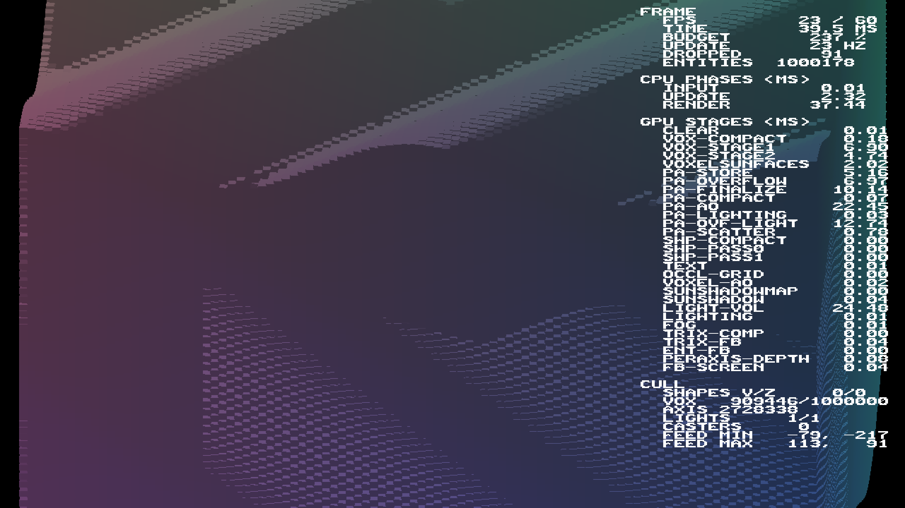

# Overflow capacity from voxel demand

Rotated overflow storage now covers three records per configured main-pool
voxel, rounded up to a power of two and retaining the existing canvas reserve.
The previous screen-area heuristic dropped 671,737 entries in the million-entity
45° workload. Both corrected runs reported no overflow-drop diagnostics.

The bound depends on unique axis compact lists, one canonical mode-3 trixel
lane per voxel/axis, micro-slice zero only, and return before dual-face emission.
Allocation, append clamp, shader layout and sort share one capacity. Reserving
before rendering covers the first frame after a camera jump or spawn without
a delayed readback/growth decision. Independent review checked both shader paths.

## Cost and measurements

This is a correctness baseline, not a speedup. Entry storage alone changes:

| Configured pool | Previous entries / MiB | Corrected entries / MiB |
|---|---:|---:|
| 64³ | 524,288 / 6 | 1,048,576 / 12 |
| 128³ | 524,288 / 6 | 8,388,608 / 96 |

These figures exclude unchanged winner/mask/control storage and other renderer
allocations. They are calculated allocation sizes, not measured peak residency.

Apple M4 Max, Metal Debug, frozen voxel-set wave, yaw 45°, zoom 4, default
lights/shadows, GPU profiling enabled; two 300-frame runs each, including initial
frames. Million runs precede default-pool runs. Reports and fingerprints are in
[overflow-demand-capacity/](overflow-demand-capacity/).

| Entities / pool | Mean frame ms (run range) | p95 range ms | p99 range ms |
|---|---:|---:|---:|
| 1,000,000 / 128³ | 52.430 (52.310–52.550) | 54.90–55.09 | 73.93–74.55 |
| 262,144 / 64³ | 17.555 (17.550–17.560) | 17.89–18.01 | 21.06–22.90 |

Runtime configs are byte-identical to the retained
[pool128](million-entity-capacity/pool128-config.lua) and
[pool64](million-entity-capacity/pool64-config.lua) audit configs, respectively.
Manifests name the parent revision plus dirty capacity/test files; these are
the final implementation in this change. Runtime config was restored afterward.
The historical audit recorded 44.705 ms for incomplete million-entity coverage
and 17.540 ms for the default pool. These are not fresh interleaved controls;
do not attribute the entire difference to any one stage. Sampled GPU invocation
rows are not additive full-frame GPU accounting.

## Validation and limits

- 20 focused capacity/chunk-bounds tests passed, including debug guard failures.
- IRPerfGrid, IRCanvasStress and IrredenEngineTest built; header/Metal registry
  and comment validators passed.
- Nine CanvasStress yaw poses were full-RGB identical to the previous captures;
  [comparison results](overflow-demand-capacity/canvas-comparison.json) retained.
- A 15-pose million-entity yaw sweep completed. Representative 40° captures below
  retain the timing HUD, so they are diagnostic views, not pixel-equivalence
  evidence or an oracle for every voxel. Visible bands/stipple remain; this
  change does not claim to resolve every rendering artifact.
- No OpenGL runtime validation on this host. Shader layouts are unchanged.
  Arbitrarily large pool dimensions remain unsupported: existing configuration
  arithmetic and hardware allocation limits require separate work.

| Historical saturated million scene | Corrected capacity |
|---|---|
|  |  |

| CanvasStress before | CanvasStress after (identical RGB) |
|---|---|
|  |  |

## Next work

Measure capacity-sized sorting/clearing and live overflow processing separately;
reduce work before choosing permanent larger allocations or paged storage.
Preserve the complete-coverage baseline and deterministic order. Pool/config
range validation and measured peak residency remain prerequisites for raising
capacity broadly. See the [canonical TODO](rotation-subdivision-audit.md).
