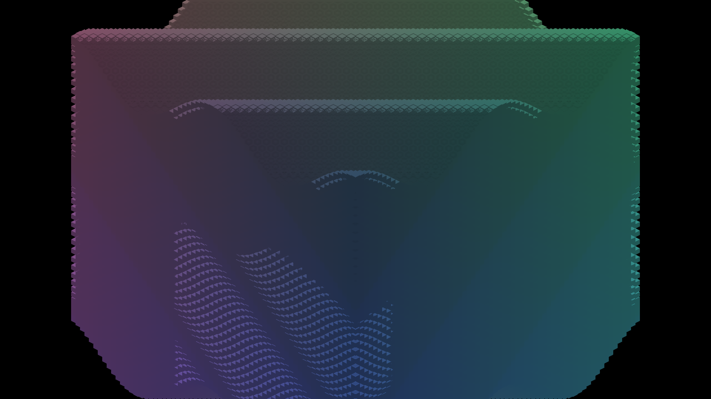

# Voxel dispatch packing experiment

This experiment retained eight micro-slices per workgroup. A global increase to 32
is promising for dense cardinal work but is not adopted: the low-density
depth pass regresses, and these grouped Debug runs do not qualify a new default.
The retained [experimental patch](packing32.patch) changes only the five packing
declarations, on parent `9fa306b92c76b7a71b4bec10ab31196a5977d9a0`.

## Native measurements

macOS Metal, Debug, AC power, 262,144 frozen-wave voxel entities, FULL subdivision,
origin pivot, no overlay, stage profiling enabled. Each arm has two 120-frame
runs; steady measurements exclude the first 30 frames. CLI arguments, binary and
shader hashes, host load, clean exits and actual camera witnesses are recorded
in each manifest. Raw reports and logs are retained beside the summaries; trailing whitespace in
logs is stripped.

| Case | Effective density | Packing 8 steady mean (run range), ms | Packing 32 steady mean (run range), ms |
|---|---|---|---|
| Cardinal, zoom 4/base 4 | 16 | 101.905 (100.040–103.770) | 82.600 (78.230–86.970) |
| Cardinal, zoom 1/base 1 | 1 | 9.555 (9.320–9.790) | 9.950 (8.940–10.960) |
| Yaw 45°, zoom 4/base 4 | capped 8, one slice per axis entry | 23.145 (21.880–24.410) | 22.715 (21.590–23.840) |

Dense cardinal depth/election/color GPU scope means change from
30.773/28.425/27.215 ms to 23.814/22.571/21.764 ms. Its frame improvement is
about 19%. Low-density depth changes from 2.375 ms (2.287–2.463) to
3.003 ms (2.609–3.397), while election improves. The rotated control is nearly
neutral and retains a peak of 745,398 overflow entries with zero drops.

The benchmark wrapper coordinates resources with the fleet, but the host was
busy and runs waited for reservations. All packing-8 runs preceded packing-32;
there is no interleaved or return-to-baseline control. Treat these results as
directional. GPU scopes include stalls and are not additive costs. Different
cardinal/per-axis effective densities do not establish rotation parity. These
are neither Release results nor a million-entity/60-FPS qualification.

## Sample and image preservation

One group still owns one voxel and six face-half lanes. Increasing Z from 8 to
32 reduces group count for dense subdivision but adds idle lanes when a voxel
needs fewer than 32 samples. The compact writer and consumer must agree on
`slice = groupZ * packing + localZ`; both padding and voxel-count guards remain
necessary. Changing only a layout or only this stride loses or duplicates work.

`scripts/tests/test_render_voxel_dispatch_packing.py` compiles the actual GLSL
and Metal dispatch writers and consumer index/guard prefixes into scalar C++
adapters. It checks every voxel/slice exactly once for counts 0/1/1023/1024/1025,
densities 1–16, all three subdivision modes, cardinal/per-axis routes and the
feeder path. Positive controls remove the row offset, slice-group offset, tail
guard and count guard; each must fail. Cross-file checks cover both constants,
both GLSL layouts and all five Metal pipeline variants. The shared extraction
helper also accepts void functions.

This gate tests writer arithmetic and consumer lane recovery, not native shader
execution, the compact finalizer's choice of slice count, or face geometry.
It passed for both the experimental 32 and retained 8. Native captures supply
a separate, narrower output check: all RGB pixels at yaw 0°/45°/90° match the
retained complete-viewport controls. [Comparison hashes](captures/comparison.json)
and [capture commands](captures/manifest.json) identify the inputs. The references
precede the latest entity-hierarchy-only master merge; equality does not prove
that their inherited geometry is universally correct.

[45° capture](captures/diagonal-packing32.png) ·
[90° capture](captures/cardinal90-packing32.png)

## Subsequent experiment

The [occupancy follow-up](../voxel-workgroup-occupancy/README.md) implements
whole-voxel sharing, actual finalizer coverage and return controls described below.
This report retains the measurements and decision from the earlier experiment.

Retain the current default while measuring dense-only group specialization or
packing several low-density voxels into a group. Route selection, indirect grid
dimensions and all consumer variants must share one explicit contract. Extend
the executable gate to the compact finalizer's actual slice selection before
changing that routing. Then compare interleaved native controls, feeder work,
continuous camera/density transitions and OpenGL output; keep every requested
sample and exact finite-face coverage. Profile conservative overflow separately.
