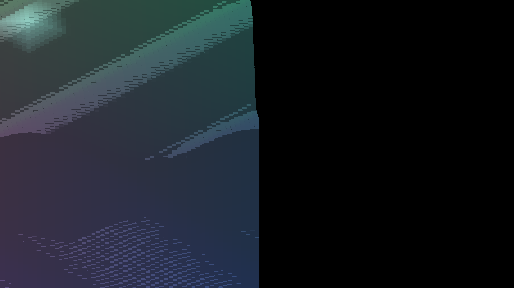
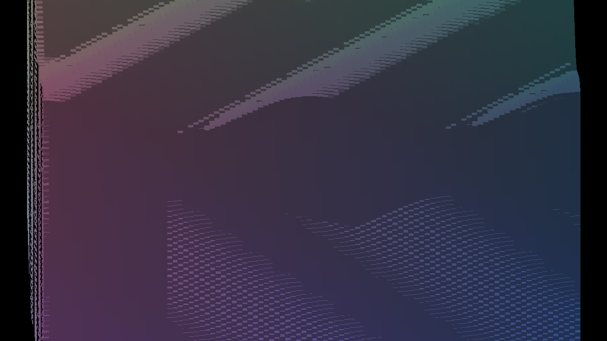

# One pose, two first frames

`IRPerfGrid` at one million entities, held at a yaw of 46.8° and captured
after frame 60, 2560 by 1440. Counts, coverage and hashes:
`docs/perf/continuous-yaw-sweep/pivot-identity/README.md`.

With the engine's default yaw pivot the view depends on the first frame: the
scene sits about 330 pixels further left when frame 1 was rendered on the
cardinal, half the screen is lit against 63%, and the cull admits 482,966
candidates against 626,223.

| Default pivot, frame 1 at 0° | Default pivot, frame 1 at 46.8° |
|---|---|
|  |  |

With the pivot pinned at the grid centre the two first frames give one
capture, byte for byte (`pinned-from-cardinal.png` and
`pinned-from-rotated.png` have the same SHA-256):

