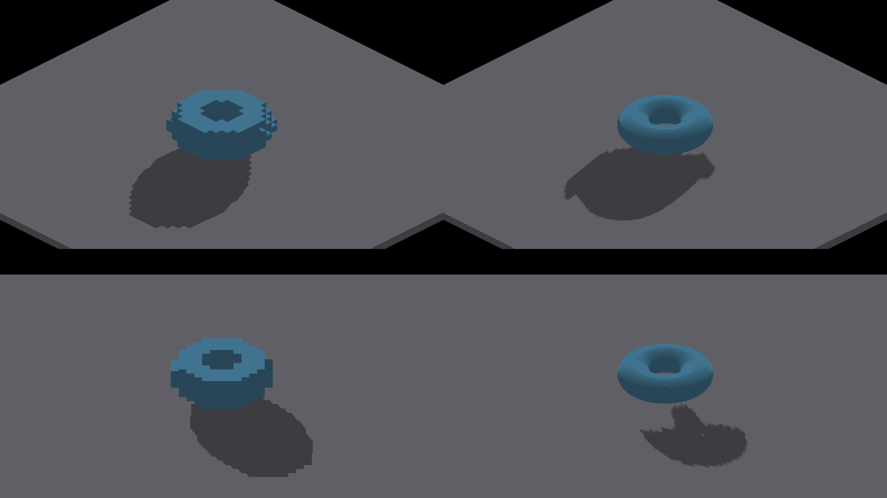
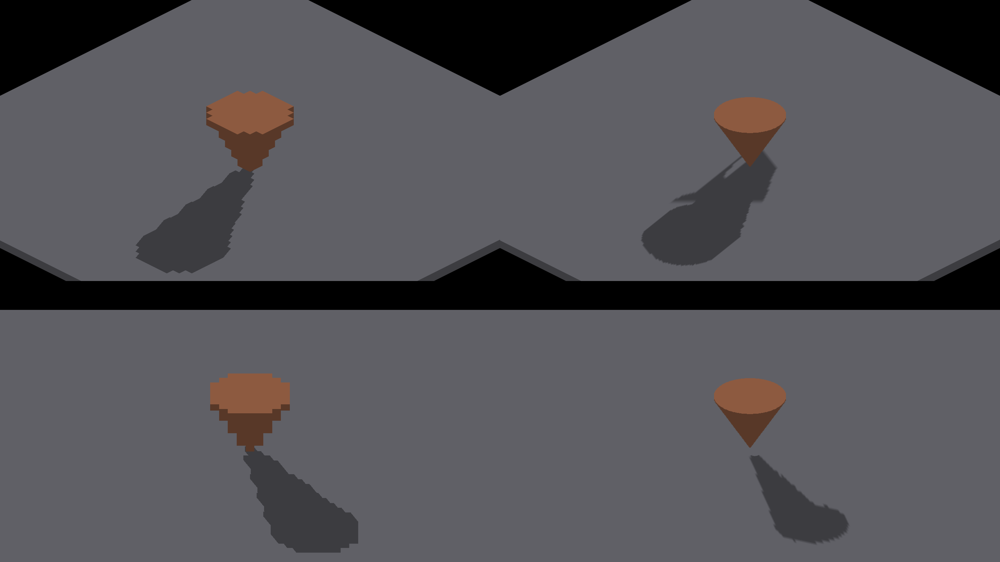

# ShapeDebug isolated floor-shadow baseline

Investigation evidence for [#4274](https://github.com/jakildev/IrredenEngine/issues/4274),
not a shadow repair or a clean-edge certification. Native Metal, Apple M4 Max,
Debug, 2560×1440 framebuffer. Captures use renderer baseline
`d1beb77d06b088a72bfa95f77e79235c89cf5951` plus the isolated floor fixture;
each run's `capture.json` contains its exact revision, dirty patch and command.

There are 64 native frames: torus/cone × voxel/SDF × shadows on/off × eight
yaws. Each directory includes the complete native run log (trailing whitespace normalized). Every valid capture
run exited cleanly. `sha256.json` records image hashes.

## Fixture and oracle

```sh
fleet-run IRShapeDebug --spin-yaw --auto-screenshot 8 --zoom 8 --no-ao --pivot-origin --spin-shape torus --spin-shape-voxel --spin-shape-floor
```

Repeat with `--no-shadows` for the control, substitute `cone`, or omit
`--spin-shape-voxel` for the analytic representation. The isolated floor has
the full scene's elevation; there are no local lights. Actual yaw, effective
subdivisions and pixel step are logged, not inferred from nominal shot angles.
The nominal 180° shot is actually `-3.1414928` radians.

The voxel oracle reconstructs the authored integer occupancy (504 torus cells,
233 cone cells), projects all occupied unit boxes along sun `(0.35,0.85,-0.4)`
onto the floor's top surface, and unions their convex projected polygons at
pixel centers. Floor height is `4.5 - 0.5/subdivisions`, accounting for the
analytic box's subdivision-scaled surface threshold. Shared fixture helpers
own camera yaw and isometric projection; shared raster helpers own pixel-center
coverage. Independent floor-ray/slab-intersection tests verify this projection.

The no-shadow image identifies visible neutral floor. A one-pixel erosion
excludes caster boundaries. Observed shadow means a red-channel darkening
greater than eight levels. Missing/excess counts exclude a one-pixel oracle
boundary band. This is a fixed-fixture diagnostic, not a generic beauty-image
classifier; do not apply it to SDF casters, panned cameras, other lights or AO.
The SDF captures are **ungraded evidence**, not covered by this voxel oracle.

Example, from the repo root (requires Pillow):

```sh
python3 scripts/render-shape-footprint-metric.py docs/pr-screenshots/codex/4274-shape-shadow-footprints/torus-voxel/0.png docs/pr-screenshots/codex/4274-shape-shadow-footprints/torus-voxel-unshadowed/0.png --shape torus --yaw 0 --iso-scale 32 16 --subdivisions 8 --strict-edges --output /tmp/shape-footprint
python3 -m unittest scripts.tests.test_render_shape_footprint_metric
```

The first command must currently exit **1**: the committed baseline has real
edge discrepancies. Without `--strict-edges`, exit 0 means the measurement
completed, not that the shadow is correct. Red oracle contours show the
expected footprint; error images mark excess red and missing cyan. No filter
is applied to the engine output. Mask morphology only defines measurement
tolerance.

## Measured voxel results

| Nominal yaw | Torus observed/expected area | Torus IoU | Cone observed/expected area | Cone IoU |
|---|---:|---:|---:|---:|
| 0° | 0.99730 | 0.97820 | 0.99960 | 0.96346 |
| 45° | 0.99644 | 0.98372 | 0.99847 | 0.97436 |
| 90° | 0.99409 | 0.98666 | 0.99849 | 0.97881 |
| 135° | 0.99016 | 0.97649 | 0.99635 | 0.96372 |
| 180° | 0.99125 | 0.96854 | 0.98845 | 0.96722 |
| 225° | 1.01744 | 0.97420 | 1.01028 | 0.97503 |
| 270° | 1.00336 | 0.98182 | 1.00116 | 0.97770 |
| 315° | 0.99831 | 0.97519 | 0.99832 | 0.95883 |

All sixteen fail strict edges. Full counts and actual yaws are in
`voxel-metrics.json`; none of the expected footprints clips the framebuffer.
Area agreement rejects a gross scale-error explanation in these voxel cases,
but does not establish correct shape or edge ownership. The sun produces
about 2.30 units of horizontal displacement per unit of vertical separation,
so a large floor footprint need not imply incorrect scale.

## Visual comparison and remaining work

Each comparison sheet has **voxel left / SDF right**, **0° top / 45° bottom**;
these are different representations at the same baseline, not before/after.
Full frames preserve the complete shadows.




The SDF cone's 0° footprint visibly stretches and contains an internal gap;
the 45° result changes substantially. Establish an analytic-surface oracle
before assigning precise SDF footprint errors or diagnosing their cause.
Retest against the active analytic cardinal-continuity work
[#4258](https://github.com/jakildev/IrredenEngine/pull/4258), backed by
[#4193](https://github.com/jakildev/IrredenEngine/issues/4193), before creating
a competing repair. Exact cardinal receiver reconstruction is separately
tracked by [#4231](https://github.com/jakildev/IrredenEngine/issues/4231).

No shadow shader changes, self-shadow correctness claim, cross-backend parity
claim, or performance result are part of this baseline. The remaining work is
edge/receiver attribution for voxels and validated analytic footprint testing.

## Existing-mode regression control

`nofloor-comparison.json` records eight byte-identical before/after PNG pairs
for the existing torus sweep without the new floor option. Representative
0°/45° pairs are committed. The new optional floor leaves that mode unchanged.

The eight unit tests include pixel-exact independent box projection at four
yaws, a 20% enlarged shadow, a displaced equal-area shadow, an entirely absent
shadow, and floor/caster/background classification. These positive controls
prevent aggregate area agreement from masquerading as geometric correctness.

After merging master `ff515105c`, both the isolated voxel-torus sweep and
the floorless torus sweep exited cleanly and reproduced all eight prior RGB
frames exactly. The `merged-master-*` manifests, comparisons and logs record
these final checks without duplicating identical screenshots.
