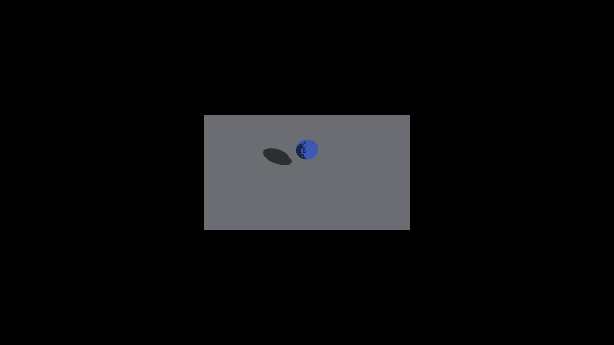

# Bounded analytic-box casting parallelism

## Change and invariant

Finite analytic boxes previously assigned one 64-thread workgroup per descriptor.
A large floor could make those 64 lanes traverse much of each 1024² cascade.
The same samples are now distributed over the Z dimension of the dispatch:

`start = groupZ * 64 + lane`, `stride = 64 * workgroupsPerShape`.

Every sample in `[0, projectedWidth * projectedHeight)` belongs to exactly one
(groupZ, lane, loop iteration). Ray intersections, coverage bounds, sample
centers and packed atomic-min writes are unchanged on GLSL and Metal. No blur,
bias, footprint expansion, extra buffer or extra dispatch is introduced.

CPU scheduling uses `clamp(256 / descriptorCount, 1, 32)` groups per descriptor.
This is a bounded scheduling heuristic, not a coverage rule. At 256 or more
descriptors it uses the previous one-group scheduling. XY padding lanes retain
the existing early-out. Count includes non-box and non-casting descriptors;
many such shapes may suppress parallelism for a remaining large box. Tiny or
offscreen boxes repeat setup across groups. These workloads need separate
profiling before any claim of a general speedup.

## Native measurements

Apple M4 Max, Metal, fixed camera yaw 45°, 303 frames with 302 valid samples per
exercised row. Baseline uses parent production shaders at
`0d4ae360a9436ea1c810ca7d314b3f8b1211d887` with only the new casting timer
boundaries added. Comparisons use identical scope boundaries on both sides.

| Fixture | Baseline box-cast average ms | Partitioned box-cast average ms |
|---|---:|---:|
| Sphere + large analytic floor | 1.028 | 0.046 / 0.059 repeat |
| Small analytic box, no floor | 0.182 | 0.037 |

The large-floor box pass improves about 17–22× in these runs. This is a
pass-specific improvement, not an engine FPS claim. Timings include startup and
GPU-timeline effects; raw min/max/count reports are adjacent. The original sphere
casting breakdown was clear 0.116, boxes 1.028, fallback 0.196, resolve 0.016,
bake 0.010 ms. New non-nested rows retain this attribution; `shapeSunCast` stays
an unwritten compatibility field rather than overlapping the subscopes.

## Visual preservation

- Baseline 2121 and partitioned 2123: exact full-frame RGB equality.
- Small baseline 2122 and partitioned 2124: exact full-frame RGB equality.
- 2125: repeat of the optimized sphere/floor workload.
- 2126–2129: rotated box entity (yaw 0.37 radians), subdivision 3, camera
  quadrants 0/90/180/270. Native smoke run exited cleanly; this is not an oracle
  certifying existing receiver or edge artifacts.

Existing sphere surface speckling and imperfect projected edges remain visible.
This optimization preserves them; geometry-correct sharp shadows remain open.

Baseline:


Partitioned:



## Reproduce

```sh
fleet-build --target IRCanvasStress -j 3
fleet-run --timeout 60 IRCanvasStress --only shadowbox,floor --probe-analytic-sphere --pivot-origin --no-spin --no-auto-rotate --no-ao --subdivisions 3 --zoom 2.5 --yaw 0.78539816 --auto-profile --auto-screenshot 240 --sweep-yaw 0.78539816 0.78539816 1
fleet-run --timeout 60 IRCanvasStress --only shadowbox --probe-analytic-box --pivot-origin --no-spin --no-auto-rotate --no-ao --subdivisions 1 --zoom 4 --yaw 0.78539816 --auto-profile --auto-screenshot 240 --sweep-yaw 0.78539816 0.78539816 1
fleet-run --timeout 60 IRCanvasStress --only shadowbox,floor --probe-analytic-box --analytic-box-yaw 0.37 --pivot-origin --no-spin --no-auto-rotate --no-ao --subdivisions 3 --zoom 2.5 --auto-screenshot 6 --sweep-yaw 0 4.71238898 4
```

For the baseline keep the new timer scopes but restore `bakeAnalyticBoxes` and
the two `c_bake_box_sun_shadow` shaders from the parent SHA above.

## Deterministic validation

`test_render_box_cast_dispatch.py` extracts the actual shader loop expressions
and CPU workgroup policy and executes them as scalar C++. It checks descriptor
counts 1–8192, partition sizes 1–32 (including non-powers of two), empty/single/tail
sample intervals and full 1024² maps. Every sample must have exactly one visit.
Mutations causing group overlap or an unpartitioned stride fail on both backends.
This proves work partitioning, not the unchanged ray-box intersection math.
All 32 rendering suites passed, including the new partition test. Native build,
format, header checks and Ruff passed. Independent review found no correctness
blockers. Native OpenGL still needs
Windows smoke validation; the extracted GLSL test is not a runtime substitute.
