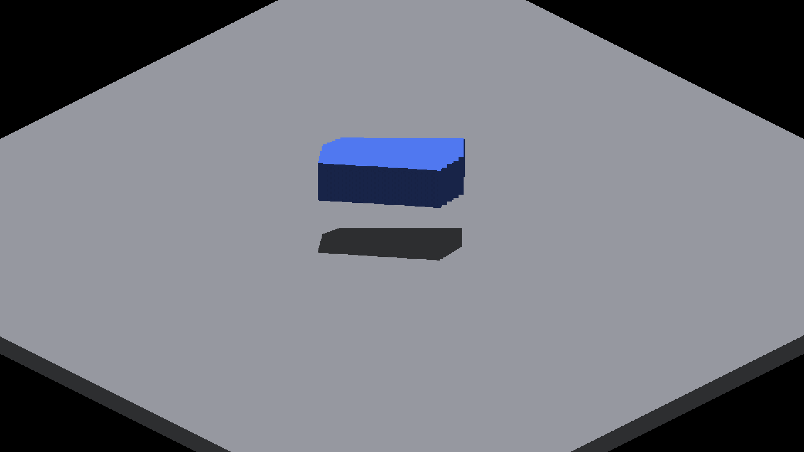

# Bounded exact shadow overflow reference

Native Metal captures, 2560×1440, four camera quadrants. Within each case,
`before-yaw*.png` and `reference-yaw*.png` differ only in the default-off
finite-face diagnostic query. No blur or image editing is applied.

| Case directory | Sun | Requested face records | Expected query change |
|---|---|---:|---|
| `count63` | Overhead | 64 | None: tile lists complete |
| `count64` | Overhead | 65 | Exact reference for incomplete tiles |
| `count128` | Overhead | 129 | Exact reference for incomplete tiles |
| `count128-oblique-sun` | Oblique | 387 | None: reference budget exceeded |

| Production fallback, 128 boxes, yaw 90° | Enabled reference |
|---|---|
|  |  |

All 16 default-off restoration frames match baseline in RGB. Those duplicate
PNGs are omitted; the restoration comparison, raw manifests, tile tables,
reproduction commands and separate timing controls are linked from the
[report](../../../perf/bounded-source-face-reference.md).

The native comparison diagnoses this analytical-box workload; it does not
certify every render mode, native OpenGL or a scalable production solution.
