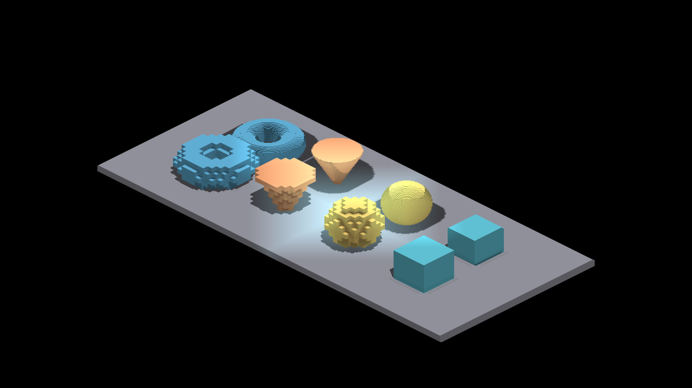
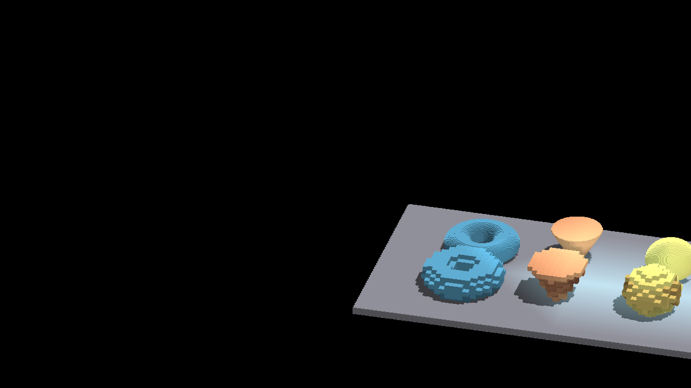
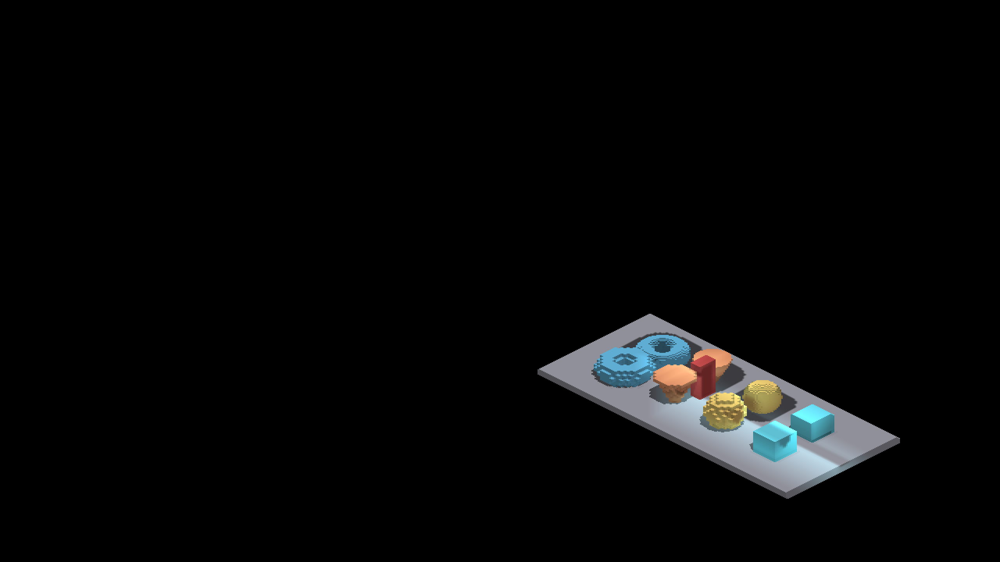

# Bounded propagation image controls

All 51 final full-domain/bounded capture pairs have identical PNG bytes.
[comparison.json](comparison.json) records every label and both SHA-256 hashes.
The [measurement record](../../../perf/bounded-light-volume/README.md) defines
the control and its limitations. Representative pairs were also inspected
visually; these images preserve existing geometry and light falloff.

| View | Full-domain control | Bounded dispatch |
|---|---|---|
| In-window light, zoom 4 |  |  |
| Boundary light, yaw 30° |  |  |
| Occlusion-relocated boundary seed |  |  |

Captured with `IRLightingEmissive` and `IRLightingOccludedBoundary`, native
Metal/macOS Debug, offscreen, ten warmup frames per view. Before and after use
the same 48-byte parameter layout; the control uses the original full-volume
host dispatch and no shader invocation offset. Both complete all captures and
shut down cleanly. No smoothing, reference refresh or tolerance change is part
of this comparison.
