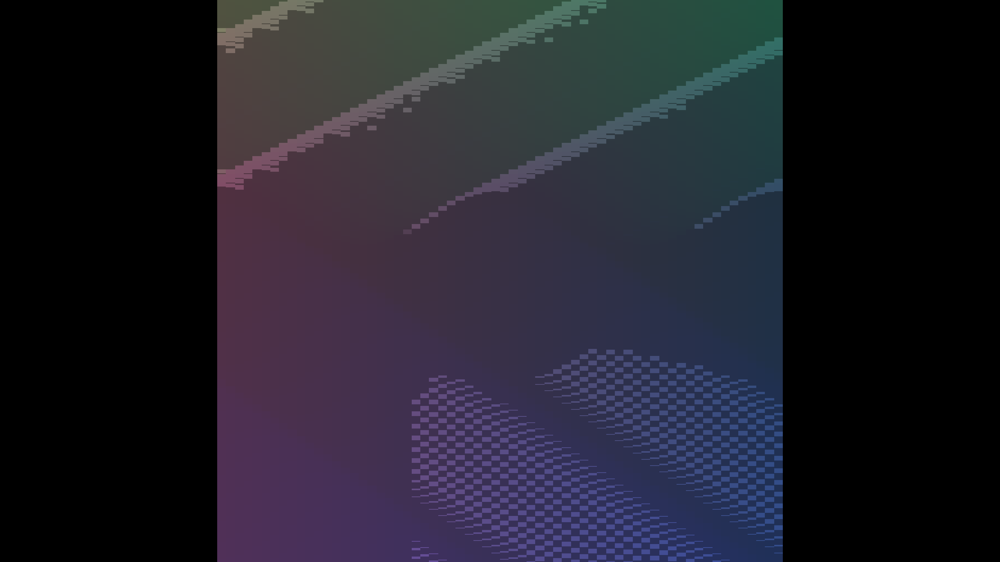

# Cardinal winner-election timing controls

Adding the independent GPU timer preserves all RGB output in paired cardinal
and diagonal views. Both scenes use 262,144 frozen wave voxels, zoom 4/base 4,
shadows enabled and no overlay; all four native Metal runs exited cleanly.

| Cardinal | Diagonal |
|---|---|
|  |  |

Each pictured image is byte-identical in RGB to its stage-profiling-disabled
counterpart. These are timing controls, not evidence of a rendering change or
complete visual acceptance. `raw.tar.gz` retains all four full captures, logs,
source diff, manifest and capture script. The two existing profiling presets
use the same 128³ pool and scene; explicit command arguments select a 64³ grid.
The performance-only measurements use the default pool; do not mix their timing
with these capture runs, which intentionally include screenshot readback.

`manifest.json` pins the commands, binary hash and capture hashes. Captures
use the timer change before commit on top of `3568e749c`; the retained source
patch supplies the exact uncommitted changes. The timer scope is documented in
[the measurement contract](../../../design/gpu-stage-timing-cost-model.md).
See [the separate profiles](../../../perf/cardinal-election-timing/README.md)
for the newly attributed dispatch cost. Native OpenGL is not validated here.

The cardinal capture also exposes a restricted central viewport at effective
density 16. Timing on/off equality does not validate that extent; its canvas
scale/allocation contract is a separate visual follow-up before dispatch packing.
