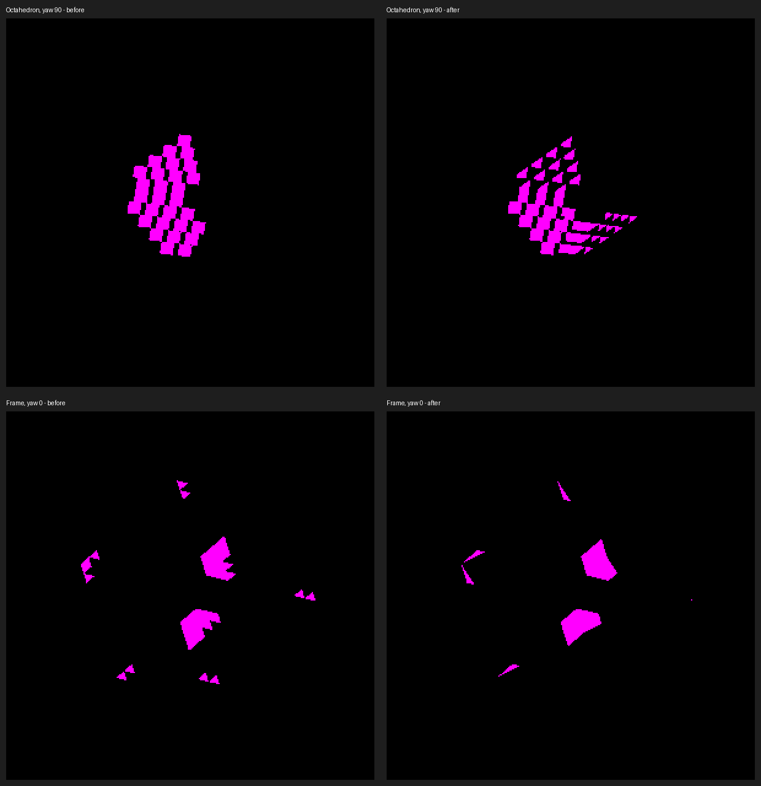

# Continuous lighting on original source faces

The rigid source-face compositor evaluates direct sun visibility at each
fragment's interpolated world surface point. It shares the bounded finite-face
query with compute receivers, retains original quads, and composes visibility
with separate linear ambient/local/sky and direct terms before ACES or clamping.
This represents a real partial shadow inside a voxel face without blurring it.

## Independent geometry result

The parent oracle in #3620 rejects all eight prior cardinal captures. All ten
current controls pass with **zero false and missed interior shadow pixels**:
stepped octahedron and hollow frame at yaw 0/90/180/270, plus frame at 45/135.
The oracle independently intersects original unit boxes; it does not read GPU
shadow maps or copy the production face query. Thresholds are unchanged: one
screenshot pixel at face boundaries, one at independently predicted shadow
boundaries, and no ray bias. Both lit and shadowed interiors survive exclusion
in every control. See [raw results](continuous-metrics.json).



The comparison uses identical `(980,430)-(1580,1030)` crops without rescaling.
Top: octahedron yaw90, before1954/after1964. Bottom: frame yaw0,
before1957/after1967. Magenta marks occlusion; black includes both lit surfaces
and background, so these overlays alone do not certify silhouette.
The before captures are retained in
[projected-face math](../projected-face-math/README.md), whose output was
pixel-identical to its baseline. They were captured at commit
`bd5e734838a65145490ababf85fb0bb624243577`; this change is based on
`355fb6489314ac5038a7b902b70f6ddb223f5483` (the oracle-only parent).

## Reproduction and controls

Native macOS, Apple M4 Max, Metal, 2560×1440 screenshots. New images contain the
production change in this PR. All visual runs below exited cleanly.

```sh
fleet-build -j3 --target IRCanvasStress header-checks
fleet-run --timeout 45 IRCanvasStress --only orbit --focus-orbit 3 --no-spin --no-auto-rotate --pivot-origin --no-ao --zoom 4 --debug-overlay shadow --auto-screenshot 6 --sweep-yaw 0 4.71238898 4
fleet-run --timeout 45 IRCanvasStress --only orbit --focus-orbit 7 --no-spin --no-auto-rotate --pivot-origin --no-ao --zoom 4 --debug-overlay shadow --auto-screenshot 6 --sweep-yaw 0 4.71238898 4
fleet-run --timeout 45 IRCanvasStress --only orbit --focus-orbit 7 --no-spin --no-auto-rotate --pivot-origin --no-ao --zoom 4 --debug-overlay shadow --auto-screenshot 6 --sweep-yaw 0.78539816 2.35619449 2
python3 scripts/render-source-occlusion-metric.py docs/pr-screenshots/codex/continuous-source-face-lighting/capture-1964.png --shape octahedron --yaw 90 --shadow-overlay --continuous-shadow
```

- 1963–1966: octahedron cardinal sweep.
- 1967–1970: frame cardinal sweep.
- 2000–2001: frame 45/135 degrees.
- 1971: representative of the clean twelve-shot `--no-lighting` frame run
  (same isolation, no `--no-ao`, no yaw sweep). No sun systems/resources exist;
  valid inert fragment bindings are provided, and baked faces do not read them.
- 1983: representative of the clean twelve-shot `--screen-lock-detached` frame
  run (same isolation, no `--no-ao`, no yaw sweep). World shadow receive stays off.
- 1999: frame45 with `--no-shadows`, same isolation/no-AO and a one-shot yaw sweep.
- 2002: same frame45 with shadows enabled; [lit control pair](lit-control.png).
- 1995–1996: full scene at yaw0/45, `--no-spin --no-auto-rotate
  --auto-screenshot 6 --sweep-yaw 0 0.78539816 2`.

The rendering suite passes **197 tests**. The new production-helper controls
execute GLSL and Metal composition, including HDR exposure, AO/shadow display and
alpha. Each backend rejects mutations that shadow indirect light, tone-map before
visibility, or overwrite alpha. Header checks, native shader compilation, ruff
and diff whitespace checks pass. Focused review identified absent sun buffers in
unlit pipelines; explicit valid bindings resolved it, with native coverage.

## Cost and remaining scope

Source records are 80 bytes instead of 48 (+32 bytes per capacity slot, +66.7%).
Existing allocations derive their size from the record type. The quaternion is
per canvas; no new buffer slot, render pass, dispatch or draw is introduced.
Sun visibility is queried per covered fragment instead of once per source face,
so overdraw and large screen coverage can increase GPU work. Queries still cap
at64 candidates per tile and retain the existing approximate overflow fallback.
This is a correctness improvement, not a performance claim.

An optional profiling attempt queued behind fleet work and ended with the
watchdog result; it is excluded as performance evidence. Profile the fragment
cost and record traffic under rotation/density before population scaling. OpenGL
runtime is unverified on this host. HDR math is executed in helper tests, but this
slice does not add native HDR/LUT/fog scene coverage. Ambient, AO, local-volume and
sky remain face-centered; only direct visibility varies within the face.

Full-scene images still show other banding/trixel artifacts. GRID/SDF reception,
strict floor-shadow boundaries, mixed-source tile/bake boundaries, dense overflow
and temporal transitions are not certified by these isolated controls. Their
remaining work stays in the [audit TODO](../../../design/rendering-audit-todo.md).

## Master refresh validation

At production merge `44c9390a2d6782b60323ff639beda6ebc8b567c3`, master includes
the SDF fog carrier and fleet CI repair. The four cardinal frame-overlay
captures 2039–2042 are RGB-identical to 1967–1970 respectively; the native
sweep exited CLEAN. IRCanvasStress and header checks pass; all 29 render
harness suites available on this branch pass. Independent source review found
no blockers in the refreshed layout, fog-carrier interaction, quaternion use,
lighting composition or bindings.

The earlier Linux startup/report blocker was followed by successful Linux
build and perf runs with nonzero head reports (perf run 35678298442). That
GRID fixture does not establish source-face OpenGL runtime or throughput.
The refreshed commit will receive its own CI run before acceptance.
