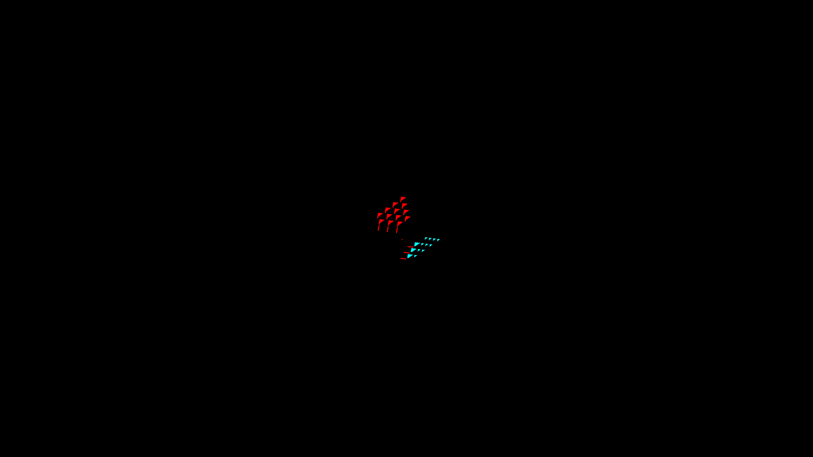

# Continuous source-surface shadow gate

The prior face-center oracle validates the visibility sampled by current source
lighting. It cannot certify a shadow boundary crossing the interior of a voxel
face. `--continuous-shadow --shadow-overlay` traces from each screenshot pixel's
actual point on the independently projected original face instead.

Both modes reuse original-cell occupancy, affine camera depth ownership and
open-volume slab intersection. The continuous mode inverts the projected face
basis to recover its original local point; it does not read renderer depth,
normals, source records or shadow-map samples.

## Baseline

These are the unchanged native Metal captures 1953–1960 from
[projected-face consolidation](../projected-face-math/README.md), at zoom 4,
yaw 0/90/180/270. All eight pass the face-center gate, but **all eight fail**
the continuous gate:

| Shape | Yaw 0 false/missed | Yaw 90 | Yaw 180 | Yaw 270 |
|---|---:|---:|---:|---:|
| Octahedron | 2006 / 0 | 2136 / 728 | 32 / 134 | 1031 / 449 |
| Frame | 736 / 202 | 236 / 514 | 20 / 1 | 5 / 420 |

Red is excess shadow; cyan is missing shadow. Triangular error regions do not
mean triangular faces are inherently wrong: a legitimate boundary can cross
part of a face, while the current renderer colors that entire face from its
center sample.



`metrics.json` retains continuous commands/results; `face-center-controls.json`
retains the passing controls. Source captures and CLEAN native logs remain in
the linked parent evidence. No shader or rendered output changes in this slice.

## Raster allowance and controls

Exclude one screenshot pixel around face ownership boundaries and one around
independently predicted shadow boundaries (eight-neighbor/Chebyshev adjacency).
The latter accommodates screenshot/framebuffer sample quantization; it is
independent of the rendered mask and applies no ray bias or smoothing.
Both lit and shadowed samples must remain after exclusions. The geometric
`tested_interior_pixels` count precedes shadow exclusions; actual shadow
comparisons are the sum of lit/shadowed interior counts (also reported as
`tested_shadow_pixels`).

A literal flat face and an offset box give an exactly known half-face shadow.
That control passes continuous mode and fails the face-center model. Blank,
fully shadowed and inverted masks fail. A two-pixel-wide face whose entire
partial boundary is excluded fails as inconclusive. Pixel-center recovery and
edge-on rejection have explicit controls. All 196 rendering tests and ruff
pass; focused independent review found no blocker and prompted the explicit
post-exclusion sample count.

```sh
python3 scripts/render-source-occlusion-metric.py docs/pr-screenshots/codex/projected-face-math/capture-1954.png --shape octahedron --yaw 90 --shadow-overlay --continuous-shadow
```

This command intentionally exits 1. Omit `--continuous-shadow` for the passing
face-center control. Continuous mode requires the shadow overlay. Pair with the
normal/ownership gate; shadow comparison alone does not validate silhouettes or
distinguish overlapping geometry with equal normals.

## Implementation consequence

`c_lighting_to_trixel` writes a single composed color per `SourceVoxelFace`;
`f_source_face_scatter` paints that color across the entire quad. Improving
the center ray cannot express a partial face. The next production change must
retain the receiving surface and separate direct sun from ambient/local-light
contributions until geometric coverage is evaluated, before nonlinear HDR/tone
mapping. Reuse the bounded finite-face query and shared projected-face math.
Do not divide already-composed color by a guessed visibility or blur it.

This is a correctness target, not approval of per-fragment brute-force traversal.
Candidate bounds, early-outs for uniformly lit/shadowed faces, extra face-record
storage and GPU cost need measurement. GRID/SDF receiver reconstruction and
their presentation remain separate open tasks.
