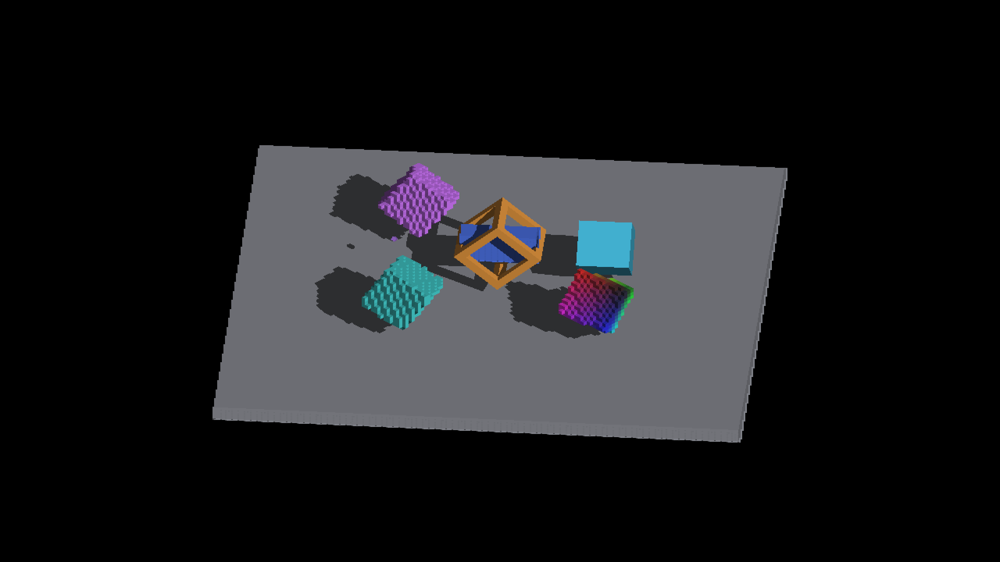

# Cooperative box indexing: appearance preservation

Apple M4 Max, macOS 26.5.2, Metal Debug, 2560×1440. Both arms use the same
IRCanvasStress binary. Before restores only the box caster and face-index
shader sources from `b872e9592b83dedfb3c88dd95b39cbed10620fd4` into runtime
staging; after uses the final cooperative source tree, staged by fleet-build.
No overrides remain.

```bash
fleet-run --timeout 60 IRCanvasStress --only shadowbox,floor,revox,rigid \
  --probe-analytic-box --no-spin --no-auto-rotate --pivot-origin \
  --zoom 2 --auto-screenshot 6 --sweep-yaw 0 5.585053606 9
```

All nine pairs (0° through 320° in 40° steps) have identical RGB pixels.
Before capture IDs: 2549–2557. After: 2558–2566. Both runs exited cleanly.
These images preserve existing geometry and artifacts; they do not claim a
visual correction. No blur, bias, extent or capacity adjustment is involved.

| Before, 40° | After, 40° |
|---|---|
|  |  |

[Method, performance and limits](../../../perf/cooperative-box-face-index.md).
