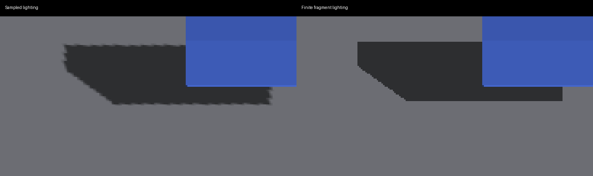
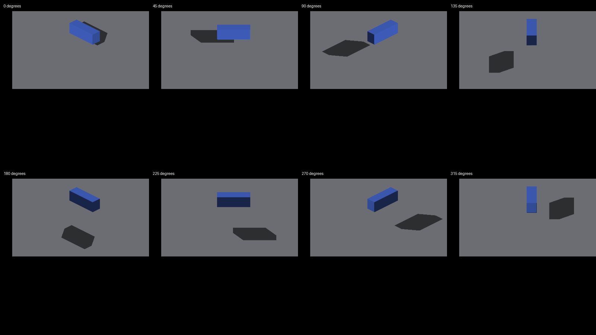

# Finite box shadows in ordinary lighting

Native Metal on Apple M4 Max, 2560×1440, 2026-09-24. Parent:
`3bfd58e1b6dc6a4524a76851b8c4d73f22a6c32a`.



The comparison crops x=950..1320, y=580..780 at yaw 45 and uses nearest-neighbor
magnification. Full captures are linked below. The finite receiver removes
repeating trixel teeth without a blur or filter change. Within x=1040..1139,
y=580..749, the first dark near-neutral shadow pixel is at y=616 or 618 in the
sampled control and y=612 in every column with finite fragment lighting. This
checks one expected horizontal boundary; it is not a general geometry oracle.

```sh
fleet-build -j3 --target IRCanvasStress header-checks
fleet-run --timeout 45 IRCanvasStress --only shadowbox,floor --probe-analytic-box --pivot-origin --no-spin --no-auto-rotate --no-ao --subdivisions 3 --zoom 2.5 --auto-screenshot 6 --sweep-yaw 0 5.49778714 8
```

| Camera yaw | Finite lighting | Sampled control |
|---|---|---|
| 0 | [capture](capture-2377.png) | [control](capture-2385.png) |
| 45 | [capture](capture-2378.png) | [control](capture-2386.png) |
| 90 | [capture](capture-2379.png) | [control](capture-2387.png) |
| 135 | [capture](capture-2380.png) | [control](capture-2388.png) |
| 180 | [capture](capture-2381.png) | [control](capture-2389.png) |
| 225 | [capture](capture-2382.png) | [control](capture-2390.png) |
| 270 | [capture](capture-2383.png) | [control](capture-2391.png) |
| 315 | [capture](capture-2384.png) | [control](capture-2392.png) |



The control disables the finite-lighting wrapper in the isolated demo runtime,
using the same binary, camera, geometry and lighting. The wrapper was restored
after the run. Control 2385/2386 are RGB-identical to parent captures 2345/2346
in the fragment-caster-footprint evidence. The initial implementation captures
2369..2376 preceded procedural-material fallback; published 2377..2384 include it.

## Adjacent modes

`IRLightingSpot --auto-screenshot 6 --no-ao` exited cleanly:
[0 degrees](spot-123.png), [30](spot-124.png), [45](spot-125.png),
[zoom 7](spot-126.png). Local illumination moves to the exact receiving surface;
these captures are not expected to be pixel-identical to sampled lighting.
Curved/lattice artifacts remain outside this box-receiver scope.

`IRFogDemo --auto-screenshot 6` exited cleanly at zoom 2/4/8.
[fog 2](fog-121.png), [fog 4](fog-122.png), [fog 8](fog-123.png) are RGB-identical
to the same run with the new fragment wrapper disabled:
[control 2](fog-124.png), [control 4](fog-125.png), [control 8](fog-126.png).
Committed historical fog references differ; they were not refreshed or treated
as acceptance evidence. This control proves the new path leaves fog composition
alone, not that the older fog rendering has no defects.

## Validation and limits

234 render tests pass. The composition test additionally passed its expanded
3,456 cases per backend and seven rejected mutants, including lost Lambert,
lost material ownership, procedural fallback, shadow toggle, local light, sky
normal and composition order. Existing finite receiver/ray and X-ray lifecycle
checks remain active. Native build/header checks and script lint pass.

Fog pipelines, procedural materials, invalid ownership, finite misses, non-box,
hollow, rotated and lattice receivers keep existing fallback. The change adds
one shader specialization, no dense per-trixel textures and no extra draw/pass.
The bounded query runs per presentation fragment; crowded-index/zoom performance
still requires profiling, and native Windows/OpenGL remains pending.

Full IRCanvasStress smoke: `--no-spin --no-auto-rotate --no-ao --subdivisions 3 --zoom 2.5 --auto-screenshot 6 --sweep-yaw 0 0.78539816 2` exited cleanly with [cardinal](scene-2393.png) and [45-degree](scene-2394.png) captures. These cover adjacent render modes but are not a complete visual-correctness certificate.

After sampler PR #3740 merged, the new finite path adopted linear local-light volume sampling. The repeated native spotlight run exited cleanly: [0 degrees](spot-127.png), [30](spot-128.png), [45](spot-129.png), [zoom 7](spot-130.png). These are the final local-light captures; the earlier spot captures document the nearest-sampled version. This sampler does not filter sun visibility. The 3,456-case composition test passed again on both backends.
