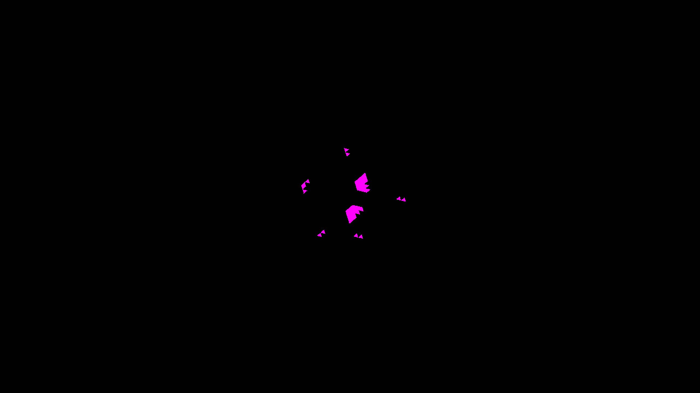
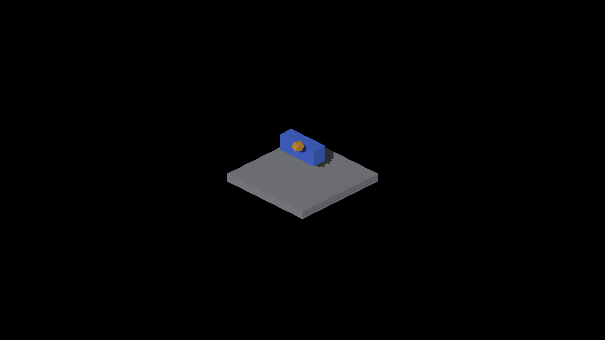

# Bounded finite source-face sun queries

Base: `6fdff71a5` (#3572). Native Metal, Apple M4 Max.

Rigid source casters retain their original transformed exposed quads in a
sun-space tile index. Surface receivers intersect their actual ray with at most
64 candidate quads. This preserves finite footprints instead of extrapolating
the nearest depth sample across an unrelated face. No blur or increased bias
is introduced. The existing 4/1024 depth quantization tolerance remains.

## Results

The independent source-face oracle passes all eight frame/octahedron views at
yaw 0/90/180/270: zero false or missed interior shadow pixels. The parent fails
six of eight. Final captures 1945–1948 are the octahedron and 1949–1952 the frame;
`final-metrics.json` contains commands and results, and `final-runs.json.gz`
contains both CLEAN native logs. Paired parent normal captures still establish
the unchanged geometry contract; a normal overlay cannot distinguish overlapping
faces with equal normals. No thresholds were relaxed.





Earlier split-layer captures 1908–1915 are retained with their metrics. They
precede extraction of the shared finite-intersection helper; final captures test
the helper and marker-based depth routing.

## Mixed casters

Source and other casters require separate depth maps. Otherwise rejecting a
source footprint can lose a different caster hidden behind its nearest map tap.
Surface queries inspect the non-source map independently; incomplete source
queries inspect the source fallback map too. Legacy receivers take the minimum
of both maps per PCF tap.

`--probe-overlapping-source` adds a small rigid cube above the shadow-box probe
along the sun direction. Captures 1916–1939 contain GRID, revoxelized and SDF
boxes, each with/without that cube across four quadrants, on a source-face floor.
All twelve comparisons preserve every common low-chroma floor pixel
(108,480–108,888 pixels per pair, zero RGB changes). This is a compatibility
control, not an independent geometric proof of every mixed-caster boundary.

The retained `shared-depth-negative.patch` deliberately removes depth separation.
Capture 1944 is pixel-identical to corrected 1920: this particular fixture does
**not** exercise the hidden-caster failure. Keep that limitation explicit; a
targeted overlapping-boundary regression remains needed. The patch is diagnostic
only and is not in production.



## Bounds, overflow and cost

The existing sun buffer grows from 8 MiB to 27,656,196 bytes: approximately
18.375 MiB extra. Its tail contains a separate source fallback depth map,
32,768 tile lists (two cascades, eight texels per tile edge), and 65,536 records
of nine floats. No new buffer binding or dispatch is introduced. The existing
clear dispatch clears both depth layers and list counts; records/IDs are reused
without clearing. A complete query reads at most 64 records.

A tile with more than 64 candidates, or intersecting a dropped record after the
record pool fills, uses the approximate source depth map. Partial lists never
certify visibility. This bounds memory and per-query work but does not guarantee
exact results in dense scenes. Global record allocation and tile insertion still
cost work proportional to emitted source faces and their tile coverage.

The earlier 16-texel tile experiment hit 87 candidates and three overflow tiles
on the octahedron; its yaw-180 shadow check retained 84 false pixels. Eight-texel
tiles pass this fixture without increasing the query limit. The overflow log is
retained in `runs.json.gz`; smaller tiles do not prove overflow absent at scale.

One 245-frame paired full-scene run (268 entities, frozen object poses, yaw
0 then 45) measured:

| Metric | Parent | Current |
|---|---:|---:|
| Frame median | 8.90 ms | 9.01 ms |
| Frame p95 | 11.42 ms | 10.30 ms |
| GPU command-buffer spans, mean | 4.448 ms | 4.438 ms |
| GPU voxelSunFaces, mean | 0.019 ms | 0.024 ms |

Reports are retained verbatim. Startup, screenshots and yaw transitions are in
the frame population. GPU spans include stalls, not just busy time. These single
runs show no clear broad regression; they do not establish dense-scene cost or
million-entity throughput. Parent engine files were temporarily restored from
the base commit for the control, then the implementation was restored.

## Reproduce and limits

```sh
fleet-build -j3 --target IRCanvasStress
fleet-run --timeout 45 IRCanvasStress --only orbit --focus-orbit 3 --no-spin --no-auto-rotate --pivot-origin --no-ao --zoom 4 --debug-overlay shadow --auto-screenshot 6 --sweep-yaw 0 4.71238898 4
python3 scripts/render-source-occlusion-metric.py docs/pr-screenshots/codex/finite-source-shadow-queries/capture-1946.png --shape octahedron --yaw 90 --shadow-overlay
python3 -m unittest discover -s scripts/tests -p 'test_render*.py'
```

Focus 7 selects the frame. Mixed controls use `--only shadowbox,floor`,
`--probe-floor-mode source --probe-floor-span 40 --subdivisions 1 --zoom 2`,
and `--probe-grid`, no mode flag (revoxelized), or `--probe-analytic-box`.
Run each with/without `--probe-overlapping-source`; full commands are in the logs.
Profile command: `fleet-run --timeout 90 IRCanvasStress --no-spin --no-auto-rotate --auto-profile --auto-screenshot 120 --sweep-yaw 0 0.78539816 2`.

Both backend layout/ray helpers execute in scalar C++ tests against the actual
CPU allocation constants, including winding, degenerate/outside footprints,
capacity limits and buffer ranges. All 183 rendering tests, ruff and header
checks pass. Native runs finish CLEAN. GLSL runtime is unverified.

This fixes finite source-caster lookup at the receiver's sampled position.
Source receivers still shade once per original face; continuous within-face
shadow boundaries, GRID/SDF finite boundary agreement, dense overflow behavior
and moving-light transitions remain separate work.
