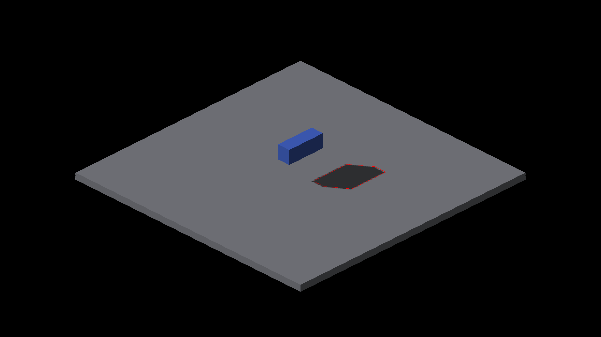
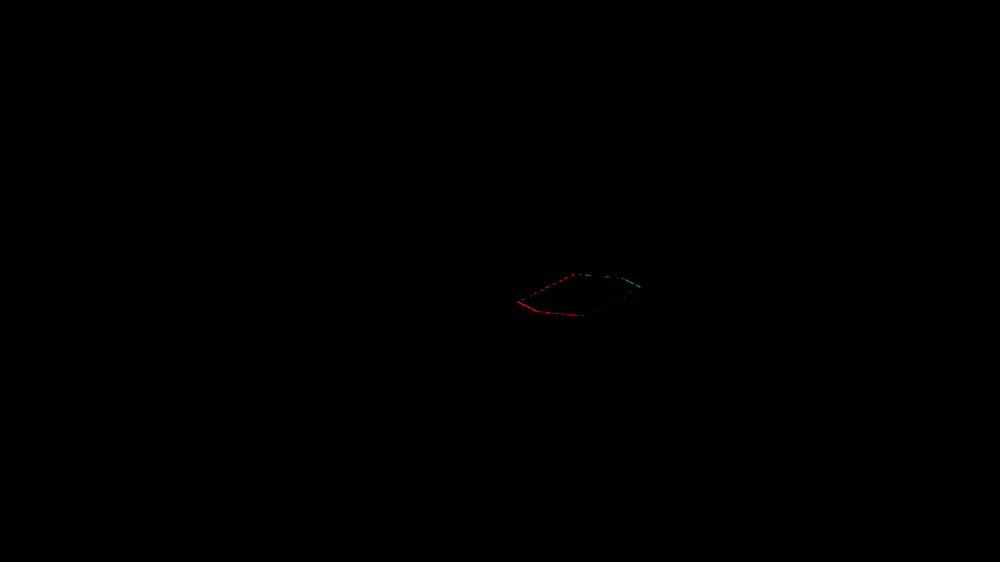
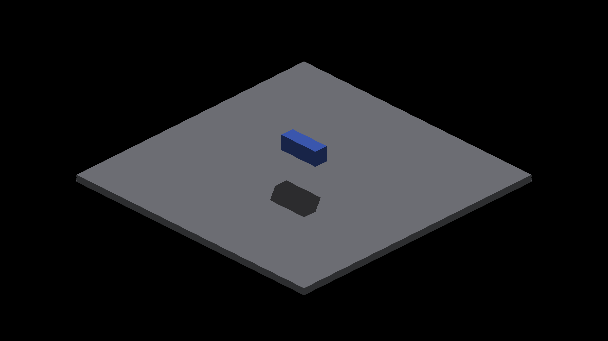

# Floor-shadow edge diagnosis

Baseline `c74b6cf5d`, native Metal Apple M4 Max, 2560×1440, effective subdivision
2. The oracle must receive `--effective-subdivisions 2`: half-integer voxel
centers survive at density 2, but snap at densities 1 and 3. This is the
measured caster density, not the demo's requested `--subdivisions 1`.
Capture run ended CLEAN. No rendering change ships in this slice.

The isolated GRID box casts onto the SDF receiver plate. All four cardinal views
pass the existing area/IoU check but fail the optional strict projected-edge
check. Its expected polygon comes from authored box corners projected along the
sun direction onto the floor. It uses no reference shadow image or renderer
shadow samples. Strict checks use the known camera projection, not the approximate bounds of
an SDF floor: `--iso-scale 8 4`, world-origin screenshot position (1280,720).
The scale follows zoom 2, iso steps (2,1), and output scale 2. The internal
framebuffer is 1280×720; screenshots are 2560×1440. Floor color bounds only
restrict the visible receiver region. Earlier reports used density 1 and inferred
projection from floor bounds; the regenerated table and overlays supersede them.

| Yaw | Capture | IoU | Area ratio | Missing shadow pixels | Excess shadow pixels |
|---|---|---:|---:|---:|---:|
| 0 | 1502 | .843 | .935 | 207 | 141 |
| 90 | 1503 | .936 | 1.028 | 65 | 515 |
| 180 | 1504 | .963 | 1.027 | 12 | 266 |
| 270 | 1505 | .938 | 1.030 | 96 | 546 |

Counts exclude a fixed one-screenshot-pixel **8-neighbor/Chebyshev** boundary
band, caster-colored pixels and their immediate neighbors. This is a raster
inclusion allowance, not a Euclidean distance threshold, blur or enlarged shadow.
Cyan diagnostic pixels are missing shadow; red are excess. The overlay's red
polygon is the independent projected boundary.




## Reproduce

```sh
fleet-run IRCanvasStress --only shadowbox,floor --probe-grid --pivot-origin --no-spin --no-auto-rotate --no-ao --subdivisions 1 --zoom 2 --auto-screenshot 6 --sweep-yaw 0 4.71238898 4
python3 scripts/render-shadow-box-metric.py --grid --effective-subdivisions 2 --iso-scale 8 4 --strict-edges docs/pr-screenshots/codex/floor-shadow-plane-sampling/capture-1502.png docs/pr-screenshots/codex/floor-shadow-plane-sampling/capture-1503.png docs/pr-screenshots/codex/floor-shadow-plane-sampling/capture-1504.png docs/pr-screenshots/codex/floor-shadow-plane-sampling/capture-1505.png
```

The strict command intentionally exits 1. Omitting `--strict-edges` preserves the
existing aggregate acceptance thresholds and passes all four. Without explicit
projection, the historical aggregate mode still uses floor-bound calibration;
strict mode requires `--iso-scale` because that approximation is insufficient. Optional
`--overlay-dir` writes the polygon and error images.

## Controls and limitations

Literal rectangles and diagonal diamonds at two scales pass. A shifted equal-area
shadow, added tooth, missing interior, blank frame, fully hidden expectation,
clipped polygon and an expectation consumed by the boundary allowance fail.
Partial caster occlusion is excluded while remaining floor pixels are checked.
The oracle is specific to this blue box, neutral floor, sun and four cardinal
views; color segmentation does not validate arbitrary materials or penumbrae.

The strict check exposes disagreement with a sharp projected polygon. It does
not attribute that disagreement among finite sun-map resolution, receiver sample
reconstruction, and the current one-lighting-value-per-trixel presentation. It
is not a claim that the current representation can express every edge exactly.
Next work must distinguish those losses and retain geometric coverage through
presentation where needed, without smoothing away legitimate voxel geometry.

## Rejected experiment

Correcting world-aligned finite PCF tap depth by the stored caster-face plane
changed **zero RGB pixels** in each of four matching captures (1506–1509).
The experiment was reverted; it did not address this isolated boundary defect.
An initial Metal launch failed to compile because the experimental block used
GLSL vector spellings; after correcting the spellings the four-shot run exited
CLEAN. Neither that compile error nor experimental shader edits ship.

## Exact-visibility controls

The two retained patches are **fixture-only Metal experiments**, not production
implementations or proposed shader changes. Apply each separately to `9bdf90683`,
build IRCanvasStress, and run the same four-view recipe. They hard-code this
box, floor, fixed-pivot camera and zoom; they do not support arbitrary scenes.
The patched runs all exited CLEAN; shader files were restored and assets rebuilt.

- `trixel-ray-control.patch`: recover the displayed rectangular texel center,
  intersect its camera ray with the known z=2 floor, then test the sun ray against
  the exact box. Writes one binary visibility value per trixel. Captures 1526–1529.
- `fragment-ray-control.patch`: evaluate the same known floor/box geometry per
  internal framebuffer fragment. Preserve the original floor border for color
  calibration. Captures 1534–1537. This does not sample or blur the sun map.

| Yaw | Production missing/extra | Exact ray per trixel | Exact ray per fragment |
|---|---:|---:|---:|
| 0 | 207/141 | 1/4 | 0/0 |
| 90 | 65/515 | 0/0 | 0/0 |
| 180 | 12/266 | 5/5 | 0/0 |
| 270 | 96/546 | 0/0 | 0/0 |

Full reports: `baseline-metrics.txt`, `trixel-metrics.txt`, `fragment-metrics.txt`.
Use the same metric command with the respective four captures. The per-fragment
control passes all four strict checks, including occlusion exclusion and adequate
resolution; the per-trixel control fails two. No tolerance was widened.



These results distinguish two losses: most baseline disagreement is upstream of
presentation (map visibility and/or receiver reconstruction); a small residual
remains when exact visibility is sampled once per trixel.
A scalable solution should retain geometric boundary coverage for final
presentation, while preserving the trixel canvas and avoiding per-entity fragment
loops. The fixture-specific ray test is not a performance result or a general
solution. Noncardinal rotations, moving lights, concave/overlapping casters and
other receiver types still need coverage.
