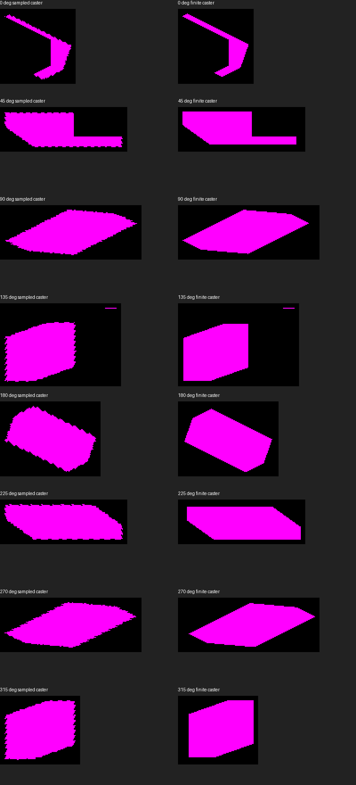
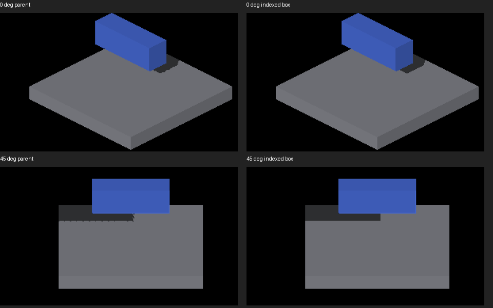

# Finite caster footprints shared by boxes and voxels

Native Metal, Apple M4 Max, macOS debug, 2560×1440. Captured 2026-09-24.



The left column uses the prior fragment receiver diagnostic (captures 2297–2304
in `../fragment-receiver-probe/`). The right column is 2337–2344. Each pair uses
the same native-pixel crop without interpolation. Both queries use exact receiver
positions; the right column additionally uses finite caster footprints. Repeating
teeth disappear in this fixture, while ordinary pixel stair steps remain.
This is not acceptance of all render modes or index-overflow behavior.



Normal lit rendering also benefits where the receiver already uses finite queries.
Top row is yaw 0°, bottom 45°; left is the parent box/voxel caster implementation
(2349–2350), right is the indexed box (2347–2348). Overview crops are reduced;
full native captures are included. The straight boundary replaces the repeating
notches without a blur pass. The baseline temporarily restored only the four
caster shaders to parent 6370b3127; gather changes were inactive outside diagnostic
mode. Those shaders were restored before subsequent runs.

## Reproduction and controls

```sh
fleet-run --timeout 60 IRCanvasStress --only shadowbox,floor --probe-analytic-box --pivot-origin --no-spin --no-auto-rotate --no-ao --subdivisions 3 --zoom 2.5 --auto-screenshot 6 --debug-overlay surface_shadow --sweep-yaw 0 5.49778714 8
```

- 2321–2328: finite sampler only, before indexing box faces. The teeth remain.
- 2329–2336: box indexing plus finite sampler, initially with yaw-only fallback rotation.
- 2337–2344: final implementation, passing the actual camera quaternion to the sampler.
- 2345–2346: no debug overlay, two-step yaw 0..0.78539816. RGB-identical to
  parent ordinary SDF beauty captures 2313–2314.
- 2347–2350: same two-step ordinary run with `--probe-floor-mode source`,
  head then parent caster control as described above.
- 2351–2354: four-step yaw 0..4.71238898, `--subdivisions 1`,
  `--analytic-box-yaw 0.37 --analytic-box-offset 0.25 -0.375 0.125`, diagnostic.
  The analytical receiver remains the unrotated floor; rotated box receiving is
  still an unsupported fallback. This tests the rotated caster.
- 2355–2356: two-step diagnostic with `--no-shadows`; every RGB pixel is zero.

Every native run exited cleanly. The full 232-test render suite passed; final
additional mutation controls passed separately. Native build, header checks,
formatting, ruff and diff checks pass. OpenGL execution and GPU timing are pending.

The new scalar oracle executes the production box-face emission on both backends
using double-precision adapters, comparing 952,576 rays with independent slab
intersections: 262,813 finite hits per backend. This checks geometry, not GPU
floating-point behavior. Mutations reverse face polarity, omit edge rotation,
shrink edges, lose translation, or duplicate index emission and must fail.
Existing executed index controls cover tile/global overflow and off-map faces;
mixed-caster tests cover preserving the independent sampled layer.
