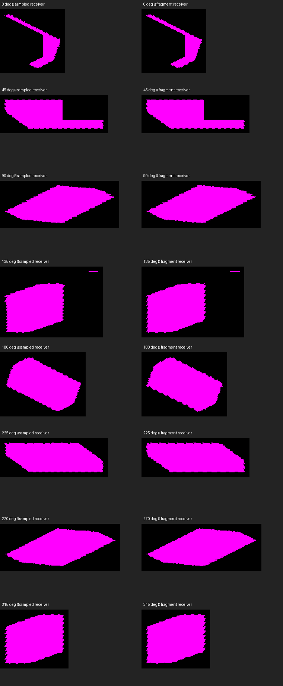

# Finite fragment receiver diagnostic

Native Metal, Apple M4 Max, 2560×1440, macOS debug. Captured 2026-09-24.
The paired crops use the same bounding box and scale at each yaw; full captures
are alongside this file. Magenta means visibility below 0.999, black means lit.



`surface_shadow` queries the selected analytical box at the actual fragment
coordinate; `shadow` uses the existing sampled receiver. Both use the existing
biased sun sampler. The diagnostic adds no blur or new visibility filter.
Finite misses and unsupported paths retain the ordinary SHADOW diagnostic,
including its existing overflow behavior; they are not guaranteed binary colors.

| Yaw | Sampled capture | Fragment capture | Changed RGB pixels |
|---|---|---|---|
| 0° | 2305 | 2297 | 144 |
| 45° | 2306 | 2298 | 176 |
| 90° | 2307 | 2299 | 256 |
| 135° | 2308 | 2300 | 516 |
| 180° | 2309 | 2301 | 616 |
| 225° | 2310 | 2302 | 552 |
| 270° | 2311 | 2303 | 348 |
| 315° | 2312 | 2304 | 344 |

The receiver changes boundary pixels in every quadrant, but repeated jagged
outlines remain. This is evidence against receiver position being the only
cause, not proof of a particular caster defect or final edge acceptance.
Next isolate finite caster footprints and sampling with the proper camera frame
before committing to full linear-lighting payload storage.

## Reproduction

Common arguments:

```sh
fleet-run --timeout 60 IRCanvasStress --only shadowbox,floor --probe-analytic-box --pivot-origin --no-spin --no-auto-rotate --no-ao --subdivisions 3 --zoom 2.5 --auto-screenshot 6 --debug-overlay surface_shadow --sweep-yaw 0 5.49778714 8
```

Replace `surface_shadow` with `shadow` for the sampled control. Both exited cleanly.
Captures 2313–2314 omit debug overlay and sweep 0 to 0.78539816 in two steps:
they are RGB-identical to the parent implementation's captures 2291–2292.
Captures 2315–2316 add `--no-shadows` to the fragment diagnostic and use the same
two-step sweep: every RGB pixel is zero.
Captures 2317–2318 use `--only maingrid`, omit `--probe-analytic-box`, and retain
`surface_shadow`; captures 2319–2320 change only the overlay to `shadow`. Each corresponding pair is RGB-identical.

## Validation scope

Both shader backends execute scalar controls for continuous query/owner separation,
finite misses, transparent pixels, shadow toggle, and selected sample clamping.
The C++ binding helper executes validity/extent guards and borrowed-slot restoration
against recording adapters. Mutation controls prove those checks reject broken code.
Ordinary shader variants exclude all fragment receiver resources at preprocessing.
The full render Python suite, ruff, native build, formatting and header checks pass.
Two focused reviews found no blockers. Native OpenGL smoke and GPU profiling remain pending.
This diagnostic does not move beauty lighting, AO, local lights or fog to fragments.
