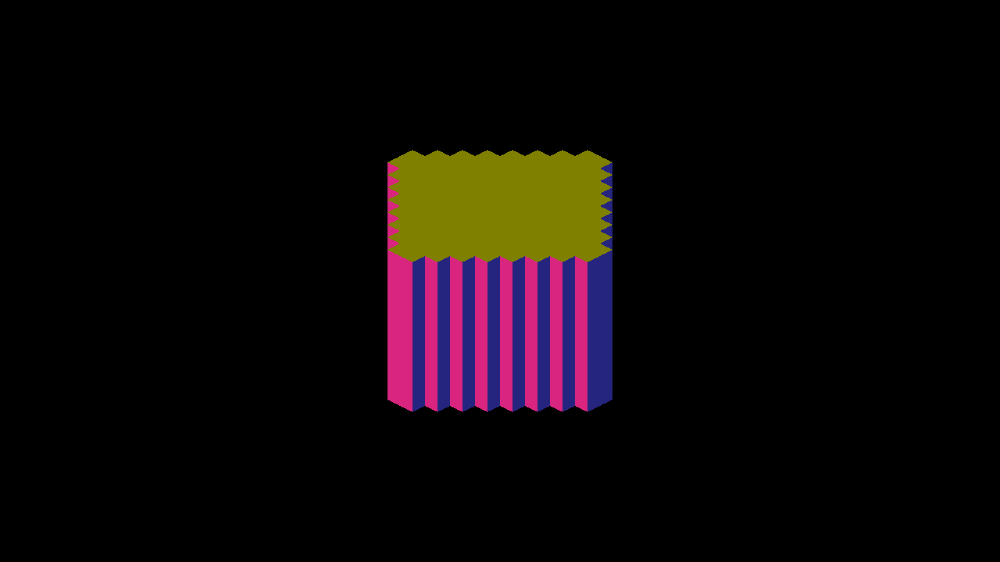
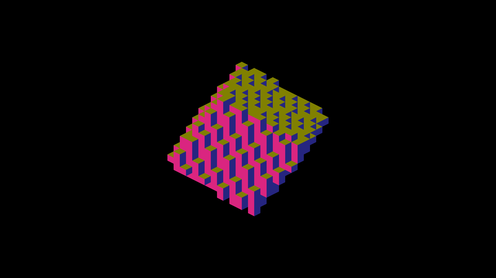
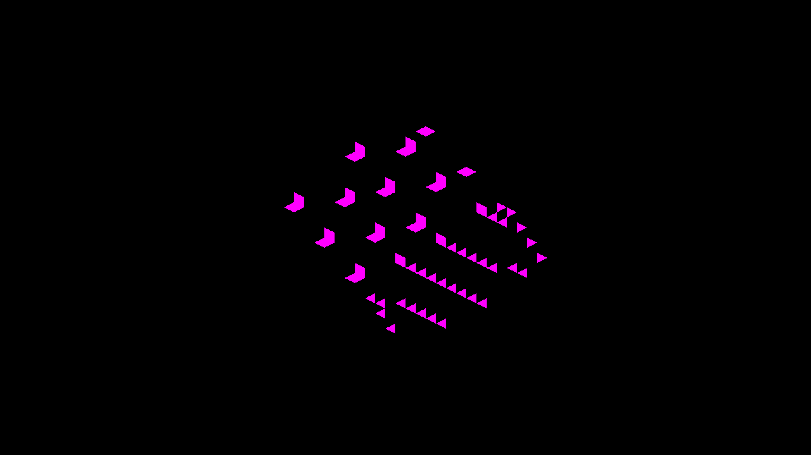

# GRID span surfaces and detached face ownership

This slice adds CPU geometry tests and records native diagnostic evidence. It
changes no renderer, shader, scene, shadow softness, or sampling policy.

## Native captures

Built `IRCanvasStress` at `ad85ada530a2ab20badd1cb4611161fb3db081aa` on macOS
Metal, after incorporating the cardinal analytic-shadow continuity branch.
All three runs returned `RESULT=CLEAN`, producing nine 2560×1440 captures.
[captures.json](captures.json) records exact commands, revision and image hashes.
All nine PNGs match the corresponding controls captured at
`1dcaf2505959d72c5f4d97cd935ed2cfdab3fa9c` byte-for-byte.

Shared capture arguments:

```text
fleet-run IRCanvasStress --auto-screenshot 30 --no-auto-rotate --no-spin
  --pivot-origin --no-ao --no-shadows --subdivisions 1 --zoom 8
  --debug-overlay normals --sweep-yaw 0 0.7853981634 3
```

| Fixture | Additional arguments | 0° | 22.5° | 45° |
|---|---|---|---|---|
| Detached, authored rotation | `--only revox --focus-revox 1` | [capture](revox-normals-yaw0.png) | [capture](revox-normals-yaw22.5.png) | [capture](revox-normals-yaw45.png) |
| Detached, identity entity rotation | `--only revox --focus-revox 1 --probe-upright` | [capture](revox-upright-yaw0.png) | [capture](revox-upright-yaw22.5.png) | [capture](revox-upright-yaw45.png) |
| CPU GRID, orbit cube +Y45 | `--only orbit --focus-orbit 6` | [capture](orbit-grid6-yaw0.png) | [capture](orbit-grid6-yaw22.5.png) | [capture](orbit-grid6-yaw45.png) |

### Revoxelized face ownership

The six detached images pass `scripts/render-revox-face-metric.py`: zero missing,
extra or wrong-face pixels outside the fixed one-framebuffer-pixel boundary band.
Scale remains the documented 32×16 pixels per iso unit; registration is zero.
[metrics.json](metrics.json) contains every command and result. For example:

```text
python3 scripts/render-revox-face-metric.py docs/pr-screenshots/codex/grid-span-surface-proof/revox-upright-yaw45.png --fixture cube --upright --yaw 45 --explain-pixel 1025 875 --explain-pixel 1062 875
```

The upright cube at camera yaw 45° has alternating faces:



Independent camera/box intersections explain two neighboring strips. Pixel
(1025,875) first hits the -Y face of destination cell (0,-7,1); (1062,875)
first hits that cell’s -X face. Their different world normals produce the
observed pink and blue. These are distinct exposed faces of the resampled
staircase, not alternating halves erroneously assigned to one planar face.
The authored-rotation fixture has the same kind of legitimate stepped regions:



This proves fidelity to the resampled lattice in these poses. It does not claim
that revoxelization preserves the rigid source surface, that every full-scene
stripe is correct, or that lighting and shadows agree with these normals.

### Direct-sun ownership controls

At revision `9dbe0fd441104ae366d1ff3862a6b13cc3433d91`, the same built Metal
renderer was captured with `--debug-overlay shadow` and shadows enabled. The
authored-rotation cube also has paired normal/shadow captures at yaw
90°, 135°, 180°, 225°, 270° and 315°.
[shadow-captures.json](shadow-captures.json) records all four additional runs;
each exited cleanly. [shadow-metrics.json](shadow-metrics.json) retains all results,
including intentionally inconclusive controls.

| Fixture | Yaws | False / missed interior shadow pixels | Occlusion gate |
|---|---|---|---|
| Authored-rotation cube | 45°, 90°, 135°, 180°, 225°, 270°, 315° | 0 / 0 at each angle | Pass: both lit and shadowed interiors |
| Authored-rotation cube | 0°, 22.5° | 0 / 0 | Inconclusive: no expected shadowed interior |
| Upright cube | 0°, 22.5°, 45° | 0 / 0 | Inconclusive: no expected shadowed interior |

All six additional normal captures have zero missing, extra or wrong-face
interior pixels. Shadow comparisons use `--terminator-tolerance 0`; the existing
one-pixel triangle-boundary exclusion remains unchanged. Inconclusive cases exit
1, not 0: an entirely lit fixture cannot validate occlusion. Back-facing regions
are excluded from the direct-sun oracle, so this is not a beauty-lighting gate.

```text
python3 scripts/render-revox-face-metric.py docs/pr-screenshots/codex/grid-span-surface-proof/revox-shadow-yaw270.png --fixture cube --yaw 270 --shadow-overlay --terminator-tolerance 0
```



The magenta regions agree with rays from the displayed triangles' centroids
through the resampled occupancy. This checks the revoxelized texture's sampled
sun visibility; it does not prove continuous shadow boundaries within triangles,
external caster reception, AO, arbitrary light directions, higher subdivisions,
or another rendering mode. No sampling, filtering or bias change was needed for
these controls.

## CPU GRID span proof

The isolated orbit cube reproduces:

```text
REBUILD_GRID_VOXELS span cap: dropped 12 of 1740 covered dest cells (span=1728, surface=610)
```

`GridInverseSurfaceTest` invokes the real CPU `inverseArm` with a nonzero pool
allocation offset. Its expected occupancy comes from double-precision analytic
half-spaces, independently of the implementation’s quaternion inversion,
round-half-up helper and destination AABB. The centered 12³ solid is checked at
+Y45 (the isolated orbit pose) and +Z45. Every exposed cell must survive; all six
neighbor-mask bits are compared with the full occupancy, and every omitted cell
must be interior. Two rebuilds must agree while retaining authored source input.

A plate carved from a full 12³ allocation checks sparse source preservation and
complete surface retention. The surface oracle also rejects a synthetic missing
exposed plate cell. A temporary header mutation swapping the surface/interior
write order makes the solid test fail for both axes: its twelve omissions become
surface holes. The repository source retains the surface-first order.

A 12×12×1 exact-fit plate at Z45 requires 145 exposed cells, exceeding its 144-slot
allocation. The solid proof therefore cannot justify truncation for thin or
sparse shapes. Destination capacity growth remains an open implementation task.
These CPU tests do not prove GPU consumption, shadow occlusion or behavior for
arbitrary pivots, transforms and subdivisions.

Validation: `fleet-build --target IrredenEngineTest -j2` succeeds;
`fleet-run IrredenEngineTest` with filter
`GridRotationTest.*:GridInverseSurfaceTest.*:GridSurfaceOracleTest.*` passes all
16 tests, including the three new cases. The deliberate interior-first mutation
exits 1 on the solid surface test. `fleet-build --target format-changed -j2`,
`git diff --check` and the comment-reference ratchet pass.
