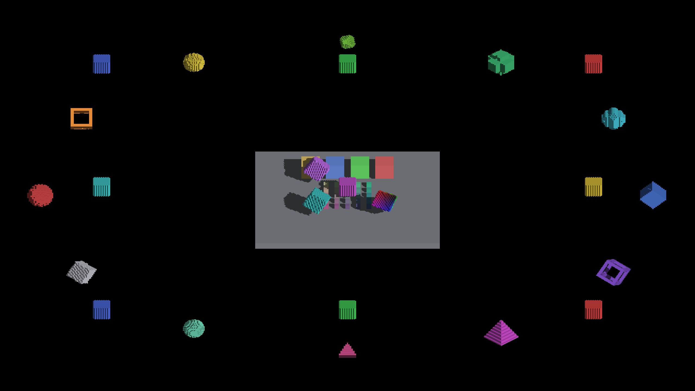
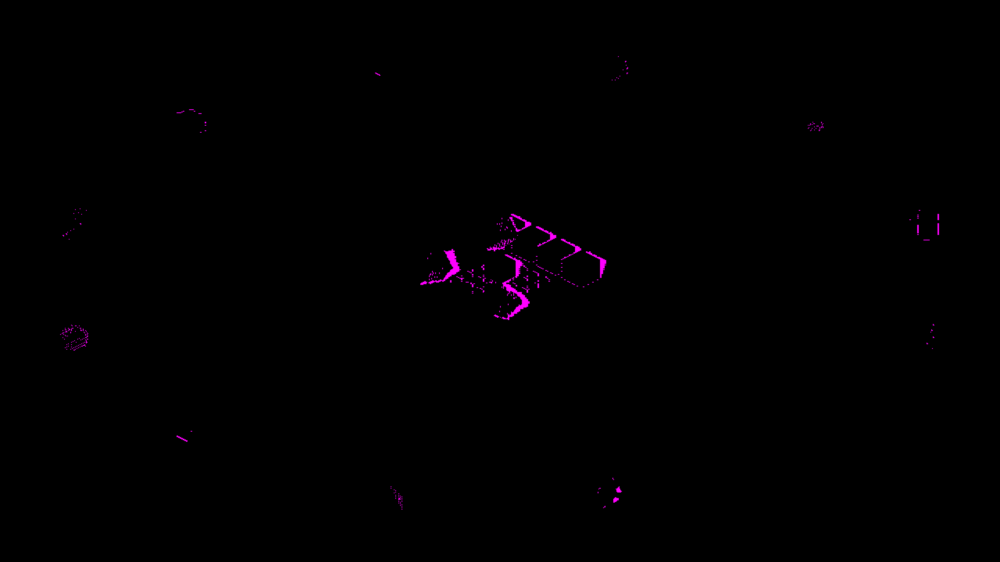
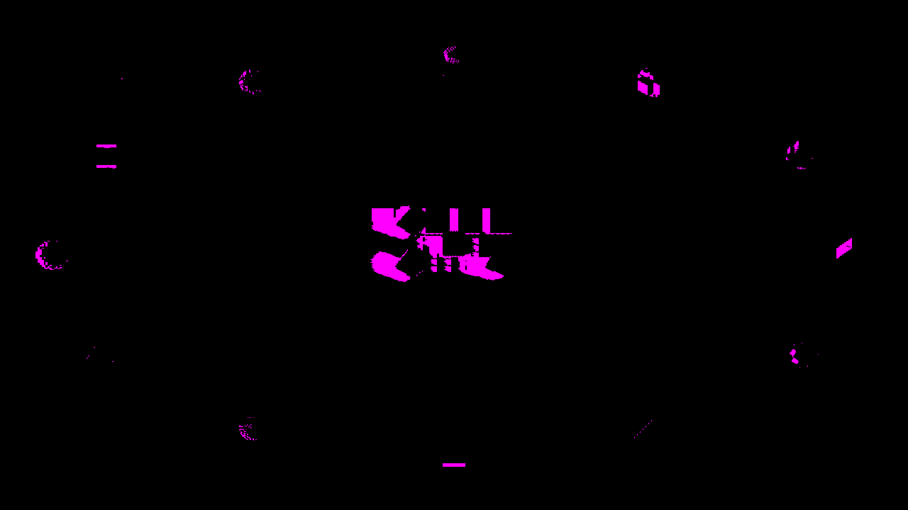

# Metal clear-source snapshots

Both Metal texture-clear APIs now borrow one device-owned immutable source per
texture. Changing the clear value replaces that source without overwriting bytes
already referenced by queued blits. Matching values reuse it, including null and
explicit zero. Encoder timing and R32I atomic-scratch mirroring retain their
existing caller-specific behavior.

## Native visual control

Baseline: `acc9e9191804d890d67e5c4e3a69e6fc52ed0e75`, built before the backend
edits. Candidate: that parent plus this PR's clear-source changes. The baseline
executable was retained for both baseline runs; the candidate was then rebuilt.
No shader or scene assets changed between these runs.

On macOS Metal, both commands returned `RESULT=CLEAN` before and after:

```text
fleet-run IRCanvasStress --auto-screenshot 120 --no-auto-rotate --no-spin
fleet-run IRCanvasStress --auto-screenshot 120 --no-auto-rotate --no-spin --debug-overlay shadow
```

All 24 paired PNGs are byte-identical: 12 normal frames and 12 shadow-overlay
frames. [comparison.json](comparison.json) records every pair's SHA-256 and the
commands. Representative full-size captures are retained below; index 0 is the
default camera and index 1 requests 45-degree yaw.

| View | Before | After |
|---|---|---|
| Normal, default |  |  |
| Normal, 45-degree yaw |  |  |
| Shadow overlay, default |  |  |
| Shadow overlay, 45-degree yaw |  |  |

These comparisons show unchanged output for this frozen scene. The varying-clear
regression is proven by GPU snapshots, since this scene uses constant clear values.
The inherited `REBUILD_GRID_VOXELS` warning (12 of 1740 destination cells dropped
at a 1728-cell span) remains a separate investigation; identical frames do not
certify that warning or other inherited artifacts as harmless.

## Regression method

Native tests enqueue each clear and copy its result into a separate buffer, then
submit and wait once after the sequence. Expected results compare every byte.
Coverage includes both APIs, alternating APIs, null and repeated values, 4/8/16-byte
pixels, R32I scratch snapshots, partial uploads, buffer reuse and deferred release,
startup clears without a command buffer, and debug precondition rejection.

All five new ordering tests fail against the parent backend. The parent control
contains those five tests plus two existing clear tests, which pass. Test outcomes
are recorded in [gpu-test-results.json](gpu-test-results.json).

The rebuilt candidate passes all 18 `MetalGpuComputeDispatchTest` cases, including
the eight new clear tests, with no skips. An isolated temporary build with the
pixel-size guard removed fails `ClearSourceRejectsInvalidTextureAndPixelSizes`:
the 17-byte call stops throwing. The committed source retains the guard.

```text
ir-acquire gpu -- fleet-run IrredenEngineTest '--gtest_filter=MetalGpuComputeDispatchTest.*' --gtest_brief=1
```

This is a correctness repair and consolidation, with no measured speedup claim.
Unchanged patterns reuse their allocation; changing patterns allocates replacement
sources until queued work drains. Validation is native Metal; OpenGL is unchanged
and was not run on this host.
