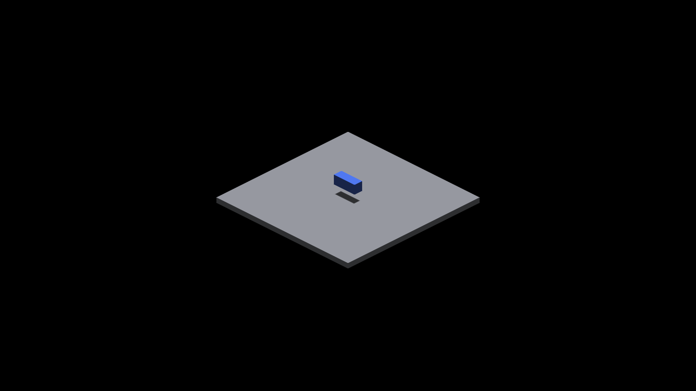
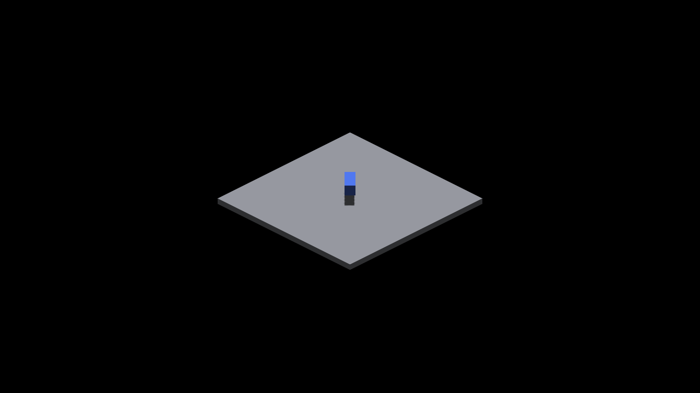
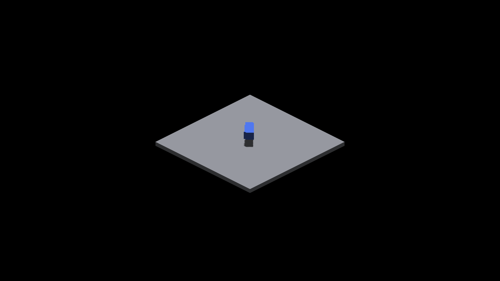
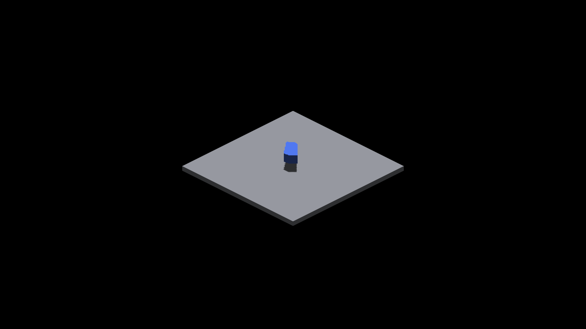
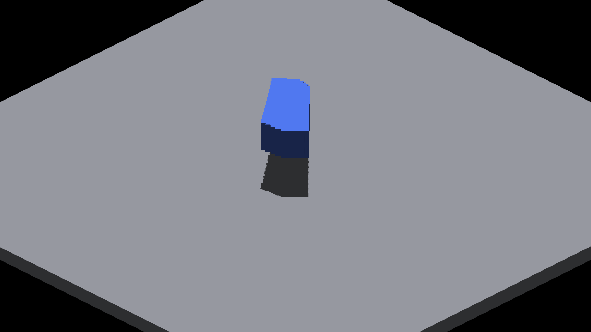

# Oblique analytical-box controls

See [measurements and commands](../../../perf/oblique-box-shadow-controls.md).
The baseline/candidate pairs compare production indexing with the deferred
SAT prototype using the new opt-in controls, not old/new demo defaults.
Each pair is RGB-identical; all 16 matrix captures were compared. These
representative images are the first capture of each first-round case.

| Case | Production | SAT prototype |
|---|---|---|
| count1-yaw0 |  |  |
| count1-yaw45 |  |  |
| count64-yaw45 |  |  |
| count128-yaw45 |  |  |

## Closer production view

After restoring the production shaders, zoom 3 with 128 distinct overlapping
boxes and the overhead sun. AO remains at the default setting. Visible
shadow-edge serration remains; these are not correctness approvals.

### Camera yaw 0 degrees

### Camera yaw 90 degrees

### Camera yaw 180 degrees

### Camera yaw 270 degrees

