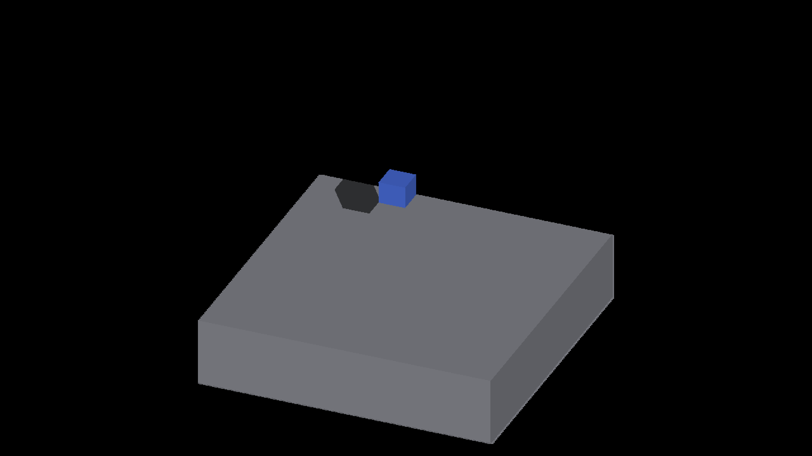

# Per-axis caster position agreement

Native Metal, Apple M4 Max, macOS 26.5.2, Debug, 2560×1440. Before:
`ee57a588f4dbacb015e99e393689d8bfdf426943`. The adjacent manifests record
binary/shader hashes, commands and clean exits for both arms. Screenshots are
unfiltered full frames. Timing from these short capture runs is not a throughput
measurement.

## Geometry contract

The per-axis store splits each aligned voxel center into an integer cell and
three signed fractions. `fracToFrac4` truncates the signed remainder toward zero
to encode sixteenths. Scatter decodes those fractions independently of zoom
subdivisions. The finite caster now calls `perAxisRenderedVoxelCenter`, which
reuses that encoder, so its face corners coincide with the displayed corners.
For input `(0.30,-0.20,-2)`, the displayed center is `(0.25,-0.1875,-2)`;
the subdivision-16 caster previously used `(0.3125,-0.1875,-2)`.

For signed face axis `a` and positive-face bit `s`, the caster corner is
`renderedCenter - (0.5,0.5,0.5) + s*axis(a)`. Scatter's decoded face origin
already contains `s*axis(a)` and applies the same half-cell anchor. Face polarity
must not be applied a second time. The decoded fraction is centered before
adding the integer cell to avoid cancellation at large float32 coordinates.

The existing allocated-per-axis predicate also selects caster quantization.
Its flag uses the spare `worldOrigin.w` lane; the frame remains 48 bytes and
`dispatch.w` retains its world/camera/rigid face-basis meaning. There is no new
allocation, GPU pass, neighbor search, filter tap or face-index capacity change.
Cardinal, rigid and detached-resampled routes keep their quantization.

## Native comparisons

All cases use one GRID voxel above the analytical floor. Effective subdivisions
are **16**, measured in the logs; requested base subdivisions are 1 at zoom 16.
Non-cardinal quadrants are 22.5°, 112.5°, 202.5°, 292.5°. Cardinal controls use
0°, 90°, 180°, 270°.

| Case / offset | Changed pixels in the four quadrants | Result |
|---|---|---|
| Off-grid `(0.30,-0.20,0)` | 848 / 924 / 980 / 944 | Only floor pixels change between shadow and lit floor; the cube and all other colors are identical |
| Integer `(0,0,0)` | 0 / 0 / 0 / 0 | Identical |
| Representable fraction `(0.3125,-0.1875,0)` | 0 / 0 / 0 / 0 | Identical |
| Cardinal, off-grid `(0.30,-0.20,0)` | 0 / 0 / 0 / 0 | Identical |

[comparisons.json](comparisons.json) retains exact PNG hashes and changed bounds.
These prove the intended native route fires and unchanged routes remain inert;
they do not certify every shadow edge against a calibrated image-space oracle.
The small plate clips portions of projected shadows. Receiver reconstruction,
shadow/plate boundaries and full sharp-edge acceptance remain separate work.

| Before, 22.5° | Matching caster center |
|---|---|
|  |  |

Reproduce each arm from its corresponding source/build state:

```sh
python3 scripts/perf/repeat_profile.py --target IRCanvasStress \
  --output /tmp/peraxis-caster-check --repeats 1 -- \
  --only shadowbox,floor --probe-grid --probe-single-voxel \
  --probe-box-offset 0.30 -0.20 0 --sun-direction -0.42 -0.60 -0.55 \
  --no-spin --no-auto-rotate --no-ao --pivot-origin --zoom 16 \
  --subdivisions 1 --auto-profile --auto-screenshot 6 \
  --sweep-yaw 0.39269908 5.10508806 4
```

## Deterministic checks

`python3 scripts/tests/test_render_per_axis_caster_position.py` executes the
actual GLSL and Metal store, decode, scatter and caster expressions through CPU
adapters. Each backend covers 1,380 translated face cases across six signs,
two flip bits and subdivisions 1/2/4/8/16; all 4,096 fractional triples on each
face; literal signed buckets, near-integer snapping and half-cell ties; large
float32 boundary literals; and rigid/cardinal/resampled route controls. It rejects
both the former subdivision quantizer and uncentered large-coordinate arithmetic.
This is expression-level backend coverage, not a native OpenGL rendering claim.

The ten existing `PerAxisCastSubCell` C++ tests also pass. They cover the separate
legacy resolve-to-raster bridge, whose density-1 limit still applies to that
representation. Source-face query/index tests, native demo build, header checks,
formatting, Ruff and comment-reference checks pass.

Next: verify attached regular/overflow receiver points against displayed face
centers before enabling finite queries there, then carry boundary evaluation to
presentation fragments. Preserve true revoxelized occupancy steps. Native
Windows/OpenGL smoke and large-population timing remain pending.
