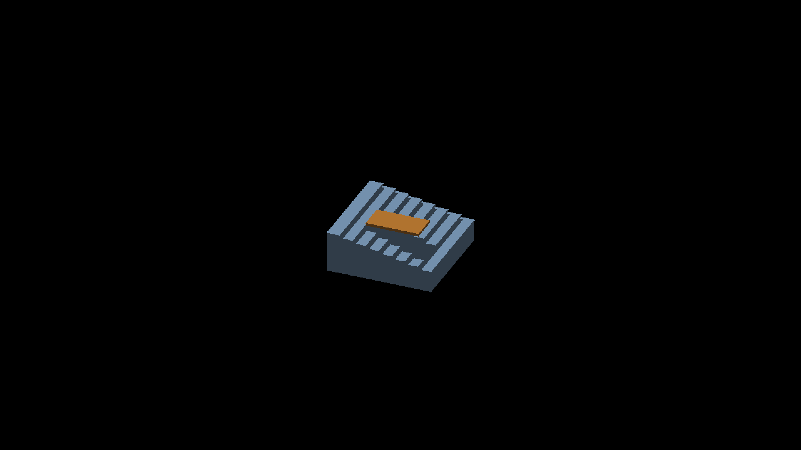

# Per-axis shadow receiver centers

Native Metal, Apple M4 Max, macOS 26.5.2, Debug, 2560×1440. Before:
`2b9d1ae8c92b45c29fb8732671f7df425235b03a`. Adjacent manifests retain
commands, binary/shader hashes, PNG hashes and clean exits. Before assets share
one shader digest, including controls captured while source edits were pending.
Images are unfiltered full frames. Capture timings are not throughput results.

## Geometry and routing

The displayed per-axis square is `O + u*eu + v*ev - (0.5,0.5,0.5)`.
Its center is `O - 0.5*positiveAxis`. Face polarity is already in decoded
origin `O`; the legacy `O + signedNormal*0.5` sample puts positive faces one
whole cell outward. `perAxisFaceCenter` owns the corrected center, and both
regular and overflow receivers use `perAxisSunShadowFactor` to query it.
Cascade selection uses continuous world iso depth, including sub-cell phase.

These receivers now use the existing finite surface query. Complete tiles test
actual face footprints without PCF or a displaced receiver. Incomplete tiles
retain the approximate plane fallback; nonfinite casters retain their existing
sampling. No blur, footprint enlargement or tuned bias is added. The lighting
volume continues to use its existing position contract.

`FrameDataSun` appends the full caster-camera quaternion at byte 128 (144 bytes
total), refreshed in `updateSunFrameData` before its shadow-disable return.
Both finite and legacy bake lifecycles own that update. World-basis fallback
planes ignore this quaternion; view-aligned revoxelized fallback planes require
it even when their receiver is attached. Existing allocation/upload calls use
`sizeof(FrameDataSun)`; no new allocation, dispatch or upload call is added.

## Native comparisons

Non-cardinal views: 22.5°, 112.5°, 202.5°, 292.5°. Stair scenes use effective
subdivision 2 at zoom 2; magnified cube controls use effective subdivision 16 at
zoom 16. Base subdivision is 1. AO and animation are disabled in both arms.

| Case | Changed RGB pixels, four views | Interpretation |
|---|---|---|
| Stair receiver, negative X/Y sun | 708 / 380 / 868 / 1324 | Blocker shadow changes at the corrected receiver positions |
| Stair receiver, positive X/Y sun | 6368 / 556 / 2440 / 5560 | Removes speckled shading along risers; shadow footprint changes |
| Fractionally positioned single cube | 0 / 0 / 0 / 0 | Unoccluded control unchanged |
| Same cube with rigid source blocker | 0 / 0 / 0 / 0 | Fully shadowed mixed-caster control unchanged |
| Cardinal stair controls | 0 / 0 / 0 / 0 | Cardinal route unchanged |
| Shadows-disabled stairs | 0 / 0 / 0 / 0 | Geometry and other lighting unchanged |

The stair captures witness overflow rendering (up to 122 entries, none dropped).
[comparisons.json](comparisons.json) records exact RGB change bounds. These
images support the receiver correction; they do not certify every shadow edge
against a calibrated pixel oracle. Stair riser bands are real geometry and remain.
The existing analytical plate boundary/contact differences remain visible in the
magnified controls.

| Before, positive X/Y sun at 22.5° | Corrected receiver |
|---|---|
|  |  |

## Deterministic checks

- `test_render_per_axis_receiver.py`: executes actual GLSL/Metal reconstruction,
  square-center and sampler-entry expressions through CPU adapters. Each backend
  checks 49,152 faces and 147,456 receiver calls: all 4,096 fractional triples,
  six signs, both flip values, permuted slots and multiple densities. Independent
  cube corners and actual scatter midpoints agree. Ten mutations per backend fail,
  including missing flip, signed-axis centering, integer depth, legacy offset and
  omitted caster quaternion. The real CPU update prefix also executes against
  stubs with enabled/disabled shadows; this is not a GPU-upload integration test.
- `test_render_source_face_basis.py`: executes production finite-query and
  fallback loops with extracted normal/quaternion helpers. Each backend checks
  9,216 incomplete-tile queries against independent rotation and ray/plane math,
  plus complete-index self-hit, external blocker and miss controls. Ignoring the
  camera quaternion or rotating world-basis planes fails its mutation controls.
- Sixteen C++ layout/default, sun-config and per-axis cast tests pass. Source-face
  query/index/overflow tests and both new backend suites pass. Native Metal build,
  header checks, formatting, Ruff and comment-reference checks pass.

## Focused query cost

A static 32×32 GRID floor plus GRID box at yaw 22.5° (requested zoom 1.6, witnessed zoom 2.0) exercises
1,580 finite records. The separate index captures show every occupied tile is
complete: near/far peaks are 36/41 candidates, with 224/202 occupied tiles.
The retained compressed CSVs let the analyzer recheck those counts. This avoids
mistaking saturated tiles, which skip the candidate loop, for its cost.

Four accepted candidate runs and three parent-query runs use the **same candidate executable**. For the parent-query
control, only the two regular/overflow receiver shader consumers (both twins)
are staged from the parent; all other shaders and the 144-byte CPU frame remain
current. [cost-query-assets.json](cost-query-assets.json) records those files'
hashes. Runtime assets were restored and rebuilt afterward. This isolates the
receiver path rather than comparing two complete source revisions. Each run
uses two static captures separated by 480 settle frames; the index readback is
omitted from timing runs. Full reports, commands and fingerprints are retained.

Two candidate attempts are rejected solely for camera drift: zoom endpoints
2→1 and 32→2. Their reports and both full attempt manifests are retained;
`cost-after-manifest.json` names all accepted and rejected runs. Every accepted
run witnesses yaw 22.5° with zero travel and zoom endpoints 2/2. The recorder
has no zoom min/max, so endpoint equality cannot prove every intermediate frame's
zoom. Candidate attempts differ only in shader comments after the include-order
cleanup; executable hashes match. This remains a focused diagnostic, not a
population benchmark or a claim of fully controlled zoom throughout each run.

| Measurement | Parent query mean (run range), ms | Finite center query mean (run range), ms |
|---|---:|---:|
| GPU computeSunShadow | 0.077 (0.074–0.082) | 0.168 (0.152–0.176) |
| GPU lightingOverflow | 0.756 (0.748–0.767) | 0.905 (0.786–0.961) |
| GPU frame envelope | 3.993 (3.455–4.499) | 4.026 (3.625–4.461) |
| Whole frame average | 8.710 (8.680–8.740) | 8.690 (8.660–8.720) |

Correct receiving has a measurable GPU cost in these passes; this is not a
speedup. The frame-time ranges overlap and do not establish parity at scale.
The loop remains bounded at 64 candidates per cascade (up to 128 in the blend
region); a 41-candidate tile is not a worst-case 64-candidate benchmark. There
are no additional per-frame dispatches/allocations, and the existing uniform
upload grows by 16 bytes. Larger-population and worst-case tests remain pending.

## Remaining scope

This is one visibility sample per displayed voxel face. Shadow boundaries inside
that face still need continuous surface evaluation during presentation. Cardinal
transition continuity, dense incomplete-index behavior, general SDF receiving,
full camera-change GPU-upload assertions and native OpenGL rendering remain
separate validation work. Large-population performance is not established by
these small scenes.
