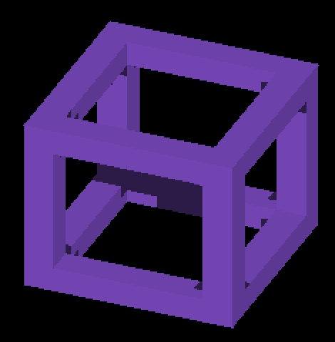

# Attached per-axis presentation lighting

`IR_PERAXIS_SURFACE_LIGHTING=1` enables an allocation-free, experimental beauty
path for attached per-axis regular and overflow faces. It keeps their existing
colors as albedo and evaluates sun visibility at the displayed finite surface
point, before combining linear lighting and display mapping. It is default-off;
cardinal rendering and pipelines with fog or debug overlays retain compute
lighting. This is not a claim that every rendering mode now has exact shadows.

## Geometry and lighting

The signed face origin and interpolated quad parameter use the existing scatter
geometry. Interior receivers use `P = O + eu*u + ev*v - anchor`. For conservative
raster margins, the nearest point on the finite rectangle is obtained by
clamping `(u,v)` to `[0,1]^2`: the in-plane axes are orthonormal. This extends
color from the finite edge without extending receiver geometry. Coverage,
planar depth, margin arbitration, and caster geometry are unchanged; there is
no blur or enlarged shadow footprint.

`worldSurfaceLighting` is shared with analytical surface presentation. Sun
visibility modulates only direct light, before tone mapping. Ambient, AO/palette,
local volume, and sky retain their contracts. Per-axis local light still samples
face origin `O`; analytical shapes still sample their continuous surface point.
Regular faces read their own axis AO texel; overflow has no AO owner and uses 1.

The lighting system owns one eligibility decision per frame and publishes
readiness only after its main-canvas tick preserves both albedo stores. The
compositor consumes that publication. Fog, overlays, missing resources, missing
consumer, non-camera canvases and cardinal poses keep the existing path. The
borrowed uniform slot and per-axis AO texture are restored after presentation.
The shared ID-volume binding uses the GL image namespace first, then the Metal
render texture table; a CPU binding-order control covers both contracts. Native
SPOT-cone coverage remains unverified.

No capacity-sized lighting records or textures are allocated. A two-vec4 payload
would reserve 32 MiB for this scene’s overflow capacity alone. This reference
instead repeats material/local-light work per fragment and skips the regular
and overflow lighting dispatches. Its cost must be measured before default
adoption or moving face-constant work to the vertex stage.

## Native correctness

Native Metal Debug, Apple M4 Max, macOS 26.5.2, 2560×1440. Full frames, commands,
artifact hashes and profile reports accompany these crops. Short capture runs
include readbacks and are not throughput measurements.

The identity GRID frame uses declared albedo `(150,90,235)`, ambient `0.30`, sun
intensity `1`, no AO, no palette, no HDR/sky and no local lights. The extended
`render-source-occlusion-metric.py --sun-beauty-rgb` predicts lit/shadowed colors
from those inputs and signed world normals, then compares against independent
unit-box ray intersections. Nothing is fitted to the screenshots. Existing
one-pixel face/shadow boundary exclusions and zero shadow bias are unchanged.
Ambiguous or wrong colors fail, and both lit and shadowed interiors must occur.

| Yaw | Tested sun-facing pixels | Before false / missed | Enabled false / missed / invalid |
|---|---:|---:|---:|
| 22.5° | 77,984 | 225 / 185 | 0 / 0 / 0 |
| 112.5° | 38,435 | 74 / 151 | 0 / 0 / 0 |
| 202.5° | 26,615 | 141 / 152 | 0 / 0 / 0 |
| 292.5° | 65,310 | 485 / 337 | 0 / 0 / 0 |

All four beauty checks pass: **208,344 pixels, zero errors**, versus 1,750 baseline
errors. These are sun-facing interiors, not whole-image correctness. All four
occupied-pixel masks remain identical. Previously recorded strict silhouette
excesses remain unresolved. This frame produces no overflow: the mixed scene
separately exercises overflow; its native pixels do not have an independent
geometry oracle.

| Before, face-center visibility | Enabled, continuous visibility |
|---|---|
|  |  |

Frame crops are unscaled `(1040,475)–(1510,955)`. Mixed crops are unscaled
`(775,475)–(1750,1000)`; complete frames remain adjacent.

| Mixed control | Result |
|---|---|
| Option disabled versus parent, five views | All RGB pixels identical |
| Shadows disabled, option off/on, five views | All RGB pixels identical |
| HDR white sky / zero sun versus parent, five views | All RGB pixels identical |
| Beauty enabled, five views including cardinal | Cardinal identical; four oblique views change shadow pixels |
| Overflow population | Peak 1,552 entries, zero drops |

## Measured cost and decision

The final executable/shader hashes match across all retained performance runs.
Each configuration has three runs at yaw 73.125°, 363 frames per run; steady
frame statistics discard the first 90. Timing runs are separate from the short
correctness captures. This is a small mixed scene (about 205 engine entities),
Debug on battery power, not a population throughput benchmark. The raw reports,
commands, host load and artifact hashes are under `perf/`.

| Zoom / path | GPU frame envelope, mean (run range) ms | Scatter scope, mean ms | Steady frame mean ms |
|---|---:|---:|---:|
| 1 / compute lighting | 5.190 (5.146–5.239) | 0.100 | 8.983 |
| 1 / presentation lighting | 9.922 (9.901–9.939) | 5.294 | 13.540 |
| 4 / compute lighting | 4.440 (4.403–4.465) | 0.061 | 8.850 |
| 4 / presentation lighting | 5.053 (4.836–5.192) | 1.105 | 8.867 |
| 1 / presentation, shadows disabled | 4.252 (4.241–4.261) | 0.488 | 8.853 |

This implementation is **not ready to enable by default**: it adds roughly
4.7 ms to the GPU frame envelope in the wider view. Zoom 4 retains only 111
overflow entries versus 1,533 at zoom 1, so its smaller delta does not prove
zoom/subdivision scaling. No drops, camera drift, or invalid GPU timestamp pairs
occur in these accepted runs. An earlier parent-build zoom-4 run drifted from
1 to 4 and was rejected by the existing guard; its manifest/report are retained
separately and excluded from the table.

The no-shadows control leaves geometry and overflow count unchanged and lowers
the scatter scope from 5.294 to 0.488 ms. This points to fragment shadow work as
the main next target, not a dense lighting payload or material reuse alone.
Disabling shadows also changes other pipeline stages, so its whole-frame delta
is not a measurement of the query alone. Metal encoder-boundary scopes may
overlap; do not sum the stage rows or call the envelope GPU busy time.

Next measure query visits and conservative-raster overdraw, skip queries whose
direct-sun contribution is zero, and improve candidate pruning while preserving
finite face intersections. Moving face-constant material/local lighting to
vertices remains an option, but this control does not support expecting that
change alone to recover the cost. Cardinal transitions, dense-index correctness
and native GL still gate adoption.

## Deterministic validation

The render harness passes all 52 suites. New controls execute both shader
expressions on the CPU: 55,296 per-axis fragment inputs per backend, all signed
faces, inside/outside finite-face coordinates, owner AO and overflow AO1. Shared
lighting tests retain 3,456 shape cases per backend plus 1,152 calls with distinct
shadow/local-light points. C++ routing tests cover 16,384 eligibility/readiness
combinations and rejected stale/early/double-lighting mutations. The beauty
oracle has 13 tests, including wrong light colors, lost ambient, missed/reversed
shadows, ambiguity, signed/rotated normals and invalid CLI inputs.

CPU execution does not validate native GPU bindings, interpolation, or OpenGL.
Native Metal captures complement it; native OpenGL remains for another host.
The final rebuilt frame, mixed and sky captures (`final-frame-*`, `final-mixed-*`, `final-sky-*`)
are RGB-identical to the candidate after the ID-volume binding correction. Their retained
comparison transfers the pixel result, not a claim of native SPOT validation.
One initial capture could not access the macOS display and produced no images;
the display-enabled retry supplied the retained candidate evidence.

## Reproduce

Build with `fleet-build --target IRCanvasStress`. Set
`IR_PERAXIS_SURFACE_LIGHTING=1` in the environment for the candidate; unset it
for compute lighting.

```bash
python3 scripts/perf/repeat_profile.py --target IRCanvasStress --output /tmp/peraxis-beauty --repeats 1 -- --only orbit --focus-orbit 7 --focus-identity --probe-grid --no-spin --no-auto-rotate --pivot-origin --no-ao --zoom 4 --subdivisions 1 --auto-profile --auto-screenshot 6 --sweep-yaw 0.39269908 5.10508806 4
python3 scripts/render-source-occlusion-metric.py enabled-frame-0.png --shape frame --identity --yaw 22.5 --iso-scale 16 8 --sun-beauty-rgb 150 90 235 --continuous-shadow
```

Use the corresponding angle for the remaining screenshots. Mixed controls use
`--only shadowocclusion,orbit,floor --probe-grid --probe-staircase`, zoom 1,
and a five-view sweep from 0 to 5.10508806 radians; add `--no-shadows` or
`--probe-sky` for contribution isolation.

## Remaining acceptance

Dense index incompleteness still falls back to approximate visibility. Cardinal
GRID remains sampled; transitions need their own oracle before default adoption.
Fog presentation, dense overflow, arbitrary revoxelized occupancy, local SPOT
lights, and larger-population GPU costs need coverage. No million-entity or
60-fps throughput claim follows from these small scenes.
