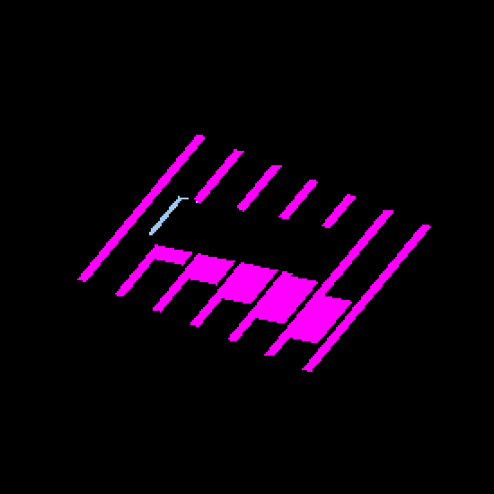
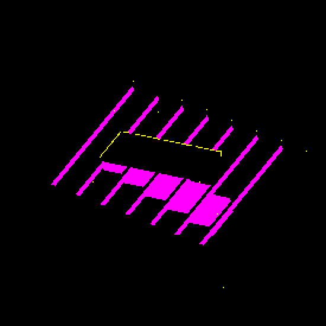
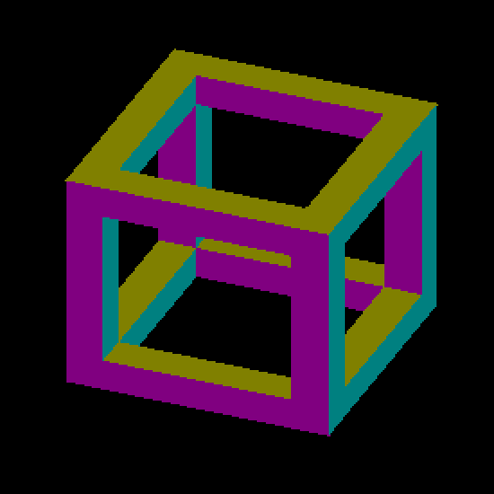
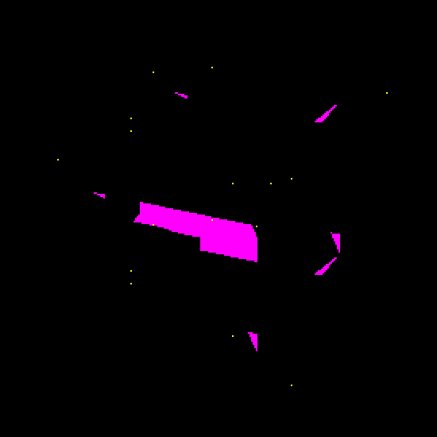

# Attached per-axis surface-shadow diagnostic

`IRCanvasStress --debug-overlay surface_shadow` samples shadow visibility at
the actual fragment position on attached per-axis voxel faces. Both the regular
and overflow draws use the same fragment body. Black is lit, magenta is shadowed,
and yellow identifies conservative raster margins outside the finite face.
Margins make no shadow query. Cardinal/gather behavior is unchanged.

This is a diagnostic, not a beauty-lighting change. All four staircase beauty
captures are pixel-identical to the parent build. It adds no blur, bias,
geometry inflation, per-entity lookup, draw or dispatch. The two extra flat
vertex outputs carry the face origin and signed face ID; only the diagnostic
fragment variant declares the sun resources and evaluates the query.

## Geometry contract

For decoded face origin `O`, signed face ID, and dilation-aware interpolated
`q = (u,v)`, the displayed finite point is
`P = O + eu*u + ev*v - kVoxelRasterCellAnchor`. `eu` and `ev` are the existing
positive in-plane unit axes. Sign selects the outward normal, not a second
translation or reversed in-plane axis. The origin already includes the regular
or overflow face reconstruction, subdivision and encoded fractional translation.
The anchor is applied exactly once. The shadow query receives continuous view
depth and the existing camera-to-world rotation.

The canonical sun buffers are bound before the diagnostic draw at slots 29/28.
Sun availability is independent of SDF system registration. Missing sun resources
select ordinary rendering; disabled shadows return black without sampling.
Coverage, alpha, planar depth and margin arbitration share the beauty body.

## Native evidence

macOS 26.5.2, Apple M4 Max, native Metal Debug, 2560×1440 captures. Each sweep
uses yaw 22.5°, 112.5°, 202.5°, 292.5°. Full frames, manifests with artifact hashes
and commands, and captured profile reports are retained here. These short runs
include screenshot readbacks and are **not throughput measurements**.

The baseline is the staged executable/shaders from parent
`9b446559df2cb831cd92284e559bc1e8fd9e9028`. Its manifests list pending source edits
because captures preceded the candidate build; executable and staged-shader hashes
identify the actual artifacts. Candidate captures followed `fleet-build --target
IRCanvasStress`. No source or shader changed between candidate capture runs.

| Control | Result |
|---|---|
| Staircase beauty before/after | 0 changed RGB pixels in all four full frames |
| Identity GRID frame, continuous ray/box oracle | 0 false, missed or invalid shadow pixels in all four quadrants |
| Tested sun-facing frame pixels | 77,984 / 38,435 / 26,615 / 65,310; both lit and occluded interiors exercised |
| Frame normals | 78,398 interior pixels per quadrant, 0 wrong normals and 0 missing pixels |
| Strict frame outline | **FAIL**: 1 / 54 / 71 / 20 extra silhouette pixels outside the existing one-pixel boundary exclusion |
| Staircase overflow witness | Peak 122 entries, 0 drops |
| Disable overflow draw | 128 / 996 / 1,608 / 1,004 changed diagnostic pixels; proves the lane affects presentation |
| Disable shadows | Black interiors; only 416 / 220 / 316 / 392 yellow margin pixels remain |

The independent oracle uses unit-box geometry, signed normals and per-pixel ray
intersections. Neither scale nor phase is fitted to the images. Its existing
one-pixel face and shadow-boundary exclusions are unchanged; shadow bias is zero.
Frame shadow interiors pass, while full outline acceptance remains open. The
frame produces no overflow entries: native overflow evidence is the separate
staircase omission control, not a ray-oracle pass for overflow pixels.

The first overflow-disabled attempt could not create a macOS window inside the
sandbox and produced no captures. The approved display-access retry supplied the
retained `no-overflow` evidence.

### Staircase diagnostic, yaw 22.5°

Unscaled crops at `(1000,450)–(1550,1000)`; the complete frames are adjacent.
The new yellow is a diagnostic margin marker, not a lit or shadowed surface.

| Parent face-center overlay | Continuous fragment overlay |
|---|---|
|  |  |

### Frame geometry and continuous shadow visibility

| Signed normals | Surface visibility |
|---|---|
|  |  |

## Reproduce

Build with `fleet-build --target IRCanvasStress`. Staircase capture:

```bash
python3 scripts/perf/repeat_profile.py --target IRCanvasStress --output /tmp/peraxis-surface-shadow --repeats 1 -- --only shadowocclusion --probe-grid --probe-staircase --sun-direction 0.42 0.60 -0.55 --no-spin --no-auto-rotate --no-ao --pivot-origin --zoom 2 --subdivisions 1 --debug-overlay surface_shadow --auto-profile --auto-screenshot 6 --sweep-yaw 0.39269908 5.10508806 4
```

Omit the overlay for beauty. Add `--no-shadows` for the disabled control.
Set `IR_PERAXIS_OVERFLOW_DISABLE=1` to omit only overflow presentation.

The existing `--probe-grid` option also selects attached rendering for focused
orbit shapes. The independent authored-frame oracle requires identity pose:
nonidentity GRID rotation revoxelizes and needs an occupancy-aware oracle.

```bash
python3 scripts/perf/repeat_profile.py --target IRCanvasStress --output /tmp/peraxis-frame-shadow --repeats 1 -- --only orbit --focus-orbit 7 --focus-identity --probe-grid --no-spin --no-auto-rotate --pivot-origin --no-ao --zoom 4 --subdivisions 1 --debug-overlay surface_shadow --auto-profile --auto-screenshot 6 --sweep-yaw 0.39269908 5.10508806 4
python3 scripts/render-source-occlusion-metric.py docs/pr-screenshots/codex/peraxis-surface-shadow-probe/frame-shadow-q0.png --shape frame --identity --yaw 22.5 --iso-scale 16 8 --shadow-overlay --continuous-shadow
```

Use `--debug-overlay normals` and omit both shadow options from the metric for
the geometry control. Other shots use their corresponding degree value.

## Deterministic coverage and limits

`test_render_per_axis_surface.py` executes GLSL and Metal expressions on the CPU:
all six signed faces and 4,096 fraction triples, regular/overflow decoding,
negative/positive positions, and dilation-aware interpolation. It checks 884,736
surface points and 491,520 interpolation samples per backend against independently
constructed cubes. Instrumented fragment calls check continuous depth, signed
normal, camera basis, margin and disabled-shadow zero-query behavior. Eight
mutations fail. These are not native rasterization tests.

`test_render_per_axis_probe_routing.py` executes C++ routing/binding statements
with stubs: 48 pipeline/overlay combinations, 384 draw-route cases, cache reuse,
and nine rejected mutations. Native Metal compile and captures complement these
tests; native OpenGL execution remains for another host.

Incomplete finite-index tiles still use approximate fallback. This scene does
not establish arbitrary-density accuracy. Normal lighting needs separate linear
ambient/local/sky and direct-sun terms before display mapping, plus the shared fog
contract. Multiplying already-lit RGBA8 would be incorrect. Storage, fragment cost,
cardinal transitions and the margin extension policy must be measured/validated
before enabling that path. The strict silhouette failures also remain on the
[worklist](../../../design/rendering-audit-todo.md).
