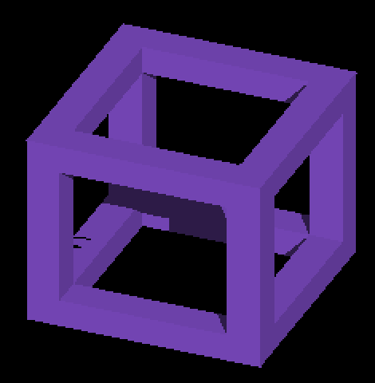
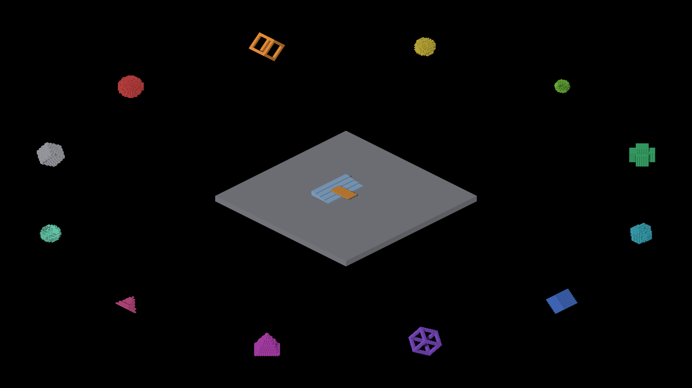

# Per-axis visibility prepass: initial candidate evidence

The implementation now uses one compiled fragment program for both passes.
See [final validation](final/README.md) for the revised implementation; the
results below preserve the failed first attempt. The [depth diagnostic](depth-diagnostic/README.md)
records a one-band disagreement at every missing frame pixel.

**Native image parity failed.** This initial candidate reduces measured work in
the zoom-1 fixture, but removes visible foreground pixels in other views.
The evidence does not support adopting the prepass or enabling it by default.
Attached per-axis lighting and the prepass remain opt-in. No filtering, blur,
or approximate replacement geometry is an acceptable remedy for these holes.

The candidate first records minimum quantized fragment depth, then replays the
same faces and skips full lighting for fragments farther than a conservative
code allowance. Its intended benefit is fewer expensive fragment-lighting and
sun-visibility calls. The following captures test the actual native result.

## Native image comparisons

Metal Debug, Apple M4 Max, macOS 26.5.2, battery power, 2560×1440 output.
[comparison.json](comparison.json) compares decoded RGB exactly, without
alignment, masks, resampling, or tolerance. Every candidate full PNG is retained.
Sweep references are the corresponding
[parent captures](../surface-shadow-query-gate/README.md); profile pairs use the
same candidate runtime with only the prepass environment setting changed.

| Case | Views | Changed RGB pixels per view |
|---|---:|---|
| Identity frame, prepass enabled | 4 | **76**, 0, **20**, 0 |
| Mixed scene, prepass enabled | 5 | 0, 0, 0, **8**, 0 |
| Zero-sun HDR sky, prepass enabled | 5 | 0, 0, 0, **4**, 0 |
| Mixed scene, prepass unset | 5 | 0, 0, 0, 0, 0 |
| Zoom-1 profile off/on pairs | 3 | 0, 0, 0 |
| Zoom-4 profile off/on pairs | 3 | **32**, **32**, **32** |
| Stats capture versus parent screenshot_003143 | 1 | 0 |

There are 26 comparisons: 19 match and seven differ. The frame differences turn
purple foreground pixels into black at `(1132,772)–(1154,786)` and
`(1178,552)–(1192,556)`. The mixed and sky differences include small black holes.
All three zoom-4 pairs replace the same 32 foreground pixels with a darker
underlying surface. These are visible coverage losses, not rounding-level color
changes. [pixel-differences.json](pixel-differences.json) preserves every changed
coordinate and both RGB values. The cause remains under investigation.

The following candidate frame detail is an unscaled 470×480 crop from
`frame-0.png`, rectangle `(1040,475)–(1510,955)`; its
[parent detail](frame-detail-parent.png) and
[absolute RGB difference](frame-detail-difference.png) are also retained.
[detail.json](detail.json) records the crop operation.

A full mixed-scene capture that matches its parent is retained below; passing
this view did not establish parity for the other views.

## Counter proof and bounded performance

The separate [stats log excerpt](captures/stats/run-1-excerpt.log) reports
`fragments=63930 retained=12664 rejected=51266 pixels=927048` at active frame 180.
The three fragment counts reconcile and demonstrate real replay rejection in
this fixture. The [stats image](captures/stats/run-1.png) matches its
[parent reference](captures/stats/parent-reference.png) exactly. Counters and
readback were enabled only for this proof; its timing is not a performance
measurement.

Each performance configuration has three fresh runs, 363 frames per run, fixed
yaw 73.125°, fixed zoom, and subdivision 1. Stats were unset throughout. All
runs have valid GPU timestamps, zero per-axis overflow drops, and unchanged
camera witnesses. Peak overflow entries are 1,533 at zoom 1 and 111 at zoom 4.
Raw profiles, summaries, commands and manifests are retained under [perf/](perf/).

| Measurement | Off mean (range), ms | On mean (range), ms |
|---|---:|---:|
| Zoom 1 GPU frame envelope | 9.921 (9.795–9.996) | 8.618 (8.508–8.779) |
| Zoom 1 per-axis scatter scope | 5.161 (5.133–5.179) | 3.874 (3.859–3.887) |
| Zoom 1 steady frame average | 13.530 (13.400–13.670) | 12.350 (12.210–12.570) |
| Zoom 4 GPU frame envelope | 5.140 (5.101–5.209) | 5.091 (4.776–5.528) |
| Zoom 4 per-axis scatter scope | 1.090 (1.081–1.105) | 0.974 (0.871–1.179) |
| Zoom 4 steady frame average | 9.053 (9.040–9.080) | 9.443 (9.120–9.860) |

Zoom 1 shows a 13.1% lower GPU frame envelope and 24.9% lower scatter scope in
this bounded fixture. The scatter scope includes both prepass and replay when
enabled. Zoom 4 has overlapping GPU ranges and worse steady frame time; its
host load rose from 4.16–4.73 to 9.00. These sequential battery-powered runs do
not establish a zoom-4 improvement or a general speedup. Other stage timings
also vary. Metal scopes can overlap; do not sum them or call the frame envelope
GPU busy time. Correctness failures remain blocking regardless of timing.

The mixed fixture logs also retain an existing `REBUILD_GRID_VOXELS` span-cap
warning: 12 of 1,740 covered destination cells were dropped. The reported zero
overflow drops concern the separate per-axis overflow queue. Image parity
compares the same fixture, not an assertion that all upstream occupancy is
complete.

## Reproduction and provenance

[Runtime comparison](runtime-comparison.json) verifies identical binary, staged
shader, and runtime-script SHA-256 fingerprints across all nine candidate
configurations, including both performance zooms. Each manifest retains the
original dirty base `44352414ef8046651bfadf1c923d4224c380f365`, source status,
launch times, host state, exact command, original-manifest hash, screenshot
mapping and compact log excerpt. `head` does not identify a clean candidate
commit; each run's `clean` field describes runtime validation, not Git status.
The separately retained parent reference has its own older runtime hashes.

Environment supplements were confirmed by the capture operator because the
runner's original manifests omit inherited environment. All runs set
`IR_PERAXIS_SURFACE_LIGHTING=1`. Off, mixed-off and off-z4 leave
`IR_PERAXIS_VISIBILITY_PREPASS` unset; the other candidate configurations set
it to `1`. Only stats sets `IR_PERAXIS_VISIBILITY_STATS=1`; it is otherwise
unset. The sky case uses `--probe-sky` with no additional environment changes.
C++ formatting between zoom-1 and zoom-4 captures did not rebuild the binary or
change the staged shaders. The manifests explicitly distinguish unset from an
explicit zero.

## Deterministic controls and limits

The GLSL and Metal CPU adapters each execute 106,545 depth pairs against
independent D24 rounding and D32 winner comparisons. They retain equal and
nearby quantized codes and reject distant codes. Executed fragment controls
cover alpha/coverage ordering, prepass discard, replay-before-lighting, invalid
depths, indexing, counters, and margin depth; six mutations fail as intended.
The probe-routing test executes program selection and binding precedence.
The separate C++ orchestration suite executes 32 configurations over 181 frames
and rejects 15 lifecycle/order mutations. These targeted suites and Ruff pass.
They model GPU atomics serially and do not prove native coverage, compiler
behavior, derivative equivalence, or GPU concurrency. The native failures show
why those controls cannot replace image comparisons.

There is no native OpenGL validation here, no population or subdivision scaling
claim, and no evidence for hundreds of thousands of entities. Preserve sharp
finite-face geometry while resolving the native coverage discrepancy before
considering further adoption.
