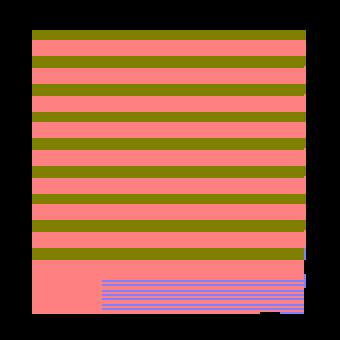
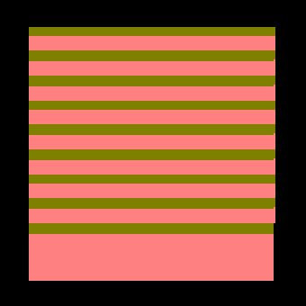
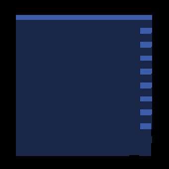
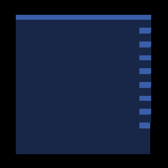

# Post-merge face ownership and shadow controls

Base: merged master `0ac961ac2b48dfe2ac3495a01ab2c3fc97111ac7`.
Native captures use macOS 26.5.2, Apple M4 Max, Metal Debug, 2560×1440.
Per-run manifests retain commands, source state and binary/shader fingerprints;
compressed logs retain clean exits and actual effective subdivision. These short
diagnostic runs are not performance comparisons.

## Rotated GRID faces

The focused orbit-6 cube is a 12³ source cube rotated 45° about Y and resampled
into the world lattice. Its alternating +X and -Z faces are real staircase
geometry. Smoothing away those normals would change the representation.

At camera yaw 135°, however, the old renderer also showed 2,928 pixels carrying
the underside (+Z) normal. The shared selection helper applied a legacy
opposite-polarity riser rule to the continuous per-axis quad route. Such a back
face is not camera-facing merely because the opposite face is unexposed.
Restricting that rule to the legacy cardinal raster removes those wrong owners.
Both raster stages and both shader backends use the same helper. No shadow
filter, depth bias, footprint expansion or new GPU allocation is added.

| Before: underside stripes | After: true side faces |
|---|---|
|  |  |

| Before lighting | After lighting |
|---|---|
|  |  |

These are unscaled crops of rectangle (1100,560)–(1440,900). Full frames remain
under `orbit/{normals,fix-normals,beauty,fix-beauty}/shot-0.png`.

The [independent ray review](orbit/grid6-ray-review.md) reconstructs 1,740
occupied cells and 610 surface cells, matching the native resampling counts.
It finds 2,814 wrong interior owners before and zero wrong or missing interior
pixels after in its bounded test window. Pixel (1280,840) changes from +Z to
the expected +X; the hit is roughly 4.4 framebuffer pixels from its nearest
Z edge. The fix preserves the legitimate alternating bands. Strict silhouette
acceptance is still incomplete: the independent projection retains 218 excess
right-edge pixels outside its one-pixel boundary allowance.

The same-binary 17-view yaw sweep covers 0–360° in 22.5° steps. Before, all 12
non-cardinal views fail the camera-facing-normal gate; after, all 17 pass.
Cardinal views retain their pixels. Four oblique quadrants also pass at base
subdivisions 1 and 8 (zoom 4); the main sweep uses base subdivision 2. See
[per-capture counts](orbit/facing-results.json). Normal-facing acceptance alone
does not certify same-normal depth ownership or every silhouette.

For `base-sweep`, only the two staged `ir_voxel_face_select` shader files were
temporarily restored from the base revision; the executable and all other
runtime assets were unchanged. The run's shader fingerprint identifies that
control. `fleet-build` restored the working sources before subsequent captures.

The CanvasStress manifest adds `grid_orbit_facing`, using the existing independent
normal-facing metric with JSON output and a stdlib PNG reader. The retained bad
capture fails this same structural runner; the corrected capture passes. The
executable shader test covers 9,216 face/exposure/route cases per backend and
requires removal of the route guard to fail. Cardinal risers, detached
revoxelization and the tested fog-cut predicates retain their contracts.

## Full-scene reference review

An independent review of all eight affected native references accepted their
refresh without changing comparison thresholds. Exact RGB differences cover
0.071–0.103% of each default frame and 0.010–0.018% of the two compare frames.
They remain confined to GRID geometry; detached objects, floor and labels retain
their presentation. The new reference images remove the demonstrated obsolete
back-face contributions rather than accepting them through a wider tolerance.
See the [review](full-scene/reference-review.md) and
[pixel counts](full-scene/reference-comparison.json). This accepts eight recorded
poses; the independent ray and normal-facing controls remain necessary.

The final fresh `python3 scripts/render-verify.py --target IRCanvasStress` run
passes **13/13** checks: all eight corrected references match exactly (100%,
maximum delta zero), and all five structural checks pass. The renderer tooling
suite passes **59/59** suites. Native Metal builds, Ruff and whitespace checks
also pass. [SHA256SUMS](SHA256SUMS) covers every file in this evidence package
except the checksum file itself.

## Overflow shadow diagnostic gate

`gridspin_shadow_palette` exercises the earlier overflow shadow-overlay fix at
a frozen 30° object pose and 22.5° camera yaw. In its 350×480 ROI, the retained
pre-fix image classified only 96.85% of pixels as shadow diagnostic colors;
the corrected image classifies 100%. The new gate requires 99% classification
and a positive shadow fraction, so an empty black image cannot pass. The old
image fails both thresholds and the corrected image passes through the actual
manifest runner. This is a diagnostic-color gate, not a silhouette oracle.

The before/after controls already live in the
[previous package](../stack-shadow-wrapup/README.md), under
`master-comparison/grid-ray-controls/grid-rotated-shadow/shot-0.png` and
`grid-ray-after/grid-rotated-shadow/shot-0.png` respectively. Existing comparison
tolerances remain unchanged.

## Dense index and camera updates

[Index audit](dense/index-audit.json) records seven fresh snapshots with matching
probe-write log lines and clean native exits:

- 63 analytical boxes plus floor, overhead sun: 64 requested records, all tiles
  complete, maximum count 64 in both cascades.
- 64 boxes plus floor: 65 requested records. Across four camera yaws, near
  incomplete-tile counts are 132/132/120/120 and far counts are 56 each. Origin
  lookups are incomplete in both cascades, as required. Each snapshot has distinct
  contents and updated lookup coordinates.
- The oblique-sun startup variant requests **195** records because additional
  box faces face the light. Its two yaw views remain valid and incomplete;
  the recorded light basis differs from the overhead control.

Each snapshot validates all 32,768 tile rows. No global record-pool exhaustion
occurs. These controls certify index accounting and sampled camera updates;
incomplete tiles still use approximate shadow fallback and retain rough edges.
The changed light is a separate process startup, not a dynamic-light lifetime
test. No exact dense-scene shadow claim follows from this audit.

## Post-merge validation and concurrent work

All CI checks on the merged top PR passed, including Linux build, fleet tests,
render harness and performance gate. Its additional fleet recheck approved and
independently reproduced Metal reference acceptance. Native OpenGL/Windows
presentation smoke remains outstanding; Linux build/GPU-writer tests do not
replace that visual validation.

Separate PRs own the inherited reference drift:

- PR #3932 (`914fcda5`): its four proposed PerfGrid references exactly match
  the retained integrated captures.
- PR #3936 (`883606ab`): detached Fog matches exactly; paint passes at
  99.9008%, but overflow fails at **99.8993%** against the unchanged 99.9%
  threshold (maximum channel delta 32). Those comparisons use integrated
  `e10f9fbc` controls, before this face-selection fix. The proposed fog references
  therefore do not by themselves close post-stack acceptance. Seven fresh Fog
  captures with the final face-selection guard are byte-identical to those
  integrated controls, so this new fix introduces no additional change in the
  tested fog fixtures. Keep the outstanding reference work coordinated.

Remaining work: strict face/silhouette boundaries, fog reference acceptance,
dynamic-light transitions, exact dense-index overflow, other receiver modes and
native OpenGL presentation. This slice fixes the demonstrated back-facing
ownership defect; it does not declare the broader visual work finished.
