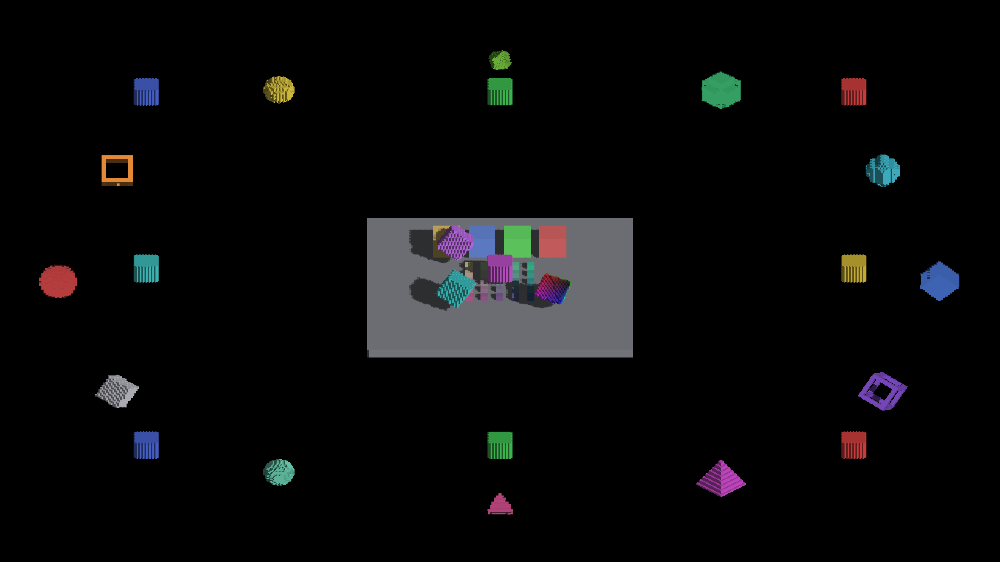

# Shared projected-face coordinates

The display face sampler, voxel sun-face baker (GRID, revoxelized and rigid
source geometry), and finite source-shadow query share the same determinant and
inverse projected-face coordinate calculation through `ir_projected_face`.
Both backend fragments contain the same arithmetic.

Geometry construction remains mode-specific. Coverage ownership also remains
explicit: display micro-faces are half-open; the existing sun-map raster
tolerance is unchanged; exact source queries use closed finite bounds.
Analytic SDF ray intersection is a different geometric operation and is not
routed through this quad helper.

## Validation

- 193 rendering tests pass, including both shader backends executed as scalar
  C++. Projected-coordinate tests cover four quadrants, reflected bases,
  reversed winding, and coordinates inside, on and outside face bounds.
- IRCanvasStress and header checks pass, including the GLSL reserved-word check;
  ruff and diff whitespace checks pass.
- Three native Metal runs exit CLEAN. Eight source-shadow captures pass the
  independent frame/octahedron oracle, with zero false/missed interior pixels.
- All ten retained captures have exactly identical decoded RGB bytes to the
  matching finite-source-query baseline captures. Comparisons ignore PNG
  metadata and alpha. No visual improvement is claimed for this refactor.
- Focused review found no blocker. OpenGL runtime remains unverified.

`runs.json.gz` contains commands/logs; `metrics.json` contains oracle commands
and results; `pixel-comparison.json` maps baseline/current capture IDs.
Baseline images are in `../finite-source-shadow-queries/`.

| Captures | Scope |
|---|---|
| 1953–1956 | Octahedron shadow overlay, yaw 0/90/180/270 |
| 1957–1960 | Frame shadow overlay, yaw 0/90/180/270 |
| 1961–1962 | Full lit scene, yaw 0/45 |

The full scene retains known artifacts. Continuous within-face shadow boundaries
and GRID/SDF receiver agreement still need work. This slice makes common
projected-face math share one implementation per backend so those future fixes
do not need independent copies of the coordinate solve.

No extra buffers, dispatches, CPU work or sampling loops are introduced.
