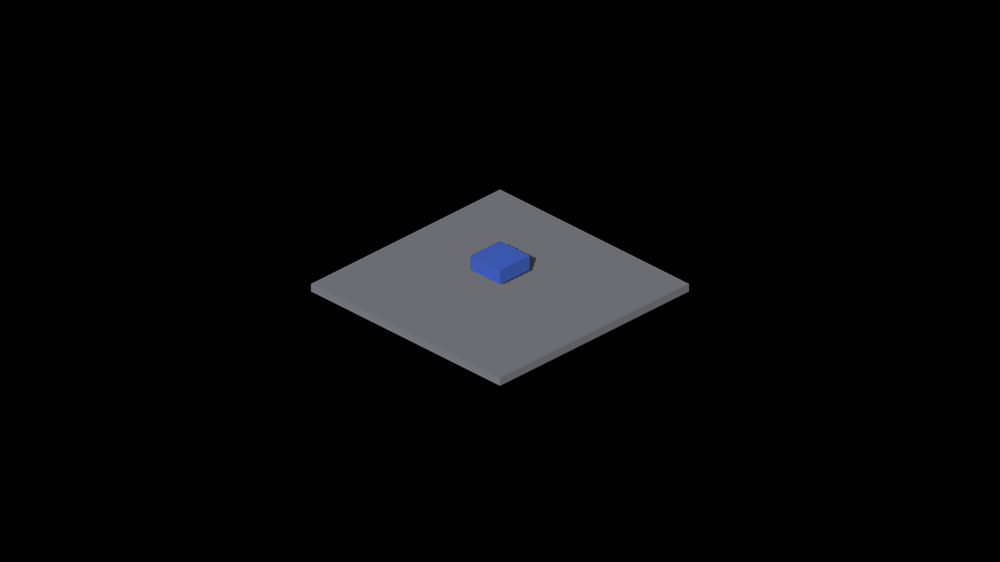

# Deferred tile-rejection experiment

Metal Debug, Apple M4 Max, 2560×1440. These are first-round profiling captures
from the small (span 18) and large (span 512) one-box controls at camera yaw 0,
zoom 1, subdivision 1. Both use the same binary. `before` is the cooperative
parent; `candidate` enables the experimental tile predicate. All 16 full-matrix
candidate/original pairs were RGB-identical. The large plate fills the viewport
and primarily witnesses the scheduling workload.

| Original small | Experimental small |
|---|---|
|  |  |

| Original large | Experimental large |
|---|---|
|  |  |

[Commands, patch, timings and decision](../../../perf/projected-face-tile-overlap.md).
The candidate was removed from production source and runtime staging.
